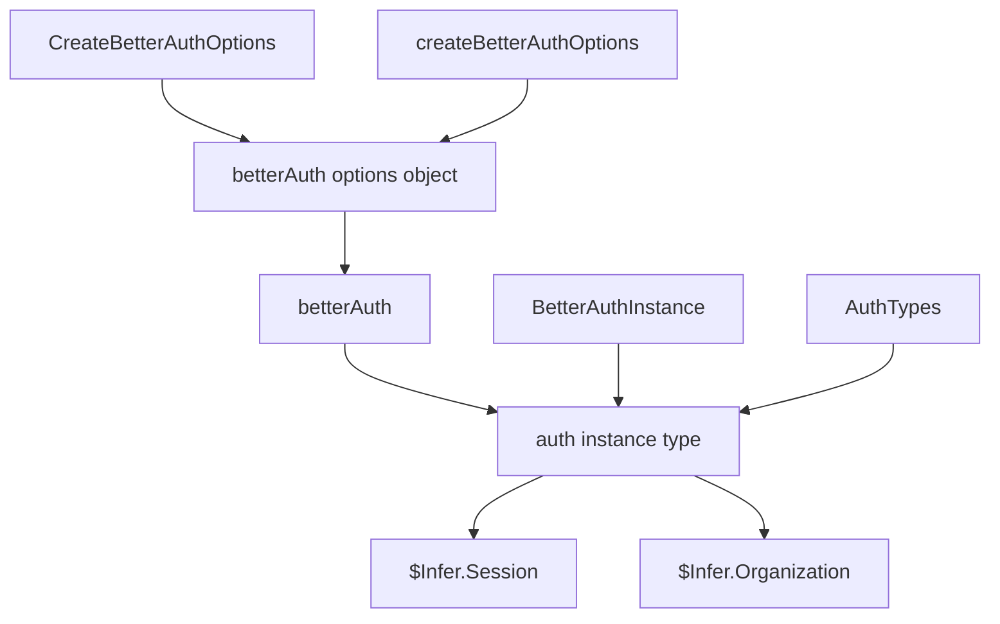

# Better Auth Auth.ts Typing Research

Date: 2026-03-06

## Question

In `src/lib/Auth.ts`:

1. why do `CreateBetterAuthOptions` and `createBetterAuthOptions` exist?
2. can they be inferred / inlined?
3. why do both `BetterAuthInstance` and `AuthTypes` exist?
4. is the file over-typed relative to Better Auth idioms?

## Short Answer

Mostly yes: this file is carrying more type structure than Better Auth itself pushes you toward.

Better Auth’s core pattern is:

```ts
export const auth = betterAuth({...})
type Session = typeof auth.$Infer.Session
```

From `refs/better-auth/docs/content/docs/concepts/typescript.mdx:38-63`:

> "Both the client SDK and the server offer types that can be inferred using the `$Infer` property."

And from `refs/better-auth/packages/better-auth/src/auth/full.ts:27-30`:

```ts
export const betterAuth = <Options extends BetterAuthOptions>(
	options: Options & {},
): Auth<Options> => {
	return createBetterAuth(options, init);
};
```

So Better Auth already infers from the concrete options object and returns `Auth<Options>`.

## What Better Auth Types Are Actually Doing

From `refs/better-auth/packages/better-auth/src/types/auth.ts:8-27`:

```ts
export type Auth<Options extends BetterAuthOptions = BetterAuthOptions> = {
	api: InferAPI<ReturnType<typeof router<Options>>["endpoints"]>;
	$Infer: InferPluginTypes<Options> extends {
		Session: any;
	}
		? InferPluginTypes<Options>
		: {
				Session: {
					session: Session<Options["session"], Options["plugins"]>;
					user: User<Options["user"], Options["plugins"]>;
				};
			} & InferPluginTypes<Options>;
};
```

Key point:

1. Better Auth’s return type is parameterized by the exact options object.
2. Plugin-added types like `Organization` and richer `Session` come from that options type.
3. The important exported type is the auth instance type, because `$Infer` hangs off that.

## Better Auth Docs Pattern

The docs consistently show inference from `typeof auth`, not from hand-built helper aliases.

From `refs/better-auth/docs/content/docs/concepts/typescript.mdx:52-63`:

```ts
export const auth = betterAuth({
    database: new Database("database.db")
})

type Session = typeof auth.$Infer.Session
```

For plugin/client inference, the docs again point back to the concrete auth instance:

From `refs/better-auth/docs/content/docs/concepts/typescript.mdx:118-127`:

```ts
import type { auth } from "@/lib/auth";

export const authClient = createAuthClient({
  plugins: [inferAdditionalFields<typeof auth>()],
});
```

So the Better Auth idiom is: define one auth instance type, then project types from `$Infer`.

## Why This Repo Introduced Extra Structure

Current file:

```ts
type BetterAuthInstance = ReturnType<
  typeof betterAuth<ReturnType<typeof createBetterAuthOptions>>
>;

export type AuthTypes = ReturnType<
  typeof betterAuth<ReturnType<typeof createBetterAuthOptions>>
>;
```

From `src/lib/Auth.ts:364-479`.

This means both aliases are the same type expression. The file currently duplicates the same type once for local use and once for export.

### Why `AuthTypes` exists

`AuthTypes` is used outside `Auth.ts`:

From `src/worker.ts:120-125`:

```ts
export interface ServerContext {
  env: Env;
  runEffect: ReturnType<typeof makeRunEffect>;
  request: Request;
  session?: AuthTypes["$Infer"]["Session"];
}
```

From `src/routes/app.$organizationId.tsx:111-116`:

```ts
}: {
  organization: AuthTypes["$Infer"]["Organization"];
  organizations: AuthTypes["$Infer"]["Organization"][];
  user: { email: string };
}) {
```

So an exported auth-instance type is genuinely needed somewhere in the repo today.

### Why `BetterAuthInstance` exists

It appears to exist only to annotate this local value:

```ts
const auth: BetterAuthInstance = betterAuth(...)
```

From `src/lib/Auth.ts:383`.

That alias is not separately justified. `AuthTypes` already covers the same type.

## Why `createBetterAuthOptions` Exists

`createBetterAuthOptions` is a local architecture choice, not a Better Auth requirement.

It gives the file 3 things:

1. one place to build the full Better Auth config,
2. a named return type to feed into `ReturnType<typeof betterAuth<...>>`,
3. injectable overrides for two database hooks.

From `src/lib/Auth.ts:19-39`, the interface is mostly constructor dependencies plus two optional hook overrides:

```ts
interface CreateBetterAuthOptions {
  db: D1Database;
  stripeClient: StripeTypes;
  runEffect: <A, E>(
    effect: Effect.Effect<A, E, KV | Stripe | Repository>,
  ) => Promise<A>;
  betterAuthUrl: string;
  betterAuthSecret: Redacted.Redacted;
  transactionalEmail: string;
  stripeWebhookSecret: Redacted.Redacted;
  databaseHookUserCreateAfter?: ...;
  databaseHookSessionCreateBefore?: ...;
}
```

### Is this required?

No, not by Better Auth.

If the config were defined inline at the `betterAuth(...)` call site, Better Auth would still infer the full auth type correctly from the object literal.

### Is it ever a valid pattern with Better Auth?

Yes, sometimes.

Better Auth docs explicitly mention hoisting options when inference inside plugin callbacks needs help.

From `refs/better-auth/docs/content/docs/concepts/session-management.mdx:519-544`:

```ts
const options = {
  //...config options
  plugins: [
    //...plugins 
  ]
} satisfies BetterAuthOptions;

export const auth = betterAuth({
    ...options,
    plugins: [
        ...(options.plugins ?? []),
        customSession(async ({ user, session }, ctx) => {
            return {
                user,
                session
            }
        }, options),
    ]
})
```

So "pull options into a named value" is a real Better Auth workaround pattern.

But that exact reason does not seem to apply here. This file is not passing the options object back into a plugin for callback inference. Here the helper is mainly being used as a type anchor and config builder.

## Is `CreateBetterAuthOptions` Necessary?

Partially, but not in its current shape.

TypeScript will not infer destructured function parameter types from the implementation body. If you keep a helper like:

```ts
const createBetterAuthOptions = ({ db, stripeClient, ... }) => ({ ... })
```

then the parameter object still needs a type annotation somewhere.

But that does not require a separately named interface. It could be inlined in the function signature, or the helper could be replaced by a `makeAuth(...)` function and let `ReturnType<typeof makeAuth>` become the exported type.

So:

1. some parameter typing is necessary if the helper stays,
2. the separate `CreateBetterAuthOptions` interface is optional,
3. the current nested `NonNullable<...>` hook types are precise, but heavy for a helper called once.

## Why The Hook Types Are So Heavy

These two fields:

```ts
databaseHookUserCreateAfter?: NonNullable<...>["after"];
databaseHookSessionCreateBefore?: NonNullable<...>["before"];
```

are deriving the callback signatures from `BetterAuthOptions["databaseHooks"]`.

That buys one legitimate thing: if Better Auth changes those hook signatures, this file tracks the library type rather than hand-copying it.

But it also makes the helper look much more reusable than it really is. In this repo, both overrides are supplied exactly once, at `src/lib/Auth.ts:392-454`.

So the tradeoff is:

1. pro: exact coupling to Better Auth hook contracts,
2. con: high visual complexity for a one-call-site helper.

## What Is Actually Needed Vs Redundant



Needed:

1. one auth instance type export, because other files consume `$Infer`,
2. some typed constructor boundary if auth creation depends on runtime services/env,
3. possibly a helper/factory if you want auth construction separated from the Effect service.

Not clearly needed:

1. both `BetterAuthInstance` and `AuthTypes`,
2. both a helper interface and a separate helper function just to type one `betterAuth(...)` call,
3. deeply nested derived hook types if those overrides are not a real abstraction boundary.

## Recommendation

### Minimum simplification

Keep the current structure, but remove the duplicate type:

1. delete `BetterAuthInstance`,
2. use `AuthTypes` for both export and local annotation.

That changes:

```ts
const auth: BetterAuthInstance = betterAuth(...)
```

to:

```ts
const auth: AuthTypes = betterAuth(...)
```

### Better simplification

Prefer one auth factory and infer from that:

```ts
const makeAuth = ({
  db,
  stripeClient,
  runEffect,
  betterAuthUrl,
  betterAuthSecret,
  transactionalEmail,
  stripeWebhookSecret,
}: {
  db: D1Database;
  stripeClient: StripeTypes;
  runEffect: <A, E>(
    effect: Effect.Effect<A, E, KV | Stripe | Repository>,
  ) => Promise<A>;
  betterAuthUrl: string;
  betterAuthSecret: Redacted.Redacted;
  transactionalEmail: string;
  stripeWebhookSecret: Redacted.Redacted;
}) =>
  betterAuth({
    ...
  } satisfies BetterAuthOptions);

export type AuthTypes = ReturnType<typeof makeAuth>;
```

Benefits:

1. one type anchor instead of two,
2. leans on Better Auth inference directly,
3. removes the separate `BetterAuthInstance` alias,
4. makes it clearer that the important type is the auth instance, not the options helper.

### Strongest alignment with Better Auth docs

If architecture allowed a concrete top-level `auth` export, the cleanest pattern would be:

```ts
export const auth = betterAuth({...})
export type Session = typeof auth.$Infer.Session
```

But this repo constructs auth inside an Effect service because config and dependencies are runtime-bound. That means a standalone exported `auth` value is not naturally available, so an exported alias like `AuthTypes` is a reasonable substitute.

## Bottom Line

1. `AuthTypes` is justified because the repo consumes `AuthTypes["$Infer"]...` in other files.
2. `BetterAuthInstance` is redundant; it duplicates `AuthTypes`.
3. `createBetterAuthOptions` is not required by Better Auth; it is a local helper used mostly as a config/type anchor.
4. `CreateBetterAuthOptions` can be inlined if desired. Some parameter typing must remain if the helper remains.
5. The file is somewhat over-typed relative to Better Auth’s normal idiom. Better Auth wants you to infer from the auth instance; this file instead builds several layers around the options object.
6. The strongest simplification is to have one factory, one exported auth-instance type, and rely on `$Infer` from that single type.
