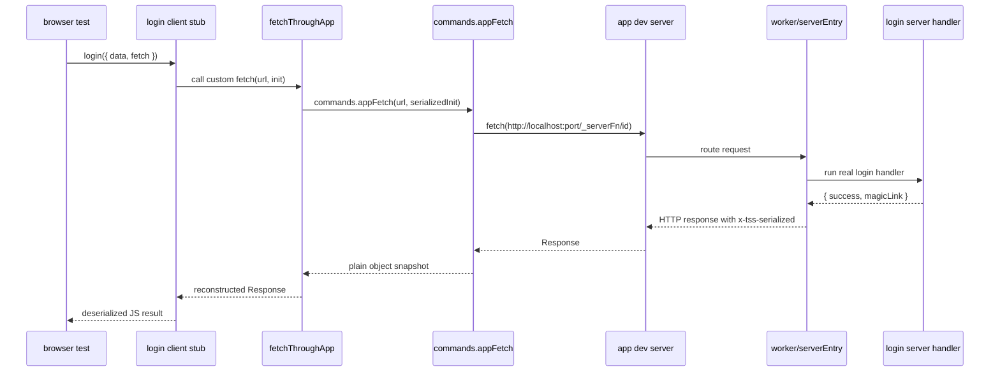

# Browser Login Server Function Research

## Bottom Line

`test/browser/login.test.ts` is not calling the server implementation directly from the browser.

It is doing this instead:

1. import a TanStack Start `createServerFn(...)` export
2. get the client-side RPC stub produced by the TanStack Start Vite plugin
3. override that stub's `fetch`
4. send the request through a Vitest Browser Mode command that runs on the Node side
5. let that command do a real HTTP request to the running app server
6. let TanStack Start route `/_serverFn/<id>` to the real server handler

The actual URL is:

- relative in browser code: `/_serverFn/<opaque-function-id>`
- absolute once `appFetch` resolves it: `http://localhost:${port}/_serverFn/<opaque-function-id>`

In this repo, `globalSetup` sets `appUrl` from `pnpm port`, and the current test expects `http://localhost:3100/_serverFn/...`.

## Short Answer To Each Question

### How is it able to call the server function?

Because `login` is a TanStack Start server function, and in browser builds TanStack replaces the handler with a client RPC stub.

TanStack's own docs describe server functions like this:

> "Server functions let you define server-only logic that can be called from anywhere in your application... They run on the server but can be invoked from client code seamlessly."

The actual transform is visible in TanStack Start's compiler code:

```ts
// Template for client caller files: createClientRpc(functionId)
const clientRpcTemplate = babel.template.expression(
  `createClientRpc(%%functionId%%)`,
)
```

And in the compiler's expected output:

```ts
const myServerFn = createServerFn().handler(createClientRpc("eyJmaWxlIjoi..."));
```

So when the browser test imports `login` from `src/lib/Login.ts`, it does not get the raw server handler body. It gets a generated client callable function.

### What is the URL?

TanStack Start builds the URL here:

```ts
export function createClientRpc(functionId: string) {
  const url = process.env.TSS_SERVER_FN_BASE + functionId
```

The plugin computes `TSS_SERVER_FN_BASE` from router basepath plus server-fn base:

```ts
const TSS_SERVER_FN_BASE = joinPaths([
  '/',
  startConfig.router.basepath,
  startConfig.serverFns.base,
  '/',
])
```

And the default `serverFns.base` is:

```ts
base: z.string().optional().default('/_serverFn')
```

So the browser-side URL is effectively:

```txt
/_serverFn/<function-id>
```

Then `test/browser/app-fetch-command.ts` resolves it against the running app URL:

```ts
const requestUrl = new URL(url, appUrl)
```

And `test/browser/global-setup.ts` sets that `appUrl`:

```ts
const appUrl = `http://localhost:${port}`
process.env.VITEST_BROWSER_APP_URL = appUrl
```

So the real request becomes:

```txt
http://localhost:${port}/_serverFn/<function-id>
```

### What is with the confusing `SerializedResponse`?

There are two different serializations happening.

#### 1. TanStack Start server-function serialization

The real server handler returns plain JS data like:

```ts
return { success: true as const, magicLink };
```

TanStack Start then serializes that into an HTTP `Response` and marks it with `x-tss-serialized: true`:

```ts
return new Response(
  nonStreamingBody ? JSON.stringify(nonStreamingBody) : undefined,
  {
    status: alsResponse.status,
    statusText: alsResponse.statusText,
    headers: {
      'Content-Type': 'application/json',
      [X_TSS_SERIALIZED]: 'true',
    },
  },
)
```

Then the TanStack client stub detects that header and deserializes it back into JS:

```ts
const serializedByStart = !!response.headers.get(X_TSS_SERIALIZED)
if (serializedByStart) {
  ...
  const jsonPayload = await response.json()
  result = fromCrossJSON(jsonPayload, { plugins: serovalPlugins! })
```

That serialization is framework RPC behavior.

#### 2. The test's own browser-command serialization

This is separate. `test/browser/app-fetch-command.ts` defines:

```ts
export interface SerializedResponse {
  body: string;
  headers: [string, string][];
  request: {
    body: string | null;
    headers: [string, string][];
    method: string;
    url: string;
  };
  status: number;
}
```

That type is not TanStack's serialized server-function payload. It is just a plain snapshot of an HTTP response plus some request debug info.

The custom command returns that plain object:

```ts
return {
  body: await response.text(),
  headers: [...response.headers.entries()],
  request: {
    body: init.body,
    headers: init.headers,
    method: init.method,
    url: requestUrl.toString(),
  },
  status: response.status,
} satisfies SerializedResponse;
```

Then `login.test.ts` rebuilds a real `Response`:

```ts
response: new Response(result.body, {
  headers: result.headers,
  status: result.status,
}),
```

So the name `SerializedResponse` is confusing because it sounds like TanStack's server-function serialization, but it actually means "plain command-safe snapshot of a fetch response".

That naming collision is a real source of confusion.

### Why is `app-fetch-command.ts` so complicated?

Part of it is required. Part of it is self-inflicted.

## The Call Chain



## What The Browser Test Actually Does

`test/browser/login.test.ts` does three non-obvious things at once:

```ts
const result = await login({
  data: { email: "u@u.com" },
  fetch: async (url, init) => {
    const appResult = await fetchThroughApp(url, init);
    request = appResult.request;
    return appResult.response;
  },
});
```

1. it calls `login(...)`, which is the TanStack client stub in browser mode
2. it overrides the fetch TanStack will use for that call
3. it captures request metadata for assertions

That override works because TanStack's client RPC fetcher explicitly uses call-site `fetch` first:

```ts
const fetchImpl = first.fetch ?? handler
```

TanStack docs also call this out:

> "This global fetch has lower priority than middleware and call-site fetch, so you can still override it for specific server functions or calls when needed."

And:

> "Custom fetch only applies on the client side. During SSR, server functions are called directly without going through fetch."

So in this browser test, `login({ fetch })` is intentionally hijacking the network call.

## Where The Request Lands

The request eventually reaches `src/worker.ts`:

```ts
return serverEntry.fetch(request, {
  context: {
    env,
    runEffect,
  },
});
```

TanStack Start's server handler checks the URL prefix first:

```ts
if (SERVER_FN_BASE && url.pathname.startsWith(SERVER_FN_BASE)) {
  const serverFnId = url.pathname
    .slice(SERVER_FN_BASE.length)
    .split('/')[0]
```

And it treats the request as a server-function call when it sees the header:

```ts
const isServerFn = request.headers.get('x-tsr-serverFn') === 'true'
```

That header is set on the client side here:

```ts
headers.set('x-tsr-serverFn', 'true')
```

That is why the test asserts:

```ts
expect(new Headers(request.headers).get("x-tsr-serverfn")).toBe("true");
```

The lowercased lookup looks odd, but `Headers` keys are case-insensitive.

## What Is Required Complexity?

These parts are legitimate:

- Vitest Browser Mode runs the test body in the browser, so browser code cannot just read `process.env.VITEST_BROWSER_APP_URL` directly and do Node-side work there.
- Vitest custom commands are explicitly the escape hatch for "invoke another function on the server and pass the result back to the browser".
- The test needs a real HTTP hop into the running app server, not just an in-process helper.
- A real `Response` object is awkward to move over the browser-command boundary, so converting it to `{ body, headers, status }` and rebuilding a `Response` is a reasonable bridge.
- The request snapshot is useful because the test wants to assert the actual method, body, URL, and `x-tsr-serverFn` header.

## What Feels Worse Than It Needs To?

These parts are making it feel more complex than the actual behavior:

- `SerializedResponse` is a bad name here because TanStack already has its own notion of a serialized server-function response.
- The returned object mixes two concerns: response reconstruction and request-inspection debug data.
- `fetchThroughApp()` returns both a rebuilt `Response` and the raw snapshot, which is a slightly awkward contract.
- `SerializedRequestInit` and `SerializedResponse` sound like broad infrastructure types, but the implementation is actually narrow and test-specific.
- The bridge only supports `string` request bodies:

```ts
body: typeof init?.body === "string" ? init.body : null,
```

So it looks generic, but it is not. It is just sufficient for this login test's JSON POST.

That mismatch is part of why it reads as "big ceremony for a small job".

## The Smallest Accurate Mental Model

If you want the simplest way to think about these files:

- `src/lib/Login.ts` defines the real server logic
- the browser test does not import that raw handler directly; it imports TanStack's generated client stub
- the stub wants to call `/_serverFn/<id>`
- the test intercepts that fetch and reroutes it through `commands.appFetch(...)`
- `commands.appFetch(...)` runs on Vitest's Node side and performs the real HTTP request to the app server
- TanStack Start then routes that request back to the real `login` handler

So yes, it works, but it works through a generated RPC client plus a Vitest browser-command bridge, not through a direct function call.

## Comparison With Integration Tests

If you want a less weird version of the same basic idea, compare this with `test/TestUtils.ts`:

```ts
const clientRpc = createClientRpc(serverFn.serverFnMeta.id);
...
return exports.default.fetch(
  new Request(new URL(url, "http://w"), {
    ...init,
    headers: mergedHeaders,
  }),
);
```

That integration helper still uses TanStack RPC machinery, but it skips the browser-command hop and calls the worker in-process. That is much easier to read because there is only one boundary to bridge instead of two.

The browser test has to deal with both of these boundaries:

1. browser code -> Vitest Node command
2. client RPC -> running app server

That is the real source of the mess.

## My Read On `app-fetch-command.ts`

The file is not complicated because the business logic is complicated.

It is complicated because it is adapting between incompatible execution models:

- browser test world
- Vitest command world
- HTTP `fetch` world
- TanStack server-function RPC world

So the complexity is mostly boundary glue, not domain complexity.

Still, the current naming makes it harder than necessary. The biggest clarity issue is that `SerializedResponse` sounds like framework RPC serialization when it is actually just a command transport snapshot.

If this ever gets cleaned up, the first wins should be naming and shape separation, not more abstractions.

## Relevant Files

- `test/browser/login.test.ts`
- `test/browser/app-fetch-command.ts`
- `test/browser/commands.d.ts`
- `test/browser/vitest.config.ts`
- `test/browser/global-setup.ts`
- `src/lib/Login.ts`
- `src/worker.ts`
- `docs/vitest-browser-mode-playwright.md`

## Sources Used

- `refs/vitest/docs/api/browser/commands.md`
- `refs/tan-router/docs/start/framework/react/guide/server-functions.md`
- `refs/tan-router/docs/start/framework/react/guide/middleware.md`
- `refs/tan-router/packages/start-client-core/src/client-rpc/createClientRpc.ts`
- `refs/tan-router/packages/start-client-core/src/client-rpc/serverFnFetcher.ts`
- `refs/tan-router/packages/start-server-core/src/server-functions-handler.ts`
- `refs/tan-router/packages/start-server-core/src/createStartHandler.ts`
- `refs/tan-router/packages/start-plugin-core/src/plugin.ts`
- `refs/tan-router/packages/start-plugin-core/src/schema.ts`
- `refs/tan-router/packages/start-plugin-core/src/start-compiler-plugin/handleCreateServerFn.ts`
- `refs/tan-router/packages/start-plugin-core/tests/createServerFn/createServerFn.test.ts`
