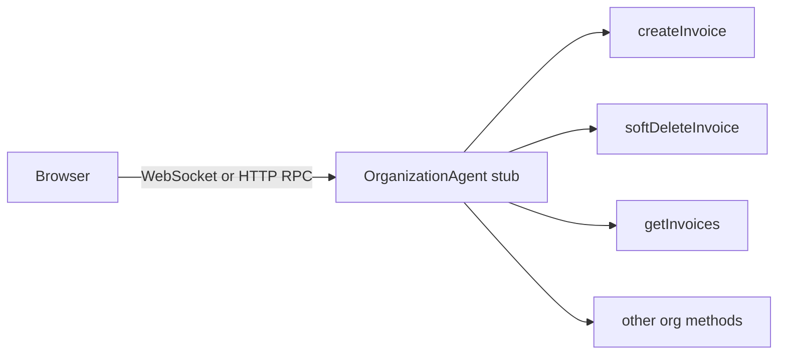
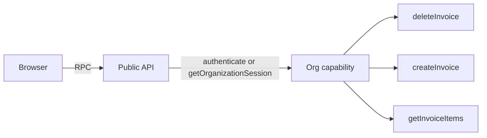
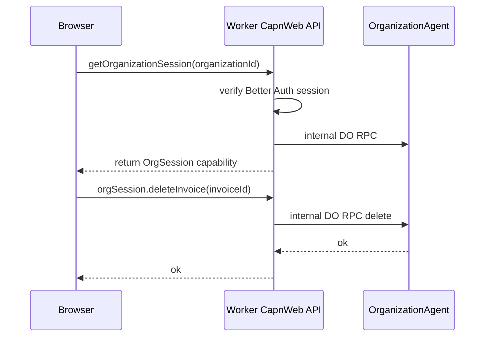

# Cap'n Web Capability Pattern Research

## Question

Could Cap'n Web help with our current problem: we want a general pattern for client -> org-scoped RPC, but we do not want to rely on broad long-lived WebSocket authorization?

Short answer:

- yes, conceptually, Cap'n Web's capability model is relevant
- no, it is not a drop-in fix for the current `agents` + `useAgent()` setup
- the most interesting idea is not "use Cap'n Web everywhere"; it is "use capability-returning APIs to narrow authority"

## What Cap'n Web Is

Cloudflare's blog describes Cap'n Web as:

> "an RPC protocol and implementation in pure TypeScript"

> "an object-capability protocol"

> "It works over HTTP, WebSocket, and postMessage() out-of-the-box"

Source: `https://blog.cloudflare.com/capnweb-javascript-rpc-library/`

The GitHub README says the same core thing:

> "JavaScript/TypeScript-native RPC library with Promise Pipelining"

> "Supports capability-based security patterns"

Source: `https://github.com/cloudflare/capnweb`

## The Important Part For Us: Returned Capabilities

The blog's key security example is:

```ts
class MyApiServer extends RpcTarget {
  authenticate(apiKey) {
    let username = await checkApiKey(apiKey);
    return new AuthenticatedSession(username);
  }
}

class AuthenticatedSession extends RpcTarget {
  constructor(username) {
    super();
    this.username = username;
  }

  whoami() {
    return this.username;
  }
}
```

And the blog makes the security claim explicit:

> "It is impossible for the client to 'forge' a session object. The only way to get one is to call authenticate(), and have it return successfully."

That is the part you were remembering.

## Why This Is Interesting For Our App

Today our main shapes are:

- browser -> TanStack Start server fn -> DO RPC -> `OrganizationAgent`
- browser -> `useAgent()` -> WebSocket RPC -> `OrganizationAgent`

The weakness in direct client WebSocket RPC is not transport alone. It is authority shape:

- the client gets a broad stub to the org agent
- once connected, later callable methods run over that socket
- there is no natural notion of "this client only has these methods / this org / this permission set" unless we add it ourselves

Cap'n Web suggests a different shape:

- expose a small public root API
- call an auth/bootstrap method first
- return a narrower capability object
- privileged methods live on that returned object, not on the public root

That is a better authority model than "everyone gets the same broad stub".

## How The Pattern Would Look

### Current broad-stub mental model



The client effectively gets one object with many methods.

### Capability-returning mental model



Now the privileged methods live on the returned capability, not the public root.

## Why This Is Better Than A Flat RPC Surface

Because authority is represented by object possession.

If the client does not hold the capability, it cannot call those methods.

That gives you a few useful properties:

- no forged session object from the client side
- no need to pass org ID / auth token to every method just to model authority
- natural narrowing: different returned objects can expose different method sets
- easier to model least privilege

For example:

```ts
class PublicApi extends RpcTarget {
  async getOrganizationSession(organizationId: string) {
    const session = await authenticateCurrentRequest();
    await assertOrgAccess(session, organizationId);
    return new OrganizationSessionCapability({
      organizationId,
      userId: session.user.id,
      canWrite: true,
    });
  }
}

class OrganizationSessionCapability extends RpcTarget {
  constructor(private readonly ctx: {
    organizationId: string;
    userId: string;
    canWrite: boolean;
  }) {
    super();
  }

  async deleteInvoice(invoiceId: string) {
    if (!this.ctx.canWrite) throw new Error("Forbidden");
    await deleteInvoiceForOrg(this.ctx.organizationId, invoiceId);
  }
}
```

This is much closer to capability security than a public `organizationAgent.softDeleteInvoice(invoiceId)` method callable by any connected client.

## But Does It Actually Solve Our Main Concern?

Only partially.

This is the critical point.

Cap'n Web solves the "broad stub" problem better than our current direct-client-agent idea.

It does **not** automatically solve the "authorization changed after connection/session bootstrap" problem.

Why not?

- the capability object is still a long-lived reference
- if permissions are revoked later, the client may still hold that reference
- unless the server re-checks current auth state inside methods, or expires/revokes capabilities, the reference can become stale

So the capability model helps with **authority shape**, but not fully with **revocation semantics**.

## Compare The Models

### 1. Server function per action

Properties:

- strongest per-call auth story
- every action sees fresh cookies/headers/request context
- easiest place to use Better Auth session checks

Weakness:

- thin wrappers can feel repetitive

### 2. Direct `useAgent()` stub to org agent

Properties:

- simple transport
- good for realtime

Weakness:

- broad authority surface
- connect-time auth, not per-call auth
- easy to overexpose methods

### 3. Cap'n Web capability-returning API

Properties:

- better authority modeling than a broad stub
- can return narrowed objects with embedded org/user/permission context
- capability object is unforgeable from the client perspective

Weakness:

- still not automatic revocation
- still needs server-side checks for expiry / membership changes / role changes
- introduces a second RPC stack into a repo already using `agents`

## HTTP Batch Mode Is Especially Relevant

Cap'n Web has both WebSocket sessions and HTTP batch sessions.

Blog:

> "What if you just want to make a quick one-time batch of calls, but do not need an ongoing connection?"

> "For that, Cap'n Web supports HTTP batch mode"

README examples:

```ts
import { newHttpBatchRpcSession } from "capnweb";

let api = newHttpBatchRpcSession<PublicApi>("https://example.com/api");
let authedApi = api.authenticate(apiToken);
let userId = await authedApi.getUserId();
```

This matters for us because HTTP batch mode can preserve the capability pattern while making each interaction short-lived.

That suggests a safer variant:

- use HTTP batch RPC for request-scoped capability acquisition
- optionally do a short pipeline of dependent calls in one round trip
- discard the capability after the batch finishes

That is closer to request-scoped auth than a long-lived WebSocket capability.

## Concrete Fit For This Repo

## Option A: Replace Agents with Cap'n Web

I would not recommend this.

Why:

- this repo already uses `agents` deeply
- org route layout already uses `useAgent()` for realtime state/activity
- Cap'n Web would be a parallel RPC stack, not a small incremental tweak
- we would be trading one transport/auth model exploration for a much larger architecture change

## Option B: Use Cap'n Web ideas, not necessarily the library

This is more interesting.

The reusable idea is:

- do not hand the client a broad org stub by default
- bootstrap from a smaller surface
- return or mint narrower capabilities for privileged work

That idea could be implemented in other ways too:

- server functions minting short-lived signed capability tokens
- worker endpoints returning narrowed resource handles
- agent methods that issue short-lived operation-specific grants

In other words: the design lesson may be more valuable than the library adoption.

## Option C: Add Cap'n Web only for a new app-facing RPC surface

This is plausible, but only as a deliberate experiment.

A possible shape:



This could work.

But note what is really happening:

- Cap'n Web endpoint becomes the app-facing authority layer
- the org agent remains the domain layer
- we still need authz rules in the Cap'n Web server
- we still need revocation/expiry strategy for returned capabilities

So this is not removing the server boundary. It is replacing server functions with a different server boundary.

## Capability Expiry / Revocation Still Matters

If we used Cap'n Web seriously here, I would not want indefinite `AuthenticatedSession` objects.

Safer patterns would be:

- short-lived capabilities with embedded expiry
- method-level re-checks against current membership/role state
- explicit revocation list / versioning
- HTTP batch for short sessions; WebSocket only for realtime or low-risk interaction

Otherwise we would reproduce the same stale-auth concern in a more elegant wrapper.

## Interaction With Workers RPC / Durable Objects

The Cap'n Web README says:

> "Cap'n Web is designed to be compatible with Workers RPC"

> "You can also send Workers Service Bindings and Durable Object stubs over Cap'n Web"

So in principle, a Cap'n Web server running in the Worker could internally call or even pass through DO / Worker RPC values.

That is good news for interoperability.

But again, it does not erase the main design decision: where auth lives, when it is checked, and how revocation works.

## Recommendation

Cap'n Web is worth studying here, but mainly as a source of a better authority model.

My recommendation:

- do not switch this repo wholesale from `agents` to Cap'n Web
- do borrow the capability-return pattern as a design tool
- if we want to experiment, do it in a narrowly-scoped spike

The most promising spike would be:

1. create a tiny app-facing RPC surface that exposes only `getOrganizationSession()`
2. verify Better Auth session there
3. return a narrowed capability with 1-2 invoice methods
4. make that capability short-lived
5. compare against current server-function ergonomics and security story

## Bottom Line

Could Cap'n Web help?

- **Yes** for modeling authority more cleanly
- **Maybe** for reducing wrapper boilerplate in some flows
- **No** as a magic fix for stale authorization on long-lived references

The real win is the capability idea:

- a client should not necessarily get a broad org stub
- a client can first obtain a narrower, unforgeable capability
- but that capability still needs expiry, revocation, or method-level revalidation if auth can change over time

So I would treat Cap'n Web less as "the answer" and more as a strong design reference for a safer app-facing RPC pattern.
