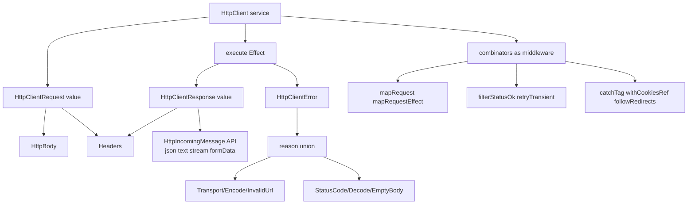
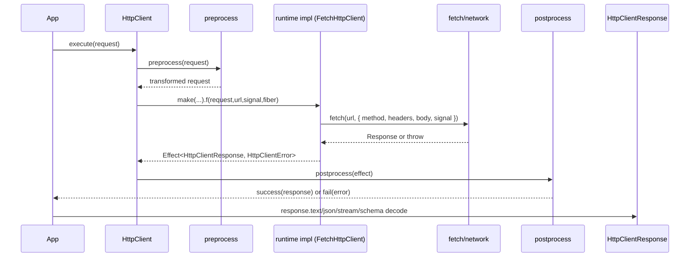
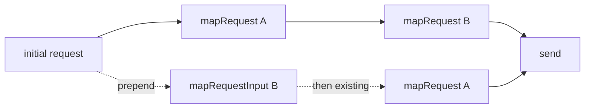
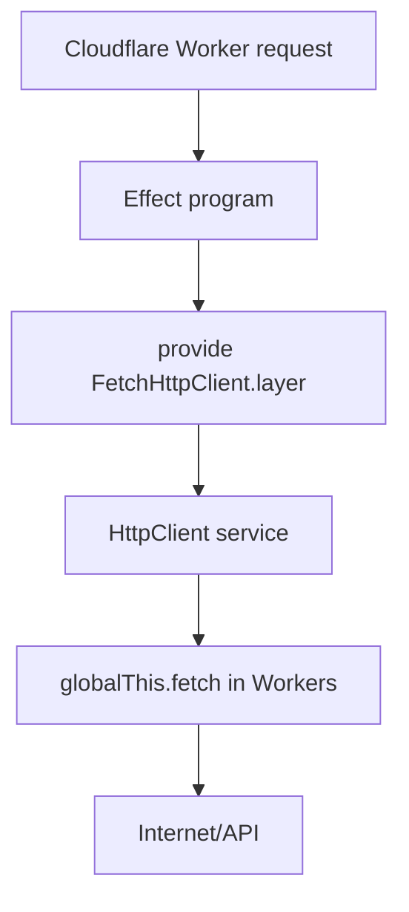
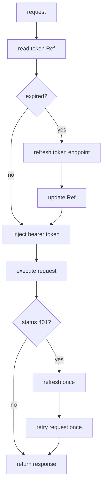

# Effect 4 HttpClient Deep Mental Model (refs/effect4)

## Scope

Researched modules in `refs/effect4`:

- `packages/effect/src/unstable/http/HttpClient.ts`
- `packages/effect/src/unstable/http/HttpClientRequest.ts`
- `packages/effect/src/unstable/http/HttpClientResponse.ts`
- `packages/effect/src/unstable/http/HttpBody.ts`
- `packages/effect/src/unstable/http/Headers.ts`
- `packages/effect/src/unstable/http/HttpClientError.ts`
- `packages/effect/src/unstable/http/HttpIncomingMessage.ts`
- `packages/effect/src/unstable/http/FetchHttpClient.ts`
- `ai-docs/src/50_http-client/10_basics.ts`
- `packages/ai/openai/src/OpenAiClient.ts` (real-world idioms)

Also checked this repo runtime wiring:

- `src/lib/effect-services.ts`

---

## Mental Model In One Diagram



Core idea: `HttpClient` is a composable effect service. `HttpClientRequest` / `HttpClientResponse` are immutable values. `HttpBody`, `Headers`, and `HttpClientError` are support domains attached to requests/responses.

---

## What Each Module Is

## 1) `HttpClient`: transport + middleware pipeline

Code excerpt:

```ts
export interface HttpClient extends HttpClient.With<Error.HttpClientError> {}
export interface HttpClient.With<E, R = never> {
  readonly preprocess: Preprocess<E, R>
  readonly postprocess: Postprocess<E, R>
  readonly execute: (request: HttpClientRequest) => Effect<HttpClientResponse, E, R>
}
```

Source: `refs/effect4/packages/effect/src/unstable/http/HttpClient.ts:44-60`

Interpretation:

- `preprocess`: transforms request before send.
- `postprocess`: transforms response/error effect after send.
- combinators (`mapRequest`, `filterStatusOk`, `retryTransient`, `catchTag`) build a middleware stack by rewriting these two functions.

Important constructor detail:

```ts
export const make = (f) => makeWith((effect) =>
  Effect.flatMap(effect, (request) =>
    Effect.withFiber((fiber) => {
      const urlResult = UrlParams.makeUrl(request.url, request.urlParams, request.hash)
      if (Result.isFailure(urlResult)) {
        return Effect.fail(new Error.HttpClientError({
          reason: new Error.InvalidUrlError({ request, cause: urlResult.failure })
        }))
      }
      ...
    })), Effect.succeed)
```

Source: `HttpClient.ts:541-560`

Meaning: invalid URL composition fails in client runtime before `fetch`.

## 2) `HttpClientRequest`: immutable request builder

Code excerpt:

```ts
export interface HttpClientRequest {
  readonly method: HttpMethod
  readonly url: string
  readonly urlParams: UrlParams.UrlParams
  readonly hash: string | undefined
  readonly headers: Headers.Headers
  readonly body: HttpBody.HttpBody
}
```

Source: `HttpClientRequest.ts:35-43`

Every combinator returns a new request (`setHeader`, `setUrlParams`, `setBody`, `bearerToken`, `basicAuth`).

Auth helpers are primitive headers only:

```ts
export const basicAuth = ... setHeader(self, "Authorization", `Basic ...`)
export const bearerToken = ... setHeader(self, "Authorization", `Bearer ...`)
```

Source: `HttpClientRequest.ts:279-310`

## 3) `HttpBody`: body algebra

Type:

```ts
export type HttpBody = Empty | Raw | Uint8Array | FormData | Stream
```

Source: `HttpBody.ts:30`

This is what request payload can be. It controls auto header behavior in `setBody`:

```ts
if (body._tag === "Empty" || body._tag === "FormData") {
  headers = Headers.remove(Headers.remove(headers, "Content-Type"), "Content-length")
} else {
  if (body.contentType) headers = Headers.set(headers, "content-type", body.contentType)
  if (body.contentLength !== undefined) headers = Headers.set(headers, "content-length", ...)
}
```

Source: `HttpClientRequest.ts:533-543`

Meaning: request body choice drives `content-type`/`content-length`.

## 4) `Headers`: normalized, immutable, redactable map

Normalization:

```ts
for (const [k, v] of Object.entries(input)) {
  out[k.toLowerCase()] = ...
}
```

Source: `Headers.ts:154-159`

Default redacted names:

```ts
defaultValue: () => ["authorization", "cookie", "set-cookie", "x-api-key"]
```

Source: `Headers.ts:307-315`

Meaning: all header keys are lowercase; redaction integrated with logging/tracing/inspection.

## 5) `HttpClientResponse`: typed wrapper around incoming message

Model:

```ts
export interface HttpClientResponse extends HttpIncomingMessage<Error.HttpClientError> {
  readonly request: HttpClientRequest
  readonly status: number
  readonly cookies: Cookies.Cookies
  readonly formData: Effect<FormData, Error.HttpClientError>
}
```

Source: `HttpClientResponse.ts:46-52`

Decode methods (`text`, `json`, `formData`, `arrayBuffer`) are cached:

```ts
return this.textBody ??= Effect.tryPromise(...).pipe(Effect.cached, Effect.runSync)
```

Source: `HttpClientResponse.ts:301-314`

Meaning: parsing body multiple times reuses cached effect result.

## 6) `HttpClientError`: one envelope, tagged reason union

Envelope:

```ts
class HttpClientError extends Data.TaggedError("HttpClientError")<{ reason: HttpClientErrorReason }>
```

Source: `HttpClientError.ts:22-24`

Reason union:

```ts
type RequestError = TransportError | EncodeError | InvalidUrlError
type ResponseError = StatusCodeError | DecodeError | EmptyBodyError
type HttpClientErrorReason = RequestError | ResponseError
```

Source: `HttpClientError.ts:221-233`

---

## Request Lifecycle



Grounding excerpts:

- `HttpClient.make` URL build + effect wiring: `HttpClient.ts:541-636`
- fetch impl: `FetchHttpClient.ts:29-65`
- from web response: `HttpClientResponse.ts:58-59`

---

## Middleware Ordering Idiom

`mapRequest` and `mapRequestInput` are intentionally different.

- `mapRequest`: append transform after existing preprocess.
- `mapRequestInput`: prepend transform before existing preprocess.

Source:

- `mapRequest`: `HttpClient.ts:644-658`
- `mapRequestInput`: `HttpClient.ts:689-703`



Rule of thumb:

- default use `mapRequest`.
- use `mapRequestInput` only when new transform must run first.

---

## Error Model By Stage

| Stage | Error reason | Where produced |
|---|---|---|
| URL assembly | `InvalidUrlError` | `HttpClient.make` (`HttpClient.ts:554-561`) |
| Transport/fetch | `TransportError` | `FetchHttpClient` catch (`FetchHttpClient.ts:45-50`) |
| Encode request body | `EncodeError` | non-fetch runtimes when stream encode fails (`BrowserHttpClient.ts:155-162`) |
| Non-expected status | `StatusCodeError` | `filterStatus` / `filterStatusOk` (`HttpClientResponse.ts:183-209`) |
| Decode response body | `DecodeError` | response parsers (`HttpClientResponse.ts:286-358`) |
| Missing stream body | `EmptyBodyError` | `response.stream` with empty body (`HttpClientResponse.ts:275-283`) |

Pattern: keep transport/status errors structured, then map to domain errors with `Effect.catchTag("HttpClientError", ...)`.

---

## Key Patterns And Idioms

## 1) Build a preconfigured client once, reuse everywhere

Grounding excerpt from docs:

```ts
const client = (yield* HttpClient.HttpClient).pipe(
  HttpClient.mapRequest(flow(
    HttpClientRequest.prependUrl("https://jsonplaceholder.typicode.com"),
    HttpClientRequest.acceptJson
  )),
  HttpClient.filterStatusOk,
  HttpClient.retryTransient({ schedule: Schedule.exponential(100), times: 3 })
)
```

Source: `refs/effect4/ai-docs/src/50_http-client/10_basics.ts:24-42`

## 2) Decode close to boundary

- `HttpClientResponse.schemaBodyJson(schema)` for body-only decode.
- `HttpClientResponse.schemaJson(schema)` when schema depends on `{ status, headers, body }`.

Source: `HttpIncomingMessage.ts:47-52`, `HttpClientResponse.ts:65-88`

## 3) Prefer status policy at client level

- global strict policy: `HttpClient.filterStatusOk`.
- endpoint-specific branching: `HttpClientResponse.matchStatus`.

Source: `HttpClient.ts:495-496`, `HttpClientResponse.ts:126-170`

## 4) Stateful HTTP sessions via cookies ref

- `HttpClient.withCookiesRef(ref)` auto-injects cookie header + merges `set-cookie` from responses.

Source: `HttpClient.ts:955-979`

## 5) Retry only transient failures

`retryTransient` considers:

- errors: timeout, transport.
- responses: 408, 429, 500, 502, 503, 504.

Source: `HttpClient.ts:790-880`, `HttpClient.ts:1209-1222`

---

## Cloudflare Runtime (Not Node): What To Use

Use `FetchHttpClient.layer`. It is runtime-agnostic and bound to `globalThis.fetch`.

Code evidence:

```ts
export const Fetch = ServiceMap.Reference<typeof globalThis.fetch>(..., {
  defaultValue: () => globalThis.fetch
})
```

Source: `FetchHttpClient.ts:17-19`

```ts
export const layer: Layer.Layer<HttpClient.HttpClient> =
  HttpClient.layerMergedServices(Effect.succeed(fetch))
```

Source: `FetchHttpClient.ts:71`

Your app already does this in Cloudflare layer wiring:

```ts
Layer.provideMerge(
  FetchHttpClient.layer,
  Layer.succeedServices(...)
)
```

Source: `src/lib/effect-services.ts:24-27`

Avoid Node-specific clients in Workers:

- `platform-node/NodeHttpClient.ts` imports `node:http`, `node:https`, `node:stream`.
- use only `effect/unstable/http/FetchHttpClient` for Workers.

Source: `refs/effect4/packages/platform-node/src/NodeHttpClient.ts:21-24`



Optional runtime customization:

- override fetch implementation per fiber with `FetchHttpClient.Fetch`.
- provide defaults like redirects/keepalive via `FetchHttpClient.RequestInit`.

Source: `FetchHttpClient.ts:17-27`, `FetchHttpClient.ts:30-44`

---

## OAuth + Refresh Tokens: What Exists, What Doesn’t

## Built-in support in `unstable/http`

| Capability | Status |
|---|---|
| Set `Authorization: Bearer ...` | Yes (`HttpClientRequest.bearerToken`) |
| Set Basic auth | Yes (`HttpClientRequest.basicAuth`) |
| OAuth2 authorization flow helpers | No |
| Token endpoint helpers | No |
| Auto refresh-token middleware | No |

Evidence:

- auth helpers exist: `HttpClientRequest.ts:279-310`.
- no `oauth`/`refresh` symbols under unstable http: `rg "oauth|refresh" refs/effect4/packages/effect/src/unstable/http` returns no matches.

Interpretation: Effect HTTP gives low-level primitives; OAuth protocol orchestration is app-level.

## Refresh-token idiom with Effect primitives

Use:

- `Ref` for token state.
- `mapRequestEffect` to inject latest access token.
- 401 handling to trigger refresh + retry once.
- `Schedule` to backoff refresh calls when needed.



Minimal skeleton:

```ts
import { Effect, Ref } from "effect"
import * as HttpClient from "effect/unstable/http/HttpClient"
import * as HttpClientRequest from "effect/unstable/http/HttpClientRequest"

interface TokenState {
  readonly accessToken: string
  readonly refreshToken: string
  readonly expiresAtMs: number
}

const withBearer = (
  client: HttpClient.HttpClient,
  getToken: Effect.Effect<string>
) =>
  client.pipe(
    HttpClient.mapRequestEffect((request) =>
      Effect.map(getToken, (token) => HttpClientRequest.bearerToken(request, token))
    )
  )
```

Real-world transform idiom reference:

- OpenAI client composes base URL + bearer header via `mapRequest`, then applies extra transform hook.
- `refs/effect4/packages/ai/openai/src/OpenAiClient.ts:148-173`

---

## Practical Takeaways

- Think in 3 layers: request value, client middleware, response decode.
- Use `FetchHttpClient.layer` on Cloudflare Workers; not Node clients.
- `HttpClientError.reason` is the key discriminant; pattern-match there.
- OAuth/refresh is not built in; implement with `Ref` + request transforms + 401 retry policy.

