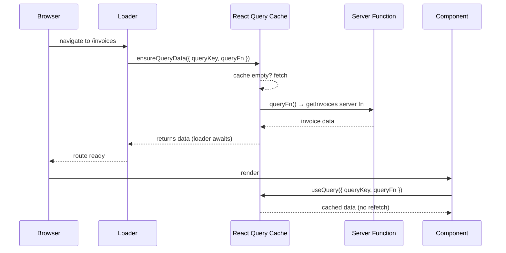
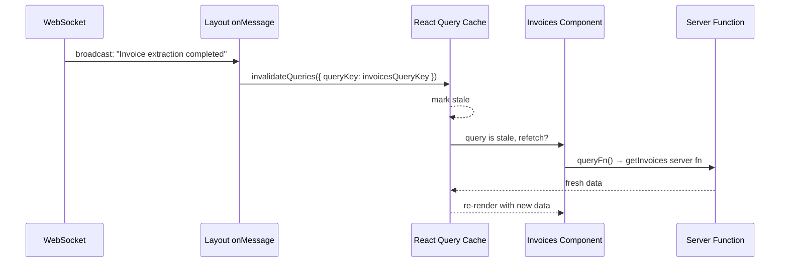
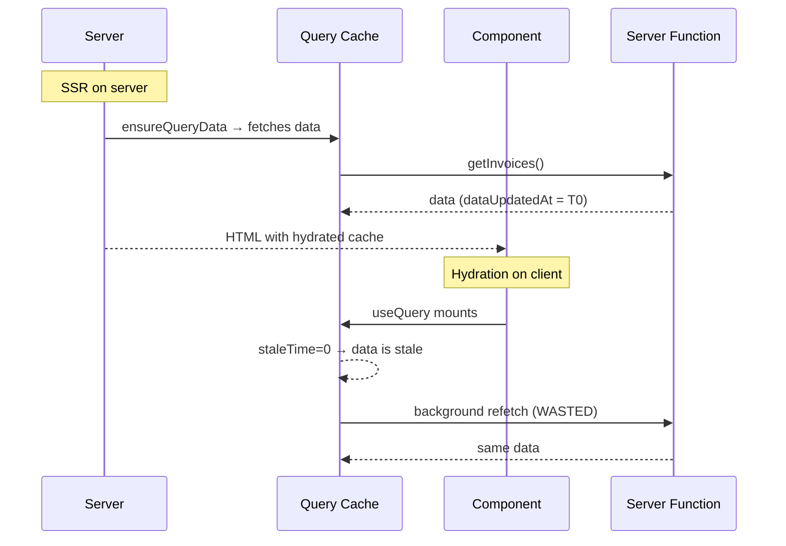
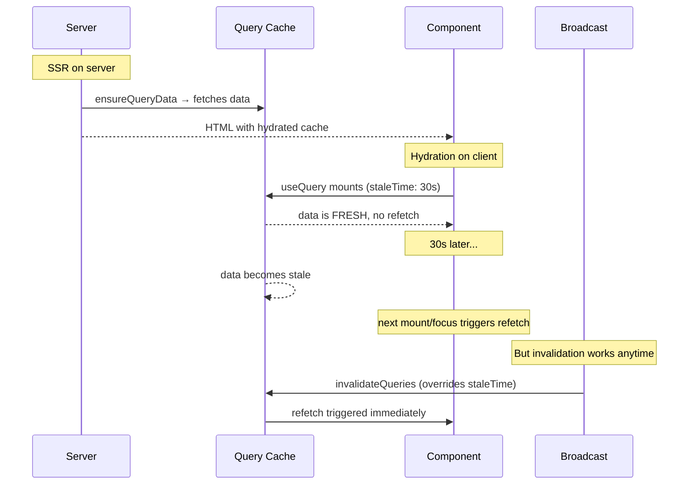

# Lifting useAgent to Layout Route

## Problem

`useAgent` creates one WebSocket per hook instance — no deduplication. Currently called in 2 child routes (`invoices.tsx`, `agent.tsx`), creating separate connections. Adding a sidebar activity feed would add a 3rd. We need exactly one `useAgent` in the component tree, with all nested routes and components able to consume its capabilities.

## Current useAgent Usage

### 1. `app.$organizationId.invoices.tsx` — broadcast messages

```tsx
useAgent<OrganizationAgent, unknown>({
  agent: "organization-agent",
  name: organizationId,
  onMessage: (event) => {
    // decode ActivityEnvelope from broadcast
    // write to query cache via queryClient.setQueryData(activityQueryKey, ...)
    // trigger router.invalidate() + queryClient.invalidateQueries for invoice events
  },
});
```

**Capabilities used:** `onMessage` only. Return value ignored.

### 2. `app.$organizationId.agent.tsx` — state sync

```tsx
useAgent<OrganizationAgent, { readonly message: string }>({
  agent: "organization-agent",
  name: organizationId,
  onStateUpdate: (state) => {
    setMessage(state.message);
  },
});
```

**Capabilities used:** `onStateUpdate` only. Return value ignored.

### Summary

Neither route uses `call`, `stub`, `setState`, `ready`, or the socket directly today. Both are passive consumers of server-pushed data via callbacks.

## OrganizationAgent Callable Methods (RPC Surface)

From `src/organization-agent.ts`, the `@callable()` methods available via `stub`/`call`:

| Method | Purpose | Currently called via RPC? |
|--------|---------|--------------------------|
| `getTestMessage()` | Returns agent state message | No (tested via state sync) |
| `onInvoiceUpload(upload)` | Handle upload event | No (called server-side from queue consumer) |
| `onInvoiceDelete(input)` | Handle delete event | No (called server-side from queue consumer) |
| `getInvoices()` | List invoices | No (called via server fn `getInvoices`) |
| `getInvoiceItems(invoiceId)` | List line items | No (called via server fn `getInvoiceItems`) |

Zero callable methods invoked from client via RPC today. All called server-side through server functions or queue consumers.

## useAgent Full Capability Surface

The hook returns a `PartySocket` extended with:

| Capability | Type | Description |
|-----------|------|-------------|
| `agent` | `string` | Agent class name (kebab-case, from server identity) |
| `name` | `string` | Instance name (from server identity) |
| `identified` | `boolean` | `true` after identity message received |
| `ready` | `Promise<void>` | Resolves when identity confirmed |
| `setState(state)` | `(State) => void` | Push state to server |
| `call(method, args)` | RPC function | Call agent method with type safety |
| `stub` | Proxy object | `stub.myMethod(args)` → RPC call |
| `send(data)` | `(Message) => void` | Raw WebSocket send |

**Callback options** (not on return value, but used during setup):

| Callback | Used today? | Purpose |
|----------|-------------|---------|
| `onMessage` | Yes (invoices) | Broadcast messages (non-protocol) |
| `onStateUpdate` | Yes (agent) | Server-pushed state changes |
| `onStateUpdateError` | No | State update failures |
| `onOpen` | No | WebSocket opened |
| `onClose` | No | WebSocket closed |
| `onError` | No | WebSocket error |

## Invalidation Strategy: Hybrid

Two invalidation mechanisms, used for different triggers:

- **User-initiated mutations** (upload, delete, etc.) — keep `router.invalidate()` in `onSuccess` handlers. Existing pattern across 13 call sites. No change.
- **Broadcast-driven updates** (from the lifted `useAgent` `onMessage` in layout) — use scoped `queryClient.invalidateQueries()` targeting specific query keys. Avoids re-running unrelated loaders when user is on members/billing/etc.

`queryClient.invalidateQueries()` only works with data managed by React Query (`useQuery`), not raw loader data (`Route.useLoaderData()`). Routes whose data gets invalidated by broadcasts need to switch to the **`ensureQueryData` + `useQuery` pattern**. Right now that's only the invoices route. Other routes keep their current loader + `router.invalidate()` pattern untouched.

### `ensureQueryData` vs `prefetchQuery`

Both populate the React Query cache from a loader. The difference:

| | `ensureQueryData` | `prefetchQuery` |
|---|---|---|
| **Returns** | `Promise<TData>` — the actual data | `Promise<void>` — nothing |
| **Throws** | No (returns cached data on fetch failure) | No (silently fails) |
| **Stale check** | Returns cached data immediately if available, even if stale. Optional `revalidateIfStale: true` to refetch in background. | Respects `staleTime` — refetches if stale |
| **Use case** | Loader needs to return/await data | Fire-and-forget cache population |

From `refs/tan-query/docs/reference/QueryClient.md`:

> `ensureQueryData` is an asynchronous function that can be used to get an existing query's cached data. If the query does not exist, `queryClient.fetchQuery` will be called and its results returned.

> `prefetchQuery` is an asynchronous method that can be used to prefetch a query before it is needed or rendered with `useQuery` and friends. The method works the same as `fetchQuery` except that it will not throw or return any data.

### How they work in a TanStack Start loader

The `queryClient` is available in route context (set up in `src/router.tsx`):

```tsx
// src/router.tsx
const router = createRouter({
  routeTree,
  context: { queryClient },  // ← available in loaders as context.queryClient
  // ...
});
```

A loader calls `ensureQueryData` to populate the query cache. The component reads from the same cache via `useQuery`:



On subsequent broadcast-driven invalidation:



If the invoices route is **not mounted**, `invalidateQueries` marks the cache entry as stale but does **not** refetch. The refetch happens lazily when the route is next visited.

### Is this idiomatic for TanStack Start?

Yes. From `docs/archive/tanstack-start-loaders.md`:

> Use TanStack Query for caching to prevent redundant fetches:
> ```tsx
> loader: async ({ context }) => {
>   const posts = await context.queryClient.ensureQueryData({
>     queryKey: ["posts"],
>     queryFn: fetchPosts,
>   });
>   return { posts };
> };
> ```

The SSR integration is handled automatically by `setupRouterSsrQueryIntegration` (already set up in `src/router.tsx`). This function handles dehydrating the query cache on the server and hydrating it on the client — no manual `dehydrate()`/`HydrationBoundary` needed.

### SSR caveats

**1. Error handling.** `ensureQueryData` and `prefetchQuery` do not throw. If the fetch fails, the query is simply absent from the cache, and `useQuery` in the component will retry. For critical data where you want the loader to fail on error, use `queryClient.fetchQuery()` instead (it throws).

**2. No usage in codebase yet.** Zero routes currently use `ensureQueryData`/`prefetchQuery`. This would be the first adoption. The infrastructure is already in place (`queryClient` in router context, `setupRouterSsrQueryIntegration`), but the pattern is new to this codebase.

## Understanding staleTime

### What it is

`staleTime` controls how long cached data is considered "fresh." Once elapsed, data becomes "stale."

- **Fresh data:** Served from cache. No refetches triggered by mount, window focus, or network reconnect.
- **Stale data:** Still served from cache immediately (no loading state), but a background refetch is triggered when:
  - A new component using the query mounts
  - The browser window regains focus
  - The network reconnects

Default: **`0` ms** — data is immediately stale. Every mount, window focus, etc. triggers a background refetch.

### How it interacts with `invalidateQueries`

From TanStack Query docs:

> When a query is invalidated with `invalidateQueries`, two things happen:
> - It is marked as stale. **This stale state overrides any `staleTime` configurations**
> - If the query is currently being rendered via `useQuery`, it will also be refetched in the background

**`invalidateQueries` bypasses `staleTime`.** Even with `staleTime: Infinity`, calling `invalidateQueries` forces the query stale and triggers a refetch. This is exactly what we want — broadcast-driven invalidation should always refetch regardless of staleTime.

### The SSR double-fetch problem



With `staleTime: 0`, the client immediately considers the SSR-fetched data stale and refetches on mount — even though the data was just fetched milliseconds ago on the server.

### How staleTime fixes it



### staleTime vs gcTime (not the same thing)

| | staleTime | gcTime |
|---|---|---|
| **Controls** | When data is eligible for **refetching** | When unused data is **deleted from memory** |
| **Default** | `0` (immediately stale) | `5 min` (or `Infinity` during SSR) |
| **Applies when** | Query is actively rendered | Query has no active subscribers |

These are independent. Data can be stale (eligible for refetch) but still in the gc cache. Data can be fresh (no refetch) but get garbage collected if the component unmounts for 5+ minutes.

### Where to set staleTime

Three levels, each overrides the previous:

```tsx
// 1. Global default (QueryClient) — applies to ALL queries
const queryClient = new QueryClient({
  defaultOptions: { queries: { staleTime: 30_000 } },
});

// 2. Per-query (useQuery) — overrides global for this query
useQuery({ queryKey, queryFn, staleTime: 60_000 });

// 3. Per-prefetch (ensureQueryData/prefetchQuery) — only affects the prefetch decision
//    Does NOT carry over to the useQuery in the component
queryClient.ensureQueryData({ queryKey, queryFn, staleTime: 60_000 });
```

Important: staleTime on `ensureQueryData`/`prefetchQuery` only controls whether the prefetch itself fires. The `useQuery` in the component uses its own staleTime (or the global default) independently.

### Recommendation: Set global default staleTime to 30s

```tsx
// src/router.tsx
const queryClient = new QueryClient({
  defaultOptions: {
    queries: {
      staleTime: 30_000, // 30s — avoid SSR double-fetch, reasonable freshness
    },
  },
});
```

**Why 30s:**
- Prevents the SSR double-fetch problem (data fetched on server stays fresh through hydration)
- Short enough that navigating between routes still gets reasonably fresh data
- Doesn't matter for broadcast-driven updates — `invalidateQueries` bypasses staleTime and forces refetch
- Matches the TanStack SSR docs recommendation of "set some default staleTime above 0"
- Individual queries can override if they need fresher (`staleTime: 0`) or more stable (`staleTime: 60_000`) data

**Why not `Infinity`:** With `Infinity`, data only refreshes on explicit invalidation. If a user leaves and returns to a tab after an hour, they'd see hour-old data until something triggers invalidation. With 30s, a window focus after a tab switch triggers a background refetch automatically.

**Why not per-query only:** Setting it globally avoids having to remember to set it on every `useQuery` call. The SSR double-fetch is a global concern — every query that goes through `ensureQueryData` in a loader benefits from a non-zero staleTime.

### Concrete migration for invoices route

**Before (raw loader data):**

```tsx
export const Route = createFileRoute("/app/$organizationId/invoices")({
  loader: ({ params: data }) => getInvoices({ data }),
  component: RouteComponent,
});

function RouteComponent() {
  const invoices = Route.useLoaderData();
  // ...
}
```

**After (ensureQueryData + useQuery):**

```tsx
const invoicesQueryKey = (organizationId: string) =>
  ["organization", organizationId, "invoices"] as const;

export const Route = createFileRoute("/app/$organizationId/invoices")({
  loader: ({ params, context }) =>
    context.queryClient.ensureQueryData({
      queryKey: invoicesQueryKey(params.organizationId),
      queryFn: () => getInvoices({ data: params }),
    }),
  component: RouteComponent,
});

function RouteComponent() {
  const { organizationId } = Route.useParams();
  const getInvoicesFn = useServerFn(getInvoices);
  const invoicesQuery = useQuery({
    queryKey: invoicesQueryKey(organizationId),
    queryFn: () => getInvoicesFn({ data: { organizationId } }),
  });
  const invoices = invoicesQuery.data ?? [];
  // ...
}
```

Now `queryClient.invalidateQueries({ queryKey: invoicesQueryKey(organizationId) })` from the layout's broadcast handler will trigger a refetch only when the invoices route is mounted.

Existing `router.invalidate()` calls in mutation `onSuccess` handlers (upload, delete) stay as-is — they're user-initiated and broad invalidation is acceptable there.

## Sharing useAgent Capabilities with Nested Routes

### What to share

Two distribution channels from a single `useAgent`:

1. **Broadcast messages + agent state → React Query cache.** High frequency, multiple consumers. Consumers subscribe via `useQuery(activityQueryKey)` or `useQuery(agentStateKey)`.

2. **Agent connection (call/stub/setState) → React Context.** Low frequency, route-specific. Consumers access via `useOrganizationAgent()` hook.

### Context shape

```tsx
// src/lib/OrganizationAgentContext.tsx
interface OrganizationAgentContextValue {
  readonly call: AgentMethodCall<OrganizationAgent>;
  readonly stub: AgentStub<OrganizationAgent>;
  readonly setState: (state: OrganizationAgentState) => void;
  readonly ready: Promise<void>;
  readonly identified: boolean;
}
```

Context exposes the stable, imperative parts of the agent. It does not expose `onMessage` or `onStateUpdate` — those are handled at the layout level and distributed through query cache.

### Layout route integration

```tsx
function RouteComponent() {
  const { organizationId } = Route.useParams();
  const { organization, organizations, sessionUser } = Route.useRouteContext();
  const queryClient = useQueryClient();

  const agent = useAgent<OrganizationAgent, OrganizationAgentState>({
    agent: "organization-agent",
    name: organizationId,
    onMessage: (event) => {
      const message = decodeActivityMessage(event);
      if (!message) return;
      queryClient.setQueryData(
        activityQueryKey(organizationId),
        (current: readonly ActivityMessage[] | undefined) =>
          [message, ...(current ?? [])].slice(0, 50),
      );
      // scoped invalidation for invoice-related broadcasts
      if (shouldInvalidateForInvoice(message.text)) {
        queryClient.invalidateQueries({
          queryKey: ["organization", organizationId, "invoices"],
        });
        queryClient.invalidateQueries({
          queryKey: ["organization", organizationId, "invoiceItems"],
        });
      }
    },
    onStateUpdate: (state) => {
      queryClient.setQueryData(
        ["organization", organizationId, "agentState"],
        state,
      );
    },
  });

  return (
    <OrganizationAgentContext value={{
      call: agent.call,
      stub: agent.stub,
      setState: agent.setState,
      ready: agent.ready,
      identified: agent.identified,
    }}>
      <SidebarProvider>
        <AppSidebar organization={organization} organizations={organizations} user={sessionUser} />
        <main>
          <SidebarTrigger />
          <Outlet />
        </main>
      </SidebarProvider>
    </OrganizationAgentContext>
  );
}
```

### How each current consumer migrates

**invoices.tsx:**
- Remove `useAgent` call
- Remove activity card UI (sidebar replaces it)
- Switch from `Route.useLoaderData()` to `useQuery(invoicesQueryKey)` (with `ensureQueryData` in loader)
- Mutation `onSuccess` handlers: keep `router.invalidate()` (user-initiated, broad invalidation is fine)

**agent.tsx:**
- Remove `useAgent` call
- Refactor to use `useOrganizationAgent().stub.getTestMessage()` via RPC

**sidebar (new):**
- `useQuery(activityQueryKey)` for message list
- Render in `SidebarGroup` with `ScrollArea`
- Unread indicator when sidebar collapsed

## Invalidation Ownership

Layout owns the mapping (Approach A). Inline with comment explaining intent. Add more conditions as new domains are added.

```tsx
// scoped invalidation for invoice-related broadcasts
if (shouldInvalidateForInvoice(message.text)) {
  queryClient.invalidateQueries({
    queryKey: ["organization", organizationId, "invoices"],
  });
  queryClient.invalidateQueries({
    queryKey: ["organization", organizationId, "invoiceItems"],
  });
}
```

## Key Files

| File | Change |
|------|--------|
| `src/routes/app.$organizationId.tsx` | Add `useAgent`, context provider, `onMessage`/`onStateUpdate` handlers |
| `src/routes/app.$organizationId.invoices.tsx` | Remove `useAgent`, remove activity card, switch to `ensureQueryData` + `useQuery` |
| `src/routes/app.$organizationId.agent.tsx` | Remove `useAgent`, refactor to use `stub` RPC via context |
| `src/lib/Activity.ts` | Add `activityQueryKey`, `decodeActivityMessage`, `shouldInvalidateForInvoice` helpers |
| `src/lib/OrganizationAgentContext.tsx` | New: context, provider, `useOrganizationAgent` hook |
