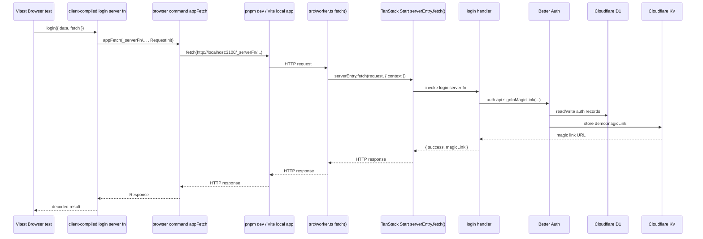

# Login Integration Test Research

## Question

What is the idiomatic way to add `test/integration/login.test.ts` for `u@u.com`?

Constraints:

- prefer the real Worker fetch path for integration coverage
- avoid relying on TanStack Start server-fn transport internals
- avoid `jest`, `jsdom`, and `happy-dom` if possible
- if Browser Mode is used, prefer `browser-playwright`

## Bottom Line

There are three distinct TanStack Start ways to call a server function:

1. direct call from server/SSR code
2. `useServerFn` from components
3. native HTTP via `.url` on a form

Those are all idiomatic.

For this repo, only `3` gives a clean Worker-first integration boundary.

Right now the login route only uses `2`, not `3`, so a Worker integration test can fetch `/login` and can verify the magic-link endpoint, but it does not have a stable app-owned HTTP boundary for starting login.

That means:

- if we keep the route as-is, the idiomatic way to test the mutation/UI is browser-side
- if we want Worker-first login integration, we would need some app-owned HTTP boundary for login initiation

## Important Distinction: This Is Not TanStack Form SSR

`docs/tanstack-form-ssr-status.md` is an important constraint for this discussion.

That doc's conclusion is explicit:

```md
Conclusion: avoid the SSR form pattern (`react-form-start`) for now. Use the client mutation pattern (login.tsx) instead.
```

And the recommendation is explicit too:

```md
Stick with client mutation pattern (`useForm` + `useMutation` + `useServerFn`) until upstream fixes land.
```

So the repo's current direction is:

- do not adopt TanStack Form SSR / `react-form-start`
- prefer the current client mutation pattern

I was previously over-emphasizing `action={fn.url}` as if it were the obvious next step. That was too hand-wavy in the context of this repo.

Important nuance:

- `react-form-start` / TanStack Form SSR is one specific stack with cookie transport and server-validation helpers
- a plain `<form action={serverFn.url}>` boundary is a TanStack Start server-function capability, not the same thing as adopting `react-form-start`

But for this repo, the practical issue is not just technical possibility. It is product direction and prior experience. Since the project already evaluated the SSR form pattern and decided against it, the research should not assume we want to pivot the login route back toward a no-JS/native-submit shape just to make integration testing easier.

So the default recommendation here should remain aligned with `docs/tanstack-form-ssr-status.md`:

- keep the current `useForm` + `useMutation` + `useServerFn` login implementation
- avoid recommending a route redesign unless the team explicitly wants that tradeoff

## Current App Shape

`src/routes/login.tsx` is JS-driven:

```ts
const loginServerFn = useServerFn(login);

const loginMutation = useMutation({
  mutationFn: (data: typeof defaultValues) => loginServerFn({ data }),
});

<form
  id="login-form"
  onSubmit={(e) => {
    e.preventDefault();
    void form.handleSubmit();
  }}
>
```

Important consequences:

- the page does not currently expose a plain HTML submit boundary
- the Worker test harness can fetch the page HTML, but cannot submit login through a normal form post

The auth route allowlist also matters.

`src/routes/api/auth/$.tsx` only allows:

```ts
new Set([
  "POST /api/auth/stripe/webhook",
  "GET /api/auth/magic-link/verify",
  "GET /api/auth/subscription/success",
  "GET /api/auth/subscription/cancel/callback",
])
```

So the app does allow Worker fetch coverage for magic-link verification, but not direct POST to Better Auth's sign-in endpoint.

## Implemented Browser Test Flow

The browser test that now exists in this repo does **not** use the in-process `exports.default.fetch(...)` Worker harness.

It uses Browser Mode to get the **client-compiled** `login` server-fn caller, then forwards that HTTP request to the app's real local dev server at `http://localhost:$(pnpm port)`.

Relevant code:

`test/browser/login.test.ts` imports the server fn and passes a custom fetch:

```ts
const result = await login({
  data: { email: "u@u.com" },
  fetch: async (url, init) => {
    const appResult = await fetchThroughApp(url, init)
    request = appResult.request
    return appResult.response
  },
})
```

`test/browser/app-fetch-command.ts` sends that request to the local app URL:

```ts
const requestUrl = new URL(url, appUrl)
const response = await fetch(requestUrl, {
  body: init.body ?? undefined,
  headers: init.headers,
  method: init.method,
})
```

`test/browser/global-setup.ts` starts the app with `pnpm dev` and sets `VITEST_BROWSER_APP_URL`:

```ts
const devServer = spawn("pnpm", ["dev"], { ... })
process.env.VITEST_BROWSER_APP_URL = appUrl
```

And `pnpm dev` is Vite dev server:

```json
"dev": "mkdir -p logs && source .env && vite dev --port $PORT --force 2>&1 | tee logs/server.log"
```

The app's Vite config includes the Cloudflare plugin:

```ts
plugins: [
  cloudflare({ viteEnvironment: { name: "ssr" } }),
  tanstackStart(),
]
```

That request path does reach the app Worker entrypoint. `src/worker.ts` logs every fetch before passing to Start:

```ts
export default {
  async fetch(request, env, _ctx) {
    console.log(`[${new Date().toISOString()}] fetch: ${request.url}`)
    ...
    return serverEntry.fetch(request, {
      context: { env, runEffect },
    })
  },
}
```

Observed log line from `logs/server.log` during the browser test:

```text
[2026-04-03T04:48:09.277Z] fetch: http://localhost:3100/_serverFn/...
```

So the actual boundary is:



### Is It Hitting The Worker Fetch Handler?

Yes, but via the **local app dev server**, not via `exports.default.fetch(...)` inside the Vitest Worker pool.

More precisely:

- Browser Mode gives us the client RPC path.
- The custom fetch override sends the RPC request to `http://localhost:PORT/_serverFn/...`.
- The local app started by `pnpm dev` routes that request through `src/worker.ts`.
- `src/worker.ts` then calls `serverEntry.fetch(...)`.

So this test covers the app's actual HTTP handling path in local dev, but **not** the in-process `cloudflare:workers` integration harness used by `test/integration/*.test.ts`.

### Is It Hitting D1?

Very likely yes.

Reasoning from app code:

`src/lib/Auth.ts` constructs Better Auth with Cloudflare D1 directly:

```ts
const { D1: database } = yield* CloudflareEnv

const auth = makeAuth({
  database,
  ...authConfig,
})
```

and the Better Auth config maps auth tables including `Session` and `Verification`:

```ts
session: { modelName: "Session", storeSessionInDatabase: true },
verification: { modelName: "Verification" },
```

Those tables exist in the D1 migration:

```sql
create table Session (...);
create table Verification (...);
```

The login server fn itself calls Better Auth:

```ts
auth.api.signInMagicLink({
  headers: request.headers,
  body: { email: data.email, callbackURL: "/magic-link" },
})
```

and in demo mode it also reads the generated link from KV:

```ts
const magicLink = demoMode
  ? ((yield* (yield* KV).get("demo:magicLink")) ?? undefined)
  : undefined
```

So the login initiation path is best understood as:

- HTTP request hits `src/worker.ts`
- Worker/Start invokes `login`
- `login` calls Better Auth
- Better Auth uses D1-backed auth storage
- demo-mode magic link is surfaced back out of KV for the test assertion

## TanStack Start Findings

### Public docs: direct call on server is idiomatic

`refs/tan-start/packages/start-client-core/skills/start-core/server-functions/SKILL.md` shows direct invocation as the normal server-side shape:

```tsx
const greetUser = createServerFn({ method: 'GET' })
  .inputValidator((data: { name: string }) => data)
  .handler(async ({ data }) => {
    return `Hello, ${data.name}!`
  })

await greetUser({ data: { name: 'John' } })
```

This matches the public docs model: server functions are just callable functions in loaders and other server-side code.

### Public docs: `useServerFn` is the idiomatic component wrapper

`refs/tan-start/packages/react-start/skills/react-start/SKILL.md`:

```tsx
const updatePostFn = useServerFn(updatePost)

<form
  onSubmit={async (e) => {
    e.preventDefault()
    await updatePostFn({ data: { id: postId, title } })
  }}
>
```

And `node_modules/@tanstack/react-start/src/useServerFn.ts` shows what it adds:

```ts
const res = await serverFn(...args)

if (isRedirect(res)) {
  throw res
}
```

plus router-aware redirect handling:

```ts
if (isRedirect(err)) {
  err.options._fromLocation = router.stores.location.state
  return router.navigate(router.resolveRedirect(err).options)
}
```

So `useServerFn` is a React integration wrapper, not a Worker-test boundary.

### Public docs: `.url` is the idiomatic no-JS / HTTP boundary

`refs/tan-start/docs/start/framework/react/guide/server-functions.md`:

```md
Use server functions without JavaScript by leveraging the `.url` property with HTML forms.
```

This is the key Start-native mechanism for a Worker-first integration test.

### TanStack Start's own e2e examples use `action={fn.url}`

`refs/tan-start/e2e/react-start/server-functions/src/routes/submit-post-formdata.tsx`:

```tsx
<form
  method="POST"
  action={greetUser.url}
>
```

More importantly, their dual-mode example combines both the native form boundary and `useServerFn` for the JS path.

`refs/tan-start/e2e/react-start/server-functions/src/routes/formdata-redirect/index.tsx`:

```tsx
const greetUserFn = useServerFn(greetUser)

<form
  method="POST"
  action={greetUser.url}
  onSubmit={async (evt) => {
    if (mode === 'js') {
      evt.preventDefault()
      const data = new FormData(evt.currentTarget)
      await greetUserFn({ data })
    }
  }}
>
```

This is the strongest evidence in `refs/tan-start` for the clean solution here.

It gives:

- plain HTTP boundary for Worker tests
- `useServerFn` path for hydrated browser behavior
- one server fn, two idiomatic call sites

### TanStack Start internal tests confirm the runtime split

`refs/tan-start/packages/start-plugin-core/tests/createServerFn/createServerFn.test.ts` shows how Start compiles server functions:

- client bundle -> `createClientRpc(...)`
- server caller -> `createSsrRpc(...)`
- provider file -> `createServerRpc(..., opts => fn.__executeServer(opts))`

Example from the snapshot:

```ts
const myServerFn = createServerFn().handler(createSsrRpc("...", () => import("...").then(m => m["myServerFn_createServerFn_handler"])));
```

and `refs/tan-start/packages/start-server-core/src/createSsrRpc.ts` makes the important behavior explicit:

```ts
const fn = async (...args: Array<any>): Promise<any> => {
  const serverFn = importer
    ? await importer()
    : await getServerFnById(functionId)
  return serverFn(...args)
}
```

That means a server-side call to a server fn is idiomatically direct in SSR/server code. It is not forced through network transport.

Practical conclusion:

- direct invocation of a server fn is Start-idiomatic for server-side tests
- but it bypasses the Worker fetch handler, so it is not the right fit for the integration boundary you want

## TanStack Query Findings

### Public guidance: isolate QueryClient and test through provider-wrapped hooks/components

`refs/tan-query/docs/framework/react/guides/testing.md` recommends:

```tsx
const queryClient = new QueryClient()
const wrapper = ({ children }) => (
  <QueryClientProvider client={queryClient}>{children}</QueryClientProvider>
)

const { result } = renderHook(() => useCustomHook(), { wrapper })

await waitFor(() => expect(result.current.isSuccess).toBe(true))
```

It explicitly calls out why:

```md
This helps to ensure that our test is completely isolated from any other tests.
```

### TanStack Query's own tests use the same pattern

`refs/tan-query/packages/react-query/src/__tests__/utils.tsx`:

```tsx
export function renderWithClient(
  client: QueryClient,
  ui: React.ReactElement,
) {
  return render(
    <QueryClientProvider client={client}>{ui}</QueryClientProvider>,
  )
}
```

Then mutation tests exercise real component behavior.

`refs/tan-query/packages/react-query/src/__tests__/useMutation.test.tsx`:

```tsx
const { getByRole } = renderWithClient(queryClient, <Page />)

fireEvent.click(getByRole('button', { name: /mutate/i }))

await vi.advanceTimersByTimeAsync(0)
expect(getByRole('heading').textContent).toBe('mutation')
```

They also test `mutateAsync` from inside component/effect code:

```tsx
const { mutateAsync } = useMutation({ ... })

const result = await mutateAsync('todo', { ... })
callbacks.push(`mutateAsync.result:${result}`)
```

They test error-boundary interaction too:

```tsx
<ErrorBoundary fallbackRender={() => <span>error</span>}>
  <Page />
</ErrorBoundary>
```

### What that means for our login mutation

The TanStack Query idiom is:

- mount a real component
- give it a real `QueryClientProvider`
- drive user interaction
- assert mutation-driven UI state changes

That strongly supports a browser-side test for:

- filling the email field
- clicking `Send magic link`
- asserting `Check your email`

It does not support reconstructing the server-fn transport manually. That would be testing below the library boundary.

## Vitest Browser Mode Findings

### Browser Mode is real-browser, and Playwright is the preferred provider

`refs/vitest/docs/guide/browser/index.md`:

```md
We also recommend switching to either one of them for testing locally instead of using the default `preview` provider since it relies on simulating events instead of using Chrome DevTools Protocol.

If you don't already use one of these tools, we recommend starting with Playwright because it supports parallel execution, which makes your tests run faster.
```

Config shape:

```ts
import { playwright } from '@vitest/browser-playwright'

export default defineConfig({
  test: {
    browser: {
      provider: playwright(),
      enabled: true,
      instances: [{ browser: 'chromium' }],
    },
  },
})
```

### Browser Mode runs inside Vitest's own server/iframe model

`refs/vitest/docs/guide/browser/index.md`:

```md
Vitest assigns port `63315` to avoid conflicts with the development server, allowing you to run both in parallel.
```

and:

```md
Your tests will run inside an iframe in the center.
```

`refs/vitest/docs/api/browser/context.md` says the same thing in API form:

```ts
page.viewport(width, height)
// Change the size of iframe's viewport.
```

and:

```ts
frameLocator(iframeElement: Locator)
// enters the iframe body
```

### Vitest explicitly distinguishes the orchestrator page from the test iframe

`refs/vitest/docs/api/browser/commands.md`:

```md
- `page` references the full page that contains the test iframe. This is the orchestrator HTML and you most likely shouldn't touch it to not break things.
- `frame` is an async method that will resolve tester `Frame`
- `iframe` is a `FrameLocator` that should be used to query other elements on the page.
```

This is the critical limitation for your concern.

Browser Mode is designed to:

- serve test code through Vitest's Vite server
- mount/test UI inside the Vitest iframe

It is not primarily designed to navigate the whole browser session onto your external app URL.

### Technically possible: custom Playwright commands can access full page navigation

Vitest's own tests prove custom commands can reach Playwright's real `page`.

`refs/vitest/test/browser/fixtures/browser-crash/vitest.config.ts`:

```ts
const forceCrash: BrowserCommand<[]> = async (context) => {
  if (context.provider.name === 'playwright') {
    await context.page.goto('chrome://crash')
  }
}
```

So yes, with `browser-playwright`, Browser Mode can technically drive `context.page.goto(...)` through a custom command.

But based on the docs, that is not the normal app-testing path. It is provider-level escape hatch behavior.

## Worker Fetch Override: Revised View

This is the part I was previously under-weighting.

If the goal is:

- call the login server fn in a client-like way
- but route the request through the real Worker fetch handler

then using the Worker fetch handler as the server-fn `fetch` override is a legitimate idea.

### Why this idea makes sense

TanStack Start has a real public fetch-override seam for server functions.

`refs/tan-start/packages/start-client-core/src/createStart.ts`:

```ts
serverFns?: {
  fetch?: CustomFetch
}
```

`refs/tan-start/docs/start/framework/react/guide/middleware.md`:

```md
1. Call site          `serverFn({ fetch: customFetch })`
4. createStart        `createStart({ serverFns: { fetch: customFetch } })`
```

And the client RPC path actually uses that fetch override.

`refs/tan-start/packages/start-client-core/src/client-rpc/createClientRpc.ts`:

```ts
const clientFn = (...args: Array<any>) => {
  const startFetch = getStartOptions()?.serverFns?.fetch
  return serverFnFetcher(url, args, startFetch ?? fetch)
}
```

So in principle, this is exactly the shape we want:

```ts
const workerFetch: CustomFetch = (url, init) =>
  exports.default.fetch(new Request(new URL(url, 'http://example.com'), init))

await login({ data: { email: 'u@u.com' }, fetch: workerFetch })
```

If that call is using the client-compiled server-fn caller, then TanStack Start would still handle:

- server-fn URL generation
- `x-tsr-serverFn` header
- seroval request serialization
- response decoding

That would be much better than reverse-engineering the RPC transport ourselves.

### The real blocker is not the fetch override

The real blocker is whether the test has a client-side server-fn caller or a server/SSR caller.

TanStack Start docs explicitly say:

`refs/tan-start/docs/start/framework/react/guide/middleware.md`:

```md
Custom fetch only applies on the client side. During SSR, server functions are called directly.
```

And the SSR implementation confirms that.

`refs/tan-start/packages/start-server-core/src/createSsrRpc.ts`:

```ts
const fn = async (...args: Array<any>): Promise<any> => {
  const serverFn = importer
    ? await importer()
    : await getServerFnById(functionId)
  return serverFn(...args)
}
```

So:

- if the test imports a server fn in a server/SSR context, the call bypasses fetch entirely
- in that case, passing `fetch: workerFetch` does not buy us Worker integration
- the problem becomes: how do we obtain the client-compiled caller in a test?

## Can Tests Obtain The Client-Compiled Caller?

Current answer: probably yes in Browser Mode, probably no in the current Node/Worker Vitest project.

### Why Browser Mode is the best candidate

TanStack Start's compiler has an explicit client/server split.

`refs/tan-start/packages/start-plugin-core/tests/createServerFn/createServerFn.test.ts`:

```ts
test.each([
  { type: 'client', isProviderFile: false },
  { type: 'server', isProviderFile: false },
  { type: 'server', isProviderFile: true },
])
```

And the client snapshot is the important part:

```ts
const myServerFn = createServerFn().handler(createClientRpc("..."));
```

while the server caller snapshot is different:

```ts
const myServerFn = createServerFn().handler(createSsrRpc("...", ...));
```

So obtaining the client-compiled caller is fundamentally an environment question.

Vitest Browser Mode runs test code through Vitest's browser Vite server, not the Node runner.

`refs/vitest/docs/config/browser/api.md`:

```md
Configure options for Vite server that serves code in the browser.
```

And `refs/vitest/docs/guide/browser/index.md` explicitly says framework plugins should be installed in that config:

```md
If you have not used Vite before, make sure you have your framework's plugin installed and specified in the config.
```

Vitest's own browser tests import source modules directly and run them in Browser Mode, for example:

`refs/vitest/test/browser/fixtures/locators/blog.test.tsx`:

```tsx
import Blog from '../../src/blog-app/blog'

test('renders blog posts', async () => {
  const screen = await page.render(<Blog />)
})
```

That is not a TanStack Start example, but it is useful evidence that Browser Mode imports source modules through the browser-side Vite pipeline.

Putting those facts together, the likely implication is:

- a Browser Mode test that imports `@/routes/login` with `tanstackStart()` in the Vitest config should receive the client-transformed `login` symbol
- if that is true, `login({ data, fetch: workerFetch })` should use `createClientRpc` -> `serverFnFetcher` -> `workerFetch`

This is still a hypothesis until verified in this repo, but it is now the strongest hypothesis.

### Why the current Node/Worker integration project is a poor candidate

The current integration setup is Worker-first and server-side:

- `@cloudflare/vitest-pool-workers`
- Worker fetch via `cloudflare:workers`
- no browser runner

In that environment, importing a server fn is much more likely to resolve to the server/SSR caller shape, which uses `createSsrRpc(...)` and bypasses fetch.

So in the current integration project, this is the likely behavior:

```ts
await login({ data: { email: 'u@u.com' }, fetch: workerFetch })
```

but `workerFetch` never runs because the import is server-side.

### Most plausible test strategy now

If we want to prove this path, the most targeted experiment is:

1. add a Browser Mode + Playwright Vitest project
2. use the same Vite plugins as the app, including `tanstackStart()`
3. import `login` from `@/routes/login` in a browser test
4. call `login({ data: { email: 'u@u.com' }, fetch: workerFetch })`
5. implement `workerFetch` to delegate to `exports.default.fetch(...)` or another Worker entrypoint
6. verify that the request reaches the Worker as a TanStack Start server-fn RPC request

If that works, it is likely the cleanest path available for the current route shape.

### Biggest unresolved integration question

Even if Browser Mode gives us the client caller, one bridge is still unresolved:

- how should browser-executed `workerFetch` talk to the in-process Cloudflare test Worker?

There are two broad possibilities:

1. browser test calls back to the Node side through a Vitest Browser command, and that command invokes `exports.default.fetch(...)`
2. browser test points at a separately running app URL instead of the in-process Worker harness

From the current evidence, `1` is the more aligned direction if we want to preserve the in-process Worker test harness.

`refs/vitest/docs/api/browser/commands.md` shows the supported bridge from browser test code back to server-side code:

```ts
import { commands } from 'vitest/browser'

const result = await commands.myCustomCommand('test1', 'test2')
```

So the likely endgame shape may actually be:

- browser test imports client-compiled `login`
- call-site `fetch` override delegates to a Browser Mode command
- command runs `exports.default.fetch(...)` on the server side
- response is returned back to browser test code

That is more complex than a plain Node integration test, but it preserves the boundaries we care about better than manual RPC recreation.

### Clearer framing of the problem

The question is not:

- can the Worker fetch handler be the `fetch` override?

It can.

The real question is:

- can our test environment call the client-compiled TanStack Start server fn so that the `fetch` override is actually used?

That is the key unknown now.

### What success would look like

Best-case path:

1. import or obtain the client-side `login` caller
2. provide `fetch: workerFetch` at call site or via `createStart({ serverFns: { fetch: workerFetch } })`
3. let TanStack Start generate the request and decode the response
4. route the actual HTTP through `exports.default.fetch(...)`

That would give:

- real Worker fetch-handler coverage
- no homegrown RPC helper
- no change to the app boundary

### Why Browser Mode is still relevant, but secondary here

Browser Mode might help only because it is much more likely to exercise the client-compiled server fn path.

But the conceptual breakthrough is independent of Browser Mode:

- the Worker can plausibly be the fetch override
- the missing piece is access to the client caller

### Implication for the Worker fetch-handler concern

If the goal is "Browser Mode, but using the Worker fetch handler", there are two realities:

1. Browser Mode natively wants to run inside the Vitest iframe/server.
2. Worker-first integration natively wants raw requests against the Cloudflare Worker.

Those are different centers of gravity.

I still do not see evidence in `refs/vitest` that Browser Mode has a first-class way to say:

- serve my tests from Vitest
- but load the app under test from the Cloudflare Worker fetch handler as the main document

But with the revised framing above, that may not be the most important question anymore. If Browser Mode can give us the client-side server-fn caller, then the Worker fetch handler could potentially sit underneath it as the custom server-fn fetch.

So Browser Mode may be useful less as "navigate to the Worker app directly" and more as "guarantee client-side Start behavior while we redirect server-fn fetches into the Worker".

## What This Means For Our Repo

### Strongest TanStack Start-aligned option in the abstract

Adopt the same pattern TanStack Start uses in its own e2e examples:

```tsx
const loginServerFn = useServerFn(login)

<form
  method="POST"
  action={login.url}
  onSubmit={async (evt) => {
    evt.preventDefault()
    const data = new FormData(evt.currentTarget)
    await loginServerFn({ data })
  }}
>
```

For this repo, the validator currently expects JSON/email shape, so the exact implementation would need to align with the route's schema, but the pattern is the important part.

Why this is the cleanest option technically:

- Worker integration gets a plain HTTP login boundary via `login.url`
- hydrated browser behavior still uses `useServerFn(login)`
- no need to test private transport details
- it matches TanStack Start's own examples and e2e usage

Why I would not make it the default recommendation for this repo:

- `docs/tanstack-form-ssr-status.md` already documents a team decision to avoid the SSR form direction for now
- the current login route is intentionally using the client mutation pattern instead
- changing the route shape primarily for testability is a product/architecture choice, not just a testing choice

### New promising option: client caller + Worker fetch override

If we can get a client-side `login` caller in tests, this may be the best fit for the current route shape.

Why:

- keeps the existing `useForm` + `useMutation` + `useServerFn` implementation model
- avoids changing the login route to expose a new HTTP initiation boundary
- still runs the actual request through the Worker fetch handler
- uses TanStack Start's public `fetch` override seam instead of recreating RPC details by hand

Current unknowns:

- how to obtain the client-compiled server-fn caller in Vitest for this repo
- whether Browser Mode is the easiest way to do that
- whether a Node-side test can import the client-transformed symbol at all

### If we keep the current app boundary

Then the clean split is:

- Worker integration for `/login` HTML, magic-link verify, cookie/session/app access
- Browser-side test for the mutation/UI state change

Best browser-side fit:

- Vitest Browser Mode with Playwright, not preview

Why:

- real DOM
- real browser events
- aligns with TanStack Query's provider-wrapped mutation testing style
- avoids `jsdom` / `happy-dom`

But I would not try to force Browser Mode to be the primary harness for the Cloudflare Worker fetch handler. `refs/vitest` makes it look possible only through custom-command escape hatches, not as the intended path.

### What this means for `L86`: direct server-fn call in a test

Yes, TanStack Start does support direct server-side invocation of a server fn.

But that is a different layer.

From `refs/tan-start/packages/start-server-core/src/createSsrRpc.ts`:

```ts
const fn = async (...args: Array<any>): Promise<any> => {
  const serverFn = importer
    ? await importer()
    : await getServerFnById(functionId)
  return serverFn(...args)
}
```

And from `refs/tan-start/packages/start-client-core/src/createServerFn.ts`:

```ts
const startContext = getStartContextServerOnly()
...
request: startContext.request,
```

So:

- direct server-fn call is Start-idiomatic for server-side tests when request context exists
- but it is not Worker-first integration
- and it bypasses the Worker fetch handler, which is the boundary we care about here

That makes it a valid lower-level test technique, but not the best answer to the integration goal.

## Recommendation

Best recommendation, in order:

1. Keep the current login implementation aligned with `docs/tanstack-form-ssr-status.md`.
2. Investigate whether tests can call the client-compiled `login` server fn with `fetch: workerFetch`, where `workerFetch` delegates to `exports.default.fetch(...)`.
3. If that works, prefer it over inventing our own server-fn RPC helper.
4. If that does not work, use Worker integration only where the app already exposes stable HTTP boundaries: `/login` HTML, magic-link verification, cookie/session/app access.
5. Use Browser Mode + Playwright for the client mutation/UI path if we want to test the actual `useMutation` + `useServerFn` login interaction without `jsdom` / `happy-dom`.
6. Only consider exposing an app-owned HTTP login-initiation boundary if the team explicitly wants that architectural tradeoff.

If we do want one test to cover the full login initiation through the Worker fetch handler, then the app boundary would need to change. That is possible in TanStack Start, but based on `docs/tanstack-form-ssr-status.md`, it should be treated as an explicit product/architecture decision, not as an assumed testing tweak.

## Thoughts

The important thing the refs changed for me is this:

- TanStack Start does have idiomatic ways to test/call server functions
- but the idiomatic Worker-facing one is the `.url` form boundary, not manual RPC reconstruction
- this repo has already chosen not to lean into the SSR-form direction for now
- the Worker fetch handler as a `fetch` override is viable in principle and may be the cleanest fit for the current route shape
- the key technical unknown is access to the client-compiled caller, not the fetch override itself
- TanStack Query strongly pushes mutation testing toward mounted components with a real provider
- Vitest Browser Mode is compelling for that UI layer, but its iframe/orchestrator model makes it a poor primary harness for the Worker fetch handler

So the missing piece is not really a fancy Vitest trick. It is the app boundary.
