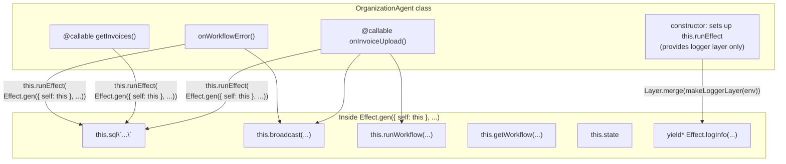

# Organization Agent Effect v4 Refactor Research

## Current State

`src/organization-agent.ts` is imperative: raw `this.sql` template literals, manual `Schema.decodeUnknownSync` calls, direct `this.broadcast`/`this.runWorkflow` calls. No Effect pipelines, no services, no layers.

The Agent class itself must stay — Agents SDK requires `extends Agent<Env, State>`. The refactor targets the *internals*.

## Key Discovery: `Effect.gen` Supports `this` Binding

Effect v4 has native `this` binding for both `Effect.gen` and `Effect.fn`. This eliminates the need for an `AgentContext` service entirely.

### `Effect.gen({ self: this }, function*() { ... })`

From `refs/effect4/packages/effect/src/Effect.ts:1564`:

```ts
export const gen: {
  <Eff extends Yieldable<any, any, any, any>, AEff>(
    f: () => Generator<Eff, AEff, never>
  ): Effect<...>
  <Self, Eff extends Yieldable<any, any, any, any>, AEff>(
    options: { readonly self: Self },
    f: (this: Self) => Generator<Eff, AEff, never>
  ): Effect<...>
}
```

The implementation in `refs/effect4/packages/effect/src/internal/effect.ts:1071` uses `.call()`:

```ts
export const gen = (...args) =>
  suspend(() =>
    fromIteratorUnsafe(
      args.length === 1 ? args[0]() : (args[1].call(args[0].self) as any)
    )
  )
```

**Migration note** (from `refs/effect4/migration/generators.md`):
- v3: `Effect.gen(this, function*() { ... })`
- v4: `Effect.gen({ self: this }, function*() { ... })`

### `Effect.fn` with `this` parameter

From `refs/effect4/packages/effect/src/Effect.ts:8792`, `Effect.fn` infers `this` from the generator's TypeScript `this` parameter:

```ts
export type Untraced = {
  <Self, Eff, AEff, Args extends Array<any>>(
    body: (this: Self, ...args: Args) => Generator<Eff, AEff, never>
  ): (this: Self, ...args: Args) => Effect<...>
}
```

### Test proof (`refs/effect4/packages/effect/test/EffectEager.test.ts:104`):

```ts
const obj = {
  value: 10,
  fn: Effect.fnUntracedEager(function*(this: { value: number }, x: number) {
    const a = yield* Effect.succeed(x)
    return a + this.value
  })
}
const result = yield* obj.fn(5)  // 15
```

## Boundary Pattern: How This Codebase Bridges Effect

Two existing patterns for running Effect at imperative boundaries:

### Pattern A: `makeHttpRunEffect` (worker.ts)

Builds layers from env/request, returns `async (effect) => Promise<A>`. Used per-request in fetch handler.

```ts
const runEffect = makeHttpRunEffect(env, request);
const result = await runEffect(someEffect);
```

### Pattern B: `Effect.runPromiseWith` (Auth.ts, invoice-extraction-workflow.ts)

Extracts services inside an Effect.gen, then creates a `runEffect` for non-Effect callbacks:

```ts
const services = yield* Effect.services<KV | Stripe | Repository>();
const runEffect = Effect.runPromiseWith(services);
runEffect(Effect.gen(function* () { ... }));
```

## Proposed Approach

### No AgentContext Service — Use `{ self: this }` Instead

With `Effect.gen({ self: this }, ...)`, every class method has direct `this` access inside the generator. No service wrapping, no interface definitions, no binding gymnastics.



### Constructor: Fully Synchronous, No `blockConcurrencyWhile` Needed

Everything in the constructor is synchronous:

1. **`this.sql\`CREATE TABLE...\``** — SQLite operations are synchronous in Durable Objects. They don't yield the event loop, so they execute atomically. No interleaving possible. From `refs/cloudflare-docs/.../state.mdx:105`: "SQLite storage operations are synchronous and do not yield the event loop, so they execute atomically without [blockConcurrencyWhile]."

2. **Layer construction** — `makeLoggerLayer(env)` and `Layer.merge(...)` are synchronous. Layers are lazy descriptions (like blueprints). `Layer.succeed()`, `Layer.succeedServices()`, `Layer.merge()` all return Layer objects immediately without executing anything. Actual layer building only happens when `Effect.runPromise` is called at method invocation time.

3. **`this.runEffect` assignment** — just stores a function reference.

`blockConcurrencyWhile` is only needed for **async** constructor initialization (e.g., reading from KV, making fetch calls). It has a throughput cost (~200 req/sec cap) and a 30-second timeout. From `refs/cloudflare-docs/.../rules-of-durable-objects.mdx:872`: "Because blockConcurrencyWhile() blocks _all_ concurrency unconditionally, it significantly reduces throughput."

```ts
constructor(ctx: DurableObjectState, env: Env) {
  super(ctx, env);
  // No blockConcurrencyWhile needed — everything here is synchronous:
  // - SQLite ops don't yield the event loop (atomic without gating)
  // - Layer construction is lazy (descriptions only, built at runPromise time)
  void this.sql`create table if not exists Invoice (...)`;
  const loggerLayer = makeLoggerLayer(env);
  this.runEffect = (effect) => Effect.runPromise(Effect.provide(effect, loggerLayer));
}
```

**Note**: This comment should be preserved in the generated code.

### Class Methods: `Effect.gen({ self: this }, ...)`

Each method passes `{ self: this }` to `Effect.gen`, making `this` available as the agent inside the generator:

```ts
@callable()
onInvoiceUpload(upload: { ... }) {
  return this.runEffect(
    Effect.gen({ self: this }, function*() {
      const r2ActionTime = Date.parse(upload.r2ActionTime);
      if (!Number.isFinite(r2ActionTime)) {
        return yield* new OrganizationAgentError({
          message: `Invalid r2ActionTime: ${upload.r2ActionTime}`,
        });
      }
      const existing = decodeInvoiceRow(
        this.sql<InvoiceRow>`select * from Invoice where id = ${upload.invoiceId}`[0] ?? null,
      );
      // ...
      yield* broadcastActivity(this, { level: "info", text: `Invoice uploaded` });
      yield* Effect.tryPromise({
        try: () => this.runWorkflow("INVOICE_EXTRACTION_WORKFLOW", { ... }, { ... }),
        catch: (cause) => new OrganizationAgentError({
          message: cause instanceof Error ? cause.message : String(cause),
        }),
      });
    }),
  );
}

@callable()
getTestMessage() {
  return this.runEffect(
    Effect.gen({ self: this }, function*() {
      yield* Effect.logDebug("getTestMessage called");
      return this.state.message;
    }),
  );
}

@callable()
getInvoices() {
  return this.runEffect(
    Effect.gen({ self: this }, function*() {
      return decodeInvoices(this.sql`select * from Invoice order by createdAt desc`);
    }),
  );
}
```

### `broadcastActivity` Helper

Module-level `Effect.fn` that takes the agent instance as a parameter (no `this` binding needed):

```ts
const broadcastActivity = Effect.fn("broadcastActivity")(function* (
  agent: OrganizationAgent,
  input: { level: WorkflowProgress["level"]; text: string },
) {
  agent.broadcast(JSON.stringify({
    type: "activity",
    message: { createdAt: new Date().toISOString(), level: input.level, text: input.text },
  } satisfies ActivityEnvelope));
});
```

Called as `yield* broadcastActivity(this, { level: "info", text: "..." })`.

## Sync vs Async: Research Findings

**All methods can be async.** Research into the Agents SDK base class confirms:

- `onWorkflowProgress`, `onWorkflowError` — defined as `async`, return `Promise<void>`, awaited by SDK
- `@callable()` methods — the decorator accepts any return type. Client-side, all RPC calls return `Promise<T>` regardless of whether the server method is sync or async (Cloudflare RPC wraps with `Promisify<T>`)
- `saveExtractedJson` — called from `invoice-extraction-workflow.ts` via `Effect.tryPromise(() => agent.saveExtractedJson(...))`, already wrapped in a promise boundary

**Conclusion**: Converting all methods to return `Promise` via `this.runEffect` is safe.

## Logger Layer: Extract to Shared Module

`makeLoggerLayer` in worker.ts is a pure function of `env: Env` (reads only `env.ENVIRONMENT`). Already needed in 3 places within worker.ts and now needed here.

**Plan**: Extract to `src/lib/LoggerLayer.ts`, import from both worker.ts and organization-agent.ts.

```ts
// src/lib/LoggerLayer.ts
import { Layer, Logger, References } from "effect";
import * as Schema from "effect/Schema";
import * as Domain from "@/lib/Domain";

export const makeLoggerLayer = (env: Env) => {
  const environment = Schema.decodeUnknownSync(Domain.Environment)(env.ENVIRONMENT);
  return Layer.merge(
    Logger.layer(
      environment === "production"
        ? [Logger.consoleJson, Logger.tracerLogger]
        : [Logger.consolePretty(), Logger.tracerLogger],
      { mergeWithExisting: false },
    ),
    Layer.succeed(References.MinimumLogLevel, environment === "production" ? "Info" : "Debug"),
  );
};
```

## Error Handling: Tagged Errors, Not `Effect.die`

`Effect.die` kills the fiber with an unrecoverable defect — callers cannot catch it. Too aggressive for validation failures.

**Plan**: Define a tagged error:

```ts
export class OrganizationAgentError extends Schema.TaggedErrorClass<OrganizationAgentError>()(
  "OrganizationAgentError",
  { message: Schema.String },
) {}
```

Use for:
- Validation failures: `yield* new OrganizationAgentError({ message: "..." })`
- Async SDK calls: `Effect.tryPromise({ try: ..., catch: (cause) => new OrganizationAgentError({ ... }) })`
- Sync SQL calls: `Effect.try({ try: ..., catch: (cause) => new OrganizationAgentError({ ... }) })`

## Proposed File Structure

Keep everything in `src/organization-agent.ts`. Module layout:

1. Imports
2. Schema definitions (unchanged)
3. `OrganizationAgentError` tagged error
4. `broadcastActivity` helper (takes agent instance param)
5. `extractAgentInstanceName` (unchanged)
6. `OrganizationAgent` class — constructor sets up `runEffect` with logger layer, each method uses `Effect.gen({ self: this }, ...)`

Extract `makeLoggerLayer` to `src/lib/LoggerLayer.ts` (new file, shared with worker.ts).

## Full Sketch

```ts
import { Agent, callable } from "agents";
import { Effect, Layer } from "effect";
import * as Schema from "effect/Schema";

import type { ActivityEnvelope, WorkflowProgress } from "@/lib/Activity";
import { WorkflowProgressSchema } from "@/lib/Activity";
import { InvoiceStatus } from "@/lib/Domain";
import { makeLoggerLayer } from "@/lib/LoggerLayer";

export interface OrganizationAgentState {
  readonly message: string;
}

const InvoiceRowSchema = Schema.Struct({
  id: Schema.String,
  fileName: Schema.String,
  contentType: Schema.String,
  createdAt: Schema.Number,
  r2ActionTime: Schema.Number,
  idempotencyKey: Schema.String,
  r2ObjectKey: Schema.String,
  status: InvoiceStatus,
  extractedJson: Schema.NullOr(Schema.String),
  error: Schema.NullOr(Schema.String),
});

const activeWorkflowStatuses = new Set(["queued", "running", "waiting"]);
type InvoiceRow = typeof InvoiceRowSchema.Type;
const decodeInvoiceRow = Schema.decodeUnknownSync(Schema.NullOr(InvoiceRowSchema));
const decodeInvoices = Schema.decodeUnknownSync(Schema.Array(InvoiceRowSchema));

export class OrganizationAgentError extends Schema.TaggedErrorClass<OrganizationAgentError>()(
  "OrganizationAgentError",
  { message: Schema.String },
) {}

const broadcastActivity = Effect.fn("broadcastActivity")(function* (
  agent: OrganizationAgent,
  input: { level: WorkflowProgress["level"]; text: string },
) {
  agent.broadcast(JSON.stringify({
    type: "activity",
    message: { createdAt: new Date().toISOString(), level: input.level, text: input.text },
  } satisfies ActivityEnvelope));
});

export const extractAgentInstanceName = (request: Request) => {
  const { pathname } = new URL(request.url);
  const segments = pathname.split("/").filter(Boolean);
  if (segments.length < 3 || segments[0] !== "agents") return null;
  return segments[2] ?? null;
};

export class OrganizationAgent extends Agent<Env, OrganizationAgentState> {
  initialState: OrganizationAgentState = { message: "Organization agent ready" };
  private declare runEffect: <A, E>(effect: Effect.Effect<A, E>) => Promise<A>;

  constructor(ctx: DurableObjectState, env: Env) {
    super(ctx, env);
    // No blockConcurrencyWhile needed — everything here is synchronous:
    // - SQLite ops don't yield the event loop (atomic without gating)
    // - Layer construction is lazy (descriptions only, built at runPromise time)
    void this.sql`create table if not exists Invoice (
      id text primary key,
      fileName text not null,
      contentType text not null,
      createdAt integer not null,
      r2ActionTime integer not null,
      idempotencyKey text not null unique,
      r2ObjectKey text not null,
      status text not null,
      extractedJson text,
      error text
    )`;
    const loggerLayer = makeLoggerLayer(env);
    this.runEffect = (effect) => Effect.runPromise(Effect.provide(effect, loggerLayer));
  }

  @callable()
  getTestMessage() {
    return this.runEffect(
      Effect.gen({ self: this }, function* () {
        yield* Effect.logDebug("getTestMessage called");
        return this.state.message;
      }),
    );
  }

  @callable()
  onInvoiceUpload(upload: {
    invoiceId: string;
    r2ActionTime: string;
    idempotencyKey: string;
    r2ObjectKey: string;
    fileName: string;
    contentType: string;
  }) {
    return this.runEffect(
      Effect.gen({ self: this }, function* () {
        const r2ActionTime = Date.parse(upload.r2ActionTime);
        if (!Number.isFinite(r2ActionTime)) {
          return yield* new OrganizationAgentError({
            message: `Invalid r2ActionTime: ${upload.r2ActionTime}`,
          });
        }
        const existing = decodeInvoiceRow(
          this.sql<InvoiceRow>`select * from Invoice where id = ${upload.invoiceId}`[0] ?? null,
        );
        if (existing && r2ActionTime < existing.r2ActionTime) return;
        const trackedWorkflow = this.getWorkflow(upload.idempotencyKey);
        if (trackedWorkflow && activeWorkflowStatuses.has(trackedWorkflow.status)) return;
        if (
          existing?.idempotencyKey === upload.idempotencyKey &&
          (existing.status === "extracting" || existing.status === "extracted")
        ) return;
        yield* Effect.try({
          try: () =>
            void this.sql`
              insert into Invoice (
                id, fileName, contentType, createdAt, r2ActionTime,
                idempotencyKey, r2ObjectKey, status, extractedJson, error
              ) values (
                ${upload.invoiceId}, ${upload.fileName}, ${upload.contentType},
                ${r2ActionTime}, ${r2ActionTime}, ${upload.idempotencyKey},
                ${upload.r2ObjectKey}, 'uploaded', null, null
              )
              on conflict(id) do update set
                fileName = excluded.fileName,
                contentType = excluded.contentType,
                r2ActionTime = excluded.r2ActionTime,
                idempotencyKey = excluded.idempotencyKey,
                r2ObjectKey = excluded.r2ObjectKey,
                status = 'uploaded',
                extractedJson = null,
                error = null
            `,
          catch: (cause) =>
            new OrganizationAgentError({
              message: cause instanceof Error ? cause.message : String(cause),
            }),
        });
        yield* broadcastActivity(this, { level: "info", text: `Invoice uploaded: ${upload.fileName}` });
        yield* Effect.tryPromise({
          try: () =>
            this.runWorkflow(
              "INVOICE_EXTRACTION_WORKFLOW",
              {
                invoiceId: upload.invoiceId,
                idempotencyKey: upload.idempotencyKey,
                r2ObjectKey: upload.r2ObjectKey,
                fileName: upload.fileName,
                contentType: upload.contentType,
              },
              { id: upload.idempotencyKey, metadata: { invoiceId: upload.invoiceId } },
            ),
          catch: (cause) =>
            new OrganizationAgentError({
              message: cause instanceof Error ? cause.message : String(cause),
            }),
        });
        yield* Effect.try({
          try: () =>
            void this.sql`
              update Invoice
              set status = 'extracting'
              where id = ${upload.invoiceId} and idempotencyKey = ${upload.idempotencyKey}
            `,
          catch: (cause) =>
            new OrganizationAgentError({
              message: cause instanceof Error ? cause.message : String(cause),
            }),
        });
      }),
    );
  }

  @callable()
  onInvoiceDelete(input: {
    invoiceId: string;
    r2ActionTime: string;
    r2ObjectKey: string;
  }) {
    return this.runEffect(
      Effect.gen({ self: this }, function* () {
        const r2ActionTime = Date.parse(input.r2ActionTime);
        if (!Number.isFinite(r2ActionTime)) {
          return yield* new OrganizationAgentError({
            message: `Invalid r2ActionTime: ${input.r2ActionTime}`,
          });
        }
        const deleted = yield* Effect.try({
          try: () =>
            this.sql<{ id: string }>`
              delete from Invoice
              where id = ${input.invoiceId} and r2ActionTime <= ${r2ActionTime}
              returning id
            `,
          catch: (cause) =>
            new OrganizationAgentError({
              message: cause instanceof Error ? cause.message : String(cause),
            }),
        });
        if (deleted.length === 0) return;
        yield* broadcastActivity(this, { level: "info", text: "Invoice deleted" });
      }),
    );
  }

  saveExtractedJson(input: {
    invoiceId: string;
    idempotencyKey: string;
    extractedJson: string;
  }) {
    return this.runEffect(
      Effect.gen({ self: this }, function* () {
        const updated = yield* Effect.try({
          try: () =>
            this.sql<{ id: string; fileName: string }>`
              update Invoice
              set status = 'extracted',
                  extractedJson = ${input.extractedJson},
                  error = null
              where id = ${input.invoiceId} and idempotencyKey = ${input.idempotencyKey}
              returning id, fileName
            `,
          catch: (cause) =>
            new OrganizationAgentError({
              message: cause instanceof Error ? cause.message : String(cause),
            }),
        });
        if (updated.length === 0) return;
        yield* broadcastActivity(this, {
          level: "success",
          text: `Invoice extraction completed: ${updated[0].fileName}`,
        });
      }),
    );
  }

  async onWorkflowProgress(
    workflowName: string,
    _workflowId: string,
    progress: unknown,
  ): Promise<void> {
    return this.runEffect(
      Effect.gen({ self: this }, function* () {
        if (workflowName !== "INVOICE_EXTRACTION_WORKFLOW") return;
        const message = Schema.decodeUnknownExit(WorkflowProgressSchema)(progress);
        if (message._tag === "Failure") return;
        yield* broadcastActivity(this, message.value);
      }),
    );
  }

  // eslint-disable-next-line @typescript-eslint/require-await
  async onWorkflowError(
    workflowName: string,
    workflowId: string,
    error: string,
  ): Promise<void> {
    return this.runEffect(
      Effect.gen({ self: this }, function* () {
        if (workflowName !== "INVOICE_EXTRACTION_WORKFLOW") return;
        const updated = yield* Effect.try({
          try: () =>
            this.sql<{ id: string; fileName: string }>`
              update Invoice
              set status = 'error',
                  error = ${error}
              where idempotencyKey = ${workflowId}
              returning id, fileName
            `,
          catch: (cause) =>
            new OrganizationAgentError({
              message: cause instanceof Error ? cause.message : String(cause),
            }),
        });
        if (updated.length === 0) return;
        yield* broadcastActivity(this, {
          level: "error",
          text: `Invoice extraction failed: ${updated[0].fileName}`,
        });
      }),
    );
  }

  @callable()
  getInvoices() {
    return this.runEffect(
      Effect.gen({ self: this }, function* () {
        return decodeInvoices(this.sql`select * from Invoice order by createdAt desc`);
      }),
    );
  }
}
```

## What Changed From Previous Iteration

| Before (AgentContext service) | After ({ self: this }) |
|---|---|
| Custom `AgentContext` service with hand-typed interface for sql, broadcast, runWorkflow, getWorkflow | No service needed — `this` is bound natively by Effect.gen |
| `yield* AgentContext` to destructure capabilities | Direct `this.sql`, `this.broadcast`, etc. |
| Constructor builds AgentContext layer + logger layer | Constructor builds logger layer only |
| `broadcastActivity` uses `yield* AgentContext` | `broadcastActivity` takes agent instance as parameter |
| `this.state` access requires capturing before Effect or adding to AgentContext | `this.state` works directly inside the generator |
| Circular reference concerns with typing | No typing issues — `this` is inferred by TypeScript |
