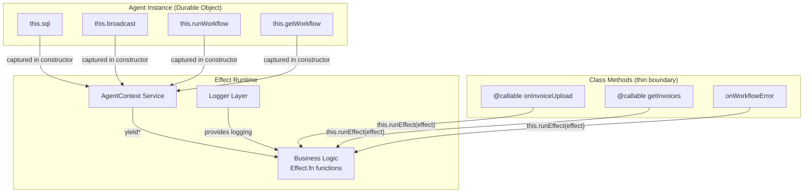

# Organization Agent Effect v4 Refactor Research

## Current State

`src/organization-agent.ts` is imperative: raw `this.sql` template literals, manual `Schema.decodeUnknownSync` calls, direct `this.broadcast`/`this.runWorkflow` calls. No Effect pipelines, no services, no layers.

The Agent class itself must stay — Agents SDK requires `extends Agent<Env, State>`. The refactor targets the *internals*.

## Boundary Pattern: How This Codebase Bridges Effect

Two existing patterns for running Effect at imperative boundaries:

### Pattern A: `makeHttpRunEffect` (worker.ts)

Builds layers from env/request, returns `async (effect) => Promise<A>`. Used per-request in fetch handler. Layers include D1, KV, R2, Auth, etc.

```ts
const runEffect = makeHttpRunEffect(env, request);
const result = await runEffect(someEffect);
```

### Pattern B: `Effect.runPromiseWith` (Auth.ts, invoice-extraction-workflow.ts)

Extracts services inside an Effect.gen, then creates a `runEffect` that can be called from non-Effect callbacks (better-auth hooks, workflow step callbacks):

```ts
const services = yield* Effect.services<KV | Stripe | Repository>();
const runEffect = Effect.runPromiseWith(services);
runEffect(Effect.gen(function* () { ... }));
```

## What Is AgentContext?

The Agents SDK `Agent` class is a Durable Object. Business logic needs access to its instance capabilities: SQL, broadcast, workflow management. These are methods on `this` — unavailable to free-standing Effect functions.

`AgentContext` is an Effect service that captures these capabilities from the agent instance so that module-level Effect functions can access them via `yield*` without holding a reference to `this`.



In the constructor, we capture `this.sql`, `this.broadcast`, etc. into a `Layer.succeedServices` layer. This layer is baked into `this.runEffect`. Each class method is a one-liner that calls `this.runEffect(someEffect)`, where the real logic lives in module-level `Effect.fn` functions that `yield* AgentContext` to get the capabilities.

## Sync vs Async: Research Findings

**All methods can be async.** Research into the Agents SDK base class confirms:

- `onWorkflowProgress`, `onWorkflowError` — defined as `async`, return `Promise<void>`, awaited by SDK
- `@callable()` methods — the decorator accepts any return type. Client-side, all RPC calls return `Promise<T>` regardless of whether the server method is sync or async (Cloudflare RPC wraps with `Promisify<T>`)
- `saveExtractedJson` — called from `invoice-extraction-workflow.ts` via `Effect.tryPromise(() => agent.saveExtractedJson(...))`, already wrapped in a promise boundary

**Conclusion**: Converting all methods to return `Promise` via `this.runEffect` is safe. This is the right call since we want logging, structured errors, and composability across all methods.

## Logger Layer: Extract to Shared Module

`makeLoggerLayer` in worker.ts is a pure function of `env: Env` (reads only `env.ENVIRONMENT`). It's already needed in 3 places within worker.ts and now needed here.

**Plan**: Extract to `src/lib/LoggerLayer.ts`, import from both worker.ts and organization-agent.ts. The agent's `runEffect` layer will include it.

```ts
// src/lib/LoggerLayer.ts
import { Layer, Logger, References } from "effect";
import * as Schema from "effect/Schema";
import * as Domain from "@/lib/Domain";

export const makeLoggerLayer = (env: Env) => {
  const environment = Schema.decodeUnknownSync(Domain.Environment)(env.ENVIRONMENT);
  return Layer.merge(
    Logger.layer(
      environment === "production"
        ? [Logger.consoleJson, Logger.tracerLogger]
        : [Logger.consolePretty(), Logger.tracerLogger],
      { mergeWithExisting: false },
    ),
    Layer.succeed(References.MinimumLogLevel, environment === "production" ? "Info" : "Debug"),
  );
};
```

## Error Handling: Tagged Errors, Not `Effect.die`

`Effect.die` kills the fiber with an unrecoverable defect — callers cannot catch it. That's too aggressive for validation failures like invalid `r2ActionTime` which are expected-ish (bad caller input, not a bug in our code).

**Plan**: Define a tagged error for the agent's domain:

```ts
export class OrganizationAgentError extends Schema.TaggedErrorClass<OrganizationAgentError>()(
  "OrganizationAgentError",
  { message: Schema.String },
) {}
```

Use it for validation failures and SQL errors:

```ts
const r2ActionTime = Date.parse(upload.r2ActionTime);
if (!Number.isFinite(r2ActionTime)) {
  return yield* new OrganizationAgentError({ message: `Invalid r2ActionTime: ${upload.r2ActionTime}` });
}
```

Use `Effect.tryPromise` with the same error for async SDK calls:

```ts
yield* Effect.tryPromise({
  try: () => runWorkflow("INVOICE_EXTRACTION_WORKFLOW", ...),
  catch: (cause) => new OrganizationAgentError({
    message: cause instanceof Error ? cause.message : String(cause),
  }),
});
```

Sync SQL calls (`this.sql`) throw on failure. Wrap in `Effect.try`:

```ts
yield* Effect.try({
  try: () => sql`update Invoice set status = 'extracting' where ...`,
  catch: (cause) => new OrganizationAgentError({
    message: cause instanceof Error ? cause.message : String(cause),
  }),
});
```

## `this.sql` Binding

`this.sql` is a tagged template literal. `Function.prototype.bind` works for tagged templates — a tagged template call `sql\`...\`` is just `sql(strings, ...values)`, and `.bind(this)` preserves `this` for that call.

To be safe, we can use a wrapper:

```ts
const sql = <T = Record<string, unknown>>(strings: TemplateStringsArray, ...values: unknown[]) =>
  this.sql<T>(strings, ...values);
```

This is explicit and avoids any ambiguity. Recommend this approach.

## Proposed Approach

### AgentContext Service

Defined with explicit interface (no circular reference to `OrganizationAgent`):

```ts
export const AgentContext = ServiceMap.Service<{
  readonly sql: <T = Record<string, unknown>>(
    strings: TemplateStringsArray,
    ...values: unknown[]
  ) => T[];
  readonly broadcast: (message: string) => void;
  readonly runWorkflow: OrganizationAgent["runWorkflow"];
  readonly getWorkflow: OrganizationAgent["getWorkflow"];
}>("OrganizationAgent/AgentContext");
```

Note: `runWorkflow` and `getWorkflow` types still reference the base class — these are complex/generic signatures from the SDK. We'll use the Agent base class type (not `OrganizationAgent`) to avoid circular deps. Need to verify the exact import.

### All Methods Through Effect — Inline Style

Per your feedback: no separate named wrapper functions + thin class methods. Instead, inline `Effect.gen` directly in each class method. This is less tedious and keeps logic co-located:

```ts
@callable()
onInvoiceUpload(upload: { ... }) {
  return this.runEffect(
    Effect.gen(function* () {
      const ctx = yield* AgentContext;
      const r2ActionTime = Date.parse(upload.r2ActionTime);
      if (!Number.isFinite(r2ActionTime)) {
        return yield* new OrganizationAgentError({ message: `Invalid r2ActionTime: ${upload.r2ActionTime}` });
      }
      // ... rest of logic
    }),
  );
}

@callable()
getInvoices() {
  return this.runEffect(
    Effect.gen(function* () {
      const { sql } = yield* AgentContext;
      return decodeInvoices(sql`select * from Invoice order by createdAt desc`);
    }),
  );
}
```

### Constructor Setup

```ts
constructor(ctx: DurableObjectState, env: Env) {
  super(ctx, env);
  void this.sql`create table if not exists Invoice (...)`;
  const agentContextLayer = Layer.succeedServices(
    ServiceMap.make(AgentContext, {
      sql: <T = Record<string, unknown>>(strings: TemplateStringsArray, ...values: unknown[]) =>
        this.sql<T>(strings, ...values),
      broadcast: this.broadcast.bind(this),
      runWorkflow: this.runWorkflow.bind(this),
      getWorkflow: this.getWorkflow.bind(this),
    }),
  );
  const runtimeLayer = Layer.merge(agentContextLayer, makeLoggerLayer(env));
  this.runEffect = (effect) => Effect.runPromise(Effect.provide(effect, runtimeLayer));
}
```

### `broadcastActivity` Helper

Stays as a module-level `Effect.fn` since it's shared across multiple methods:

```ts
const broadcastActivity = Effect.fn("broadcastActivity")(
  function* (input: { level: WorkflowProgress["level"]; text: string }) {
    const { broadcast } = yield* AgentContext;
    broadcast(JSON.stringify({
      type: "activity",
      message: { createdAt: new Date().toISOString(), level: input.level, text: input.text },
    } satisfies ActivityEnvelope));
  },
);
```

## Proposed File Structure

Keep everything in `src/organization-agent.ts`. Module layout:

1. Imports
2. Schema definitions (unchanged)
3. `OrganizationAgentError` tagged error
4. `AgentContext` service definition
5. `broadcastActivity` shared Effect helper
6. `OrganizationAgent` class — constructor sets up `runEffect`, each method inlines `Effect.gen`

Extract `makeLoggerLayer` to `src/lib/LoggerLayer.ts` (new file, shared with worker.ts).

## Full Sketch

```ts
import { Agent, callable } from "agents";
import { Effect, Layer, ServiceMap } from "effect";
import * as Option from "effect/Option";
import * as Schema from "effect/Schema";

import type { ActivityEnvelope, WorkflowProgress } from "@/lib/Activity";
import { WorkflowProgressSchema } from "@/lib/Activity";
import { InvoiceStatus } from "@/lib/Domain";
import { makeLoggerLayer } from "@/lib/LoggerLayer";

export interface OrganizationAgentState {
  readonly message: string;
}

const InvoiceRowSchema = Schema.Struct({
  id: Schema.String,
  fileName: Schema.String,
  contentType: Schema.String,
  createdAt: Schema.Number,
  r2ActionTime: Schema.Number,
  idempotencyKey: Schema.String,
  r2ObjectKey: Schema.String,
  status: InvoiceStatus,
  extractedJson: Schema.NullOr(Schema.String),
  error: Schema.NullOr(Schema.String),
});

const activeWorkflowStatuses = new Set(["queued", "running", "waiting"]);
type InvoiceRow = typeof InvoiceRowSchema.Type;
const decodeInvoiceRow = Schema.decodeUnknownSync(Schema.NullOr(InvoiceRowSchema));
const decodeInvoices = Schema.decodeUnknownSync(Schema.Array(InvoiceRowSchema));

export class OrganizationAgentError extends Schema.TaggedErrorClass<OrganizationAgentError>()(
  "OrganizationAgentError",
  { message: Schema.String },
) {}

export const AgentContext = ServiceMap.Service<{
  readonly sql: <T = Record<string, unknown>>(
    strings: TemplateStringsArray,
    ...values: unknown[]
  ) => T[];
  readonly broadcast: (message: string) => void;
  readonly runWorkflow: Agent<Env, OrganizationAgentState>["runWorkflow"];
  readonly getWorkflow: Agent<Env, OrganizationAgentState>["getWorkflow"];
}>("OrganizationAgent/AgentContext");

const broadcastActivity = Effect.fn("broadcastActivity")(
  function* (input: { level: WorkflowProgress["level"]; text: string }) {
    const { broadcast } = yield* AgentContext;
    broadcast(JSON.stringify({
      type: "activity",
      message: { createdAt: new Date().toISOString(), level: input.level, text: input.text },
    } satisfies ActivityEnvelope));
  },
);

export const extractAgentInstanceName = (request: Request) => {
  const { pathname } = new URL(request.url);
  const segments = pathname.split("/").filter(Boolean);
  if (segments.length < 3 || segments[0] !== "agents") return null;
  return segments[2] ?? null;
};

export class OrganizationAgent extends Agent<Env, OrganizationAgentState> {
  initialState: OrganizationAgentState = { message: "Organization agent ready" };
  private declare runEffect: <A, E>(
    effect: Effect.Effect<A, E, typeof AgentContext["Service"]>,
  ) => Promise<A>;

  constructor(ctx: DurableObjectState, env: Env) {
    super(ctx, env);
    void this.sql`create table if not exists Invoice (
      id text primary key,
      fileName text not null,
      contentType text not null,
      createdAt integer not null,
      r2ActionTime integer not null,
      idempotencyKey text not null unique,
      r2ObjectKey text not null,
      status text not null,
      extractedJson text,
      error text
    )`;
    const agentContextLayer = Layer.succeedServices(
      ServiceMap.make(AgentContext, {
        sql: <T = Record<string, unknown>>(strings: TemplateStringsArray, ...values: unknown[]) =>
          this.sql<T>(strings, ...values),
        broadcast: this.broadcast.bind(this),
        runWorkflow: this.runWorkflow.bind(this),
        getWorkflow: this.getWorkflow.bind(this),
      }),
    );
    const runtimeLayer = Layer.merge(agentContextLayer, makeLoggerLayer(env));
    this.runEffect = (effect) => Effect.runPromise(Effect.provide(effect, runtimeLayer));
  }

  @callable()
  getTestMessage() {
    return this.runEffect(
      Effect.gen(function* () {
        yield* Effect.logDebug("getTestMessage called");
        // still need `this` for state — but state access doesn't go through AgentContext
        // this is a question: how to access this.state from inside Effect.gen?
        // Option: add state to AgentContext, or keep this method as a direct return
      }),
    );
  }

  @callable()
  onInvoiceUpload(upload: {
    invoiceId: string;
    r2ActionTime: string;
    idempotencyKey: string;
    r2ObjectKey: string;
    fileName: string;
    contentType: string;
  }) {
    return this.runEffect(
      Effect.gen(function* () {
        const { sql, runWorkflow, getWorkflow } = yield* AgentContext;
        const r2ActionTime = Date.parse(upload.r2ActionTime);
        if (!Number.isFinite(r2ActionTime)) {
          return yield* new OrganizationAgentError({
            message: `Invalid r2ActionTime: ${upload.r2ActionTime}`,
          });
        }
        const existing = decodeInvoiceRow(
          sql<InvoiceRow>`select * from Invoice where id = ${upload.invoiceId}`[0] ?? null,
        );
        if (existing && r2ActionTime < existing.r2ActionTime) return;
        const trackedWorkflow = getWorkflow(upload.idempotencyKey);
        if (trackedWorkflow && activeWorkflowStatuses.has(trackedWorkflow.status)) return;
        if (
          existing?.idempotencyKey === upload.idempotencyKey &&
          (existing.status === "extracting" || existing.status === "extracted")
        ) return;
        yield* Effect.try({
          try: () =>
            void sql`
              insert into Invoice (
                id, fileName, contentType, createdAt, r2ActionTime,
                idempotencyKey, r2ObjectKey, status, extractedJson, error
              ) values (
                ${upload.invoiceId}, ${upload.fileName}, ${upload.contentType},
                ${r2ActionTime}, ${r2ActionTime}, ${upload.idempotencyKey},
                ${upload.r2ObjectKey}, 'uploaded', null, null
              )
              on conflict(id) do update set
                fileName = excluded.fileName,
                contentType = excluded.contentType,
                r2ActionTime = excluded.r2ActionTime,
                idempotencyKey = excluded.idempotencyKey,
                r2ObjectKey = excluded.r2ObjectKey,
                status = 'uploaded',
                extractedJson = null,
                error = null
            `,
          catch: (cause) =>
            new OrganizationAgentError({
              message: cause instanceof Error ? cause.message : String(cause),
            }),
        });
        yield* broadcastActivity({ level: "info", text: `Invoice uploaded: ${upload.fileName}` });
        yield* Effect.tryPromise({
          try: () =>
            runWorkflow(
              "INVOICE_EXTRACTION_WORKFLOW",
              {
                invoiceId: upload.invoiceId,
                idempotencyKey: upload.idempotencyKey,
                r2ObjectKey: upload.r2ObjectKey,
                fileName: upload.fileName,
                contentType: upload.contentType,
              },
              { id: upload.idempotencyKey, metadata: { invoiceId: upload.invoiceId } },
            ),
          catch: (cause) =>
            new OrganizationAgentError({
              message: cause instanceof Error ? cause.message : String(cause),
            }),
        });
        yield* Effect.try({
          try: () =>
            void sql`
              update Invoice
              set status = 'extracting'
              where id = ${upload.invoiceId} and idempotencyKey = ${upload.idempotencyKey}
            `,
          catch: (cause) =>
            new OrganizationAgentError({
              message: cause instanceof Error ? cause.message : String(cause),
            }),
        });
      }),
    );
  }

  @callable()
  onInvoiceDelete(input: {
    invoiceId: string;
    r2ActionTime: string;
    r2ObjectKey: string;
  }) {
    return this.runEffect(
      Effect.gen(function* () {
        const { sql } = yield* AgentContext;
        const r2ActionTime = Date.parse(input.r2ActionTime);
        if (!Number.isFinite(r2ActionTime)) {
          return yield* new OrganizationAgentError({
            message: `Invalid r2ActionTime: ${input.r2ActionTime}`,
          });
        }
        const deleted = yield* Effect.try({
          try: () =>
            sql<{ id: string }>`
              delete from Invoice
              where id = ${input.invoiceId} and r2ActionTime <= ${r2ActionTime}
              returning id
            `,
          catch: (cause) =>
            new OrganizationAgentError({
              message: cause instanceof Error ? cause.message : String(cause),
            }),
        });
        if (deleted.length === 0) return;
        yield* broadcastActivity({ level: "info", text: "Invoice deleted" });
      }),
    );
  }

  saveExtractedJson(input: {
    invoiceId: string;
    idempotencyKey: string;
    extractedJson: string;
  }) {
    return this.runEffect(
      Effect.gen(function* () {
        const { sql } = yield* AgentContext;
        const updated = yield* Effect.try({
          try: () =>
            sql<{ id: string; fileName: string }>`
              update Invoice
              set status = 'extracted',
                  extractedJson = ${input.extractedJson},
                  error = null
              where id = ${input.invoiceId} and idempotencyKey = ${input.idempotencyKey}
              returning id, fileName
            `,
          catch: (cause) =>
            new OrganizationAgentError({
              message: cause instanceof Error ? cause.message : String(cause),
            }),
        });
        if (updated.length === 0) return;
        yield* broadcastActivity({
          level: "success",
          text: `Invoice extraction completed: ${updated[0].fileName}`,
        });
      }),
    );
  }

  async onWorkflowProgress(
    workflowName: string,
    _workflowId: string,
    progress: unknown,
  ): Promise<void> {
    return this.runEffect(
      Effect.gen(function* () {
        if (workflowName !== "INVOICE_EXTRACTION_WORKFLOW") return;
        const message = Schema.decodeUnknownExit(WorkflowProgressSchema)(progress);
        if (message._tag === "Failure") return;
        yield* broadcastActivity(message.value);
      }),
    );
  }

  async onWorkflowError(
    workflowName: string,
    workflowId: string,
    error: string,
  ): Promise<void> {
    return this.runEffect(
      Effect.gen(function* () {
        if (workflowName !== "INVOICE_EXTRACTION_WORKFLOW") return;
        const { sql } = yield* AgentContext;
        const updated = yield* Effect.try({
          try: () =>
            sql<{ id: string; fileName: string }>`
              update Invoice
              set status = 'error',
                  error = ${error}
              where idempotencyKey = ${workflowId}
              returning id, fileName
            `,
          catch: (cause) =>
            new OrganizationAgentError({
              message: cause instanceof Error ? cause.message : String(cause),
            }),
        });
        if (updated.length === 0) return;
        yield* broadcastActivity({
          level: "error",
          text: `Invoice extraction failed: ${updated[0].fileName}`,
        });
      }),
    );
  }

  @callable()
  getInvoices() {
    return this.runEffect(
      Effect.gen(function* () {
        const { sql } = yield* AgentContext;
        return decodeInvoices(sql`select * from Invoice order by createdAt desc`);
      }),
    );
  }
}
```

## Open Design Detail: `this.state` Access

`getTestMessage` currently returns `this.state.message`. Inside `Effect.gen(function* () { ... })`, `this` is not the agent. Two options:

1. **Capture before entering Effect**: `const message = this.state.message; return this.runEffect(Effect.succeed(message));`
2. **Add `state` to AgentContext**: makes state accessible inside Effect pipelines

Recommendation: option 1 for simple reads, option 2 if state access becomes common.

## `runWorkflow` / `getWorkflow` Typing

These are complex generics from the Agent base class. To avoid circular references, type them via `Agent<Env, OrganizationAgentState>["runWorkflow"]` (base class, not our subclass). Need to verify this works without import issues.
