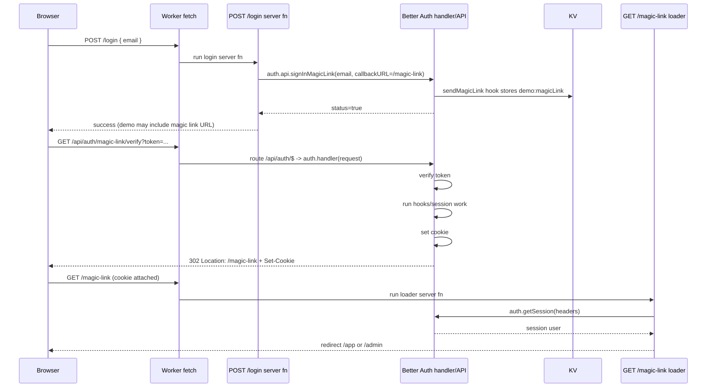
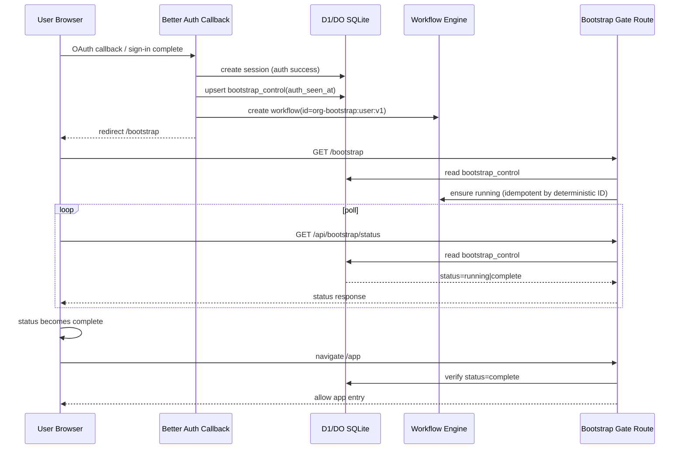
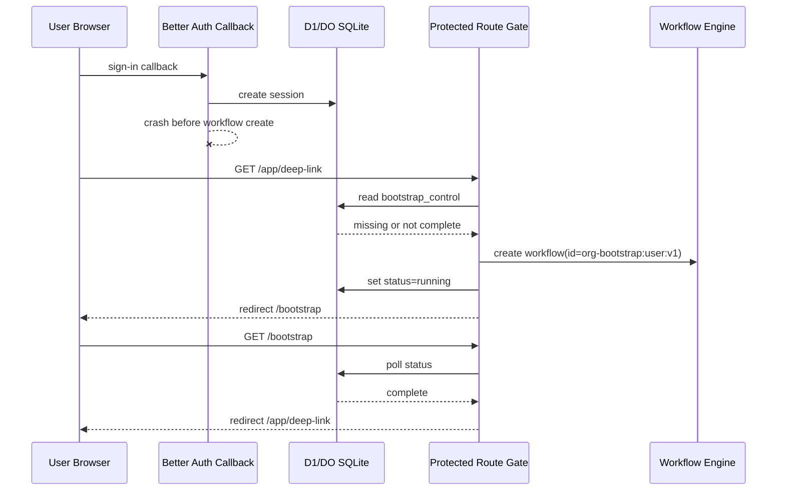
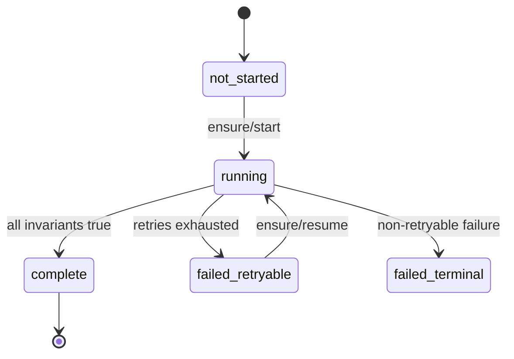

# Organization Bootstrap Fault Tolerance Research (Revised)

## TL;DR

- Yes: use a Workflow as the bootstrap runner.
- No: do not rely on Durable Object in-memory state. If Durable Objects are used at all, use their SQLite storage as the durable source, or use D1 as source-of-truth.
- Authentication success and bootstrap completion are separate distributed events. Treat them independently.
- App entry must be gated by durable bootstrap invariants on every protected entry path, not only the auth callback redirect.
- Bootstrap logic must follow a convergent loop: read durable truth -> one write -> read durable truth.
- On ambiguous failures (timeout, connection reset, worker restart), do not blind retry writes. Re-read first.

## What Was Wrong In The Previous Version

The previous version had the right direction but two major gaps:

1. Crash window was under-modeled.
   - Login can succeed, session can exist, and process can crash before synchronous bootstrap gate runs.
2. State machine durability was vague.
   - "One bootstrap owner" is not enough unless ownership and progress are durable across crashes/restarts.

Those are correctness issues, not implementation details.

## First-Principles Failure Model

Assume all of the following are true:

1. Better Auth organization bootstrap requires multiple API calls.
2. Calls are not a single atomic transaction.
3. A call can fail after the side effect already committed.
4. Worker/request/runtime can crash or restart between any two calls.
5. Duplicate triggers can happen (multi-tab, retries, refresh, callback replay, racey client behavior).
6. Async systems (Queues, eventually-consistent projections, stale caches) may lag.

If any of these are true, correctness requires durable checkpointing and durable invariant checks.

## Grounding From Docs

- Cloudflare Queues are at-least-once and may duplicate delivery.
  - `refs/cloudflare-docs/src/content/docs/queues/reference/delivery-guarantees.mdx`
- Durable Objects lose in-memory state on hibernation/restart; important state must be persisted.
  - `refs/cloudflare-docs/src/content/docs/durable-objects/concepts/durable-object-lifecycle.mdx`
  - `refs/cloudflare-docs/src/content/docs/durable-objects/reference/in-memory-state.mdx`
- Durable Object storage is private, transactional, and strongly consistent.
  - `refs/cloudflare-docs/src/content/docs/durable-objects/best-practices/access-durable-objects-storage.mdx`
- Workflows persist step state, retry steps, and resume from last successful step after interruption.
  - `refs/cloudflare-docs/src/content/docs/workflows/get-started/guide.mdx`
  - `refs/cloudflare-docs/src/content/docs/workflows/build/rules-of-workflows.mdx`
- Better Auth organization behavior is configurable:
  - active org can be client-managed and optional, not always session-persisted.
  - creator role can be `owner` or `admin`.
  - `refs/better-auth/docs/content/docs/plugins/organization.mdx`

## Correctness Requirements

### Safety

The system must never:

1. allow app entry unless bootstrap invariants are durably true;
2. trust API success response without post-write verification;
3. trust queue/DO cache/projection as authority for first app use.

### Liveness

The system must:

1. eventually complete bootstrap or surface explicit terminal failure;
2. recover automatically from process/runtime crash;
3. converge under duplicate/concurrent bootstrap attempts.

## Durable Invariants (Config-Aware)

Bootstrap is complete when all required durable invariants for this app policy are true:

1. user exists;
2. target organization exists (or already-existing one selected by policy);
3. membership exists with required role policy (`owner` or `admin`, based on config);
4. org context for authorization is resolvable at app entry:
   - either active org is set in session,
   - or app auth path derives org deterministically from durable truth;
5. first protected app authorization check succeeds without waiting for async projection.

Important: do not hardcode "exactly one organization" unless product policy explicitly requires it.

## Primary Architecture

### A) Durable source-of-truth

Use D1 (or a DO with SQLite storage) for authoritative bootstrap state.

If using Durable Objects:

- in-memory fields are cache only;
- SQLite storage is authority;
- in-memory loss on hibernation/restart is expected and must not break correctness.

### B) Workflow as bootstrap runner

Use a Cloudflare Workflow instance as the state-machine executor.

Why Workflow is the right owner:

1. each step is independently retryable;
2. step outputs are persisted;
3. crash/restart resumes from last successful step;
4. retry behavior is explicit and configurable;
5. aligns with "read -> write -> verify" convergent steps.

### C) Route-level bootstrap gate

Gate all protected app entry paths with a durable bootstrap check.

Do not rely solely on auth callback flow ordering.

Flow:

1. user authenticates;
2. callback redirects to `/bootstrap` (or equivalent gate route), not main app;
3. gate checks durable bootstrap status;
4. if incomplete, gate ensures workflow is running and waits/polls;
5. only when complete, redirect to app.

Also enforce the same check in protected server loaders/middleware so deep links cannot bypass the gate.

## Bootstrap State Model

Maintain durable bootstrap status keyed by user:

- `not_started`
- `running`
- `complete`
- `failed_retryable`
- `failed_terminal`

Minimal durable fields:

- `user_id` (pk)
- `workflow_instance_id`
- `status`
- `last_completed_step`
- `last_error_code`
- `last_error_message`
- `updated_at`
- `version`

This record is control-plane truth for gate behavior.

## Bootstrap Algorithm (Workflow Steps)

Each step follows the same shape:

1. read durable state;
2. if invariant already true, return success for step;
3. perform exactly one write;
4. read durable state again;
5. verify invariant;
6. if still false and error is retryable, throw to retry step;
7. if terminal condition, throw non-retryable error and mark terminal failure.

Suggested step sequence:

1. resolve target organization (existing by policy or create);
2. ensure membership with required role;
3. ensure org context used by auth path (session active org or deterministic fallback path);
4. run final authorization probe used by app entry;
5. mark bootstrap `complete` durably.

No side effects outside `step.do` boundaries.

## Concurrency and Duplicate Triggers

Use deterministic workflow instance ID per user for first bootstrap:

- `org-bootstrap:${userId}`

Trigger behavior:

1. gate tries to create workflow;
2. if duplicate/exists error occurs, treat as already-running and fetch status;
3. never start multiple independent bootstrap runners for same user bootstrap generation.

If re-bootstrap is needed later, use explicit generation/version in ID.

## Crash Scenarios and Recovery

### Crash after auth success, before bootstrap starts

- Next protected request hits gate.
- Gate sees bootstrap status is not `complete`.
- Gate triggers or resumes workflow.
- User remains in setup gate; app is not entered early.

### Crash during bootstrap step

- Workflow resumes from last successful step checkpoint.
- Re-executed step re-reads durable truth before write, so it converges.

### Write committed but caller timed out

- Step retry begins with read.
- If invariant now true, skip duplicate write.
- If false, write again.

### Duplicate tabs or repeated callbacks

- Deterministic workflow ID + durable status prevents divergent multi-run behavior.

## Role of Queues and Durable Objects (Secondary)

Queues and DO caches are still useful, but not authoritative for bootstrap correctness.

Use queues for:

- projection/fanout/non-blocking follow-up work.

Use Durable Objects for:

- low-latency coordination/cache/session-adjacent state.

Rule:

- first app authorization must succeed from durable truth directly (D1/DO SQLite), or from synchronous repair from that durable truth.
- never block first correctness on async queue catch-up.

## Current Magic Link Callback Flow (As Implemented)

This section describes the exact runtime flow in this repo so callback behavior is concrete.

### Terminology clarification (important)

There are two different routes involved and they are easy to confuse:

1. **Magic-link verify endpoint**: `/api/auth/magic-link/verify`
   - This is the Better Auth endpoint that consumes token/state and performs auth/session work.
   - It is handled by `src/routes/api/auth/$.tsx` -> `auth.handler(request)`.
2. **`callbackURL` target**: `/magic-link`
   - This is the post-verify redirect destination configured in `signInMagicLink`.
   - In this app, `/magic-link` only checks session and redirects to `/app` or `/admin`.

So your point is correct: hooks/session creation happen during **verify endpoint** handling, before landing on `/magic-link`.

Relevant code:

- `src/routes/api/auth/$.tsx`
- `src/lib/Auth.ts`
- `src/lib/Login.ts`
- `src/routes/magic-link.tsx`
- `src/worker.ts`

### Where each route runs

- Both routes run server-side in the Worker `fetch` pipeline.
- `/api/auth/magic-link/verify` runs through Better Auth handler.
- `/magic-link` runs TanStack route loader `src/routes/magic-link.tsx`.

### What happens when user clicks magic link

Browser-side events:

1. user clicks the URL from email (or demo link shown on `/login`);
2. browser performs full navigation to `/api/auth/magic-link/verify?...`;
3. browser follows redirect responses automatically;
4. browser stores auth cookies from `Set-Cookie` headers automatically.

Server-side events:

1. Worker handles `GET /api/auth/magic-link/verify`;
2. request is routed to `src/routes/api/auth/$.tsx` server handler;
3. handler calls `auth.handler(request)`;
4. Better Auth verifies token, resolves/creates user/session, runs related hooks, sets session cookie;
5. Better Auth redirects to configured `callbackURL` (`/magic-link` in this app);
6. browser requests `/magic-link`;
7. `/magic-link` loader calls `auth.getSession(headers)` and redirects to `/app` or `/admin`.

### Mermaid: verify endpoint vs callbackURL target



### Why this matters for fault tolerance

- In this repo's happy path, verify endpoint success is a strong signal that setup ran:
  - Better Auth `databaseHooks` run in the request lifecycle and `after` hooks run after create/update operations.
  - This code creates organization in `user.create.after` and backfills session `activeOrganizationId` for null sessions.
- So if `/api/auth/magic-link/verify` returns success and redirects, session + org context are usually already prepared before `/magic-link`.
- Fault-tolerance concern is not "/magic-link ran but setup did not" in normal flow. The concern is interruption before successful verify completion, plus rare partial-commit/error windows.
- Therefore protected routes should still enforce a durable bootstrap gate as recovery and correctness boundary, especially for crash/retry/concurrent-tab edge cases.

## Concrete Implementation Sketch

This section is the non-handwavy version.

### 1) Durable schema (D1 or DO SQLite)

```sql
create table if not exists bootstrap_control (
  user_id text primary key,
  generation integer not null default 1,
  status text not null check (status in (
    'not_started',
    'running',
    'complete',
    'failed_retryable',
    'failed_terminal'
  )),
  workflow_instance_id text,
  auth_seen_at integer,
  bootstrap_started_at integer,
  bootstrap_completed_at integer,
  last_completed_step text,
  last_error_code text,
  last_error_message text,
  updated_at integer not null,
  version integer not null default 0
);

create index if not exists idx_bootstrap_status on bootstrap_control(status);
```

```sql
create table if not exists bootstrap_events (
  id text primary key,
  user_id text not null,
  generation integer not null,
  event_type text not null,
  payload_json text,
  created_at integer not null
);
```

`bootstrap_control` is gate authority. `bootstrap_events` is optional observability/audit.

### 2) Deterministic workflow identity

- `workflow_instance_id = org-bootstrap:${userId}:v${generation}`
- Use this ID everywhere so duplicate triggers converge to one runner.
- If `create()` returns duplicate ID error, treat as already running and continue.

### 3) Auth-side integration (best-effort starter, not sole owner)

In Better Auth `after` hook on sign-in/session creation:

1. upsert `bootstrap_control` row if missing;
2. set `auth_seen_at = now`;
3. if status is not `complete`, call `ensureBootstrapStarted(userId)`;
4. redirect user to `/bootstrap`.

Important: this hook is optimization. Correctness does not depend on it succeeding.

### 4) Gate-side integration (actual correctness owner)

On every protected app entry (server loader/middleware):

1. require authenticated session;
2. read `bootstrap_control` by `user_id`;
3. if missing or status != `complete`, call `ensureBootstrapStarted(userId)` and redirect to `/bootstrap`;
4. only allow route if status == `complete`.

This closes the crash hole: auth can complete, process can die, and next protected request still repairs and gates.

### 5) `/bootstrap` route behavior

Server loader:

1. require session;
2. call `ensureBootstrapStarted(userId)`;
3. return current `bootstrap_control` state.

Client behavior:

1. poll `/api/bootstrap/status` every 1-2s;
2. when status becomes `complete`, redirect to app home;
3. if `failed_terminal`, render support/retry UX.

### 6) Workflow contract (step-by-step)

Each step is strictly:

1. read durable truth;
2. if invariant already true, return;
3. one write;
4. read again;
5. verify invariant;
6. throw retryable/non-retryable error accordingly.

Workflow steps:

1. `resolve-org`
   - find existing org by app policy, else create;
2. `ensure-membership`
   - verify required role policy (`owner` or `admin` config-aware), create/repair if needed;
3. `ensure-org-context`
   - set session active org if app requires session-persisted active org;
   - otherwise persist deterministic fallback context used by app auth path;
4. `authz-probe`
   - run the same authorization read used by first protected request;
5. `mark-complete`
   - set `status='complete'`, set `bootstrap_completed_at`, clear error fields.

### 7) `ensureBootstrapStarted(userId)` behavior

Pseudo-logic:

```ts
async function ensureBootstrapStarted(userId: string) {
  const now = Date.now()
  let row = await db.getBootstrapControl(userId)

  if (!row) {
    await db.insertBootstrapControl({
      userId,
      status: "not_started",
      updatedAt: now,
    })
    row = await db.getBootstrapControl(userId)
  }

  if (row.status === "complete") return row

  const instanceId = `org-bootstrap:${userId}:v${row.generation}`

  try {
    await env.BOOTSTRAP_WORKFLOW.create({
      id: instanceId,
      params: { userId, generation: row.generation },
    })
  } catch (error) {
    if (!isDuplicateWorkflowIdError(error)) throw error
  }

  await db.updateBootstrapControl(userId, {
    status: "running",
    workflowInstanceId: instanceId,
    bootstrapStartedAt: row.bootstrapStartedAt ?? now,
    updatedAt: now,
  })

  return await db.getBootstrapControl(userId)
}
```

### 8) Mermaid: happy path



### 9) Mermaid: crash after auth, before bootstrap start



### 10) Mermaid: state machine



### 11) Why this is fault-tolerant for both auth and bootstrap

- Auth is fault-tolerant because session durability is independent and gate re-checks durable bootstrap status later.
- Bootstrap is fault-tolerant because runner state is durable (Workflow checkpoints + durable control row), not in-memory.
- Combined safety holds because protected routes require both conditions:
  1. authenticated session exists;
  2. durable bootstrap status is `complete`.

## Implementation Decision

From first principles and Cloudflare primitives, the proper solution is:

1. **Workflow-run bootstrap state machine** for crash-safe orchestration.
2. **Durable bootstrap status record** for gate control-plane truth.
3. **Protected-route gate enforcement** so auth completion cannot bypass bootstrap completion.
4. **Read-before-retry convergent writes** for all ambiguous failures.

Anything weaker leaves a real, user-visible broken state: authenticated but unusable.
