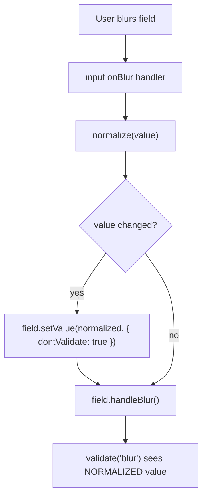

# Text Length Constraints Research

## Problem

The Invoice and InvoiceItem SQLite schemas have no length constraints on text columns.
Data flows in from two external sources:

1. **User upload** — filenames, content types via `uploadInvoice` callable
2. **AI extraction** — all InvoiceExtractionFields and InvoiceItemFields from the extraction workflow

Unbounded text can break UI rendering, waste storage in per-DObject SQLite, and mask upstream bugs.

## Effect v4 Schema Patterns for Length Constraints

### API surface

```ts
import * as Schema from "effect/Schema";

// Built-in filters — used with .check()
Schema.isMinLength(n); // length >= n
Schema.isMaxLength(n); // length <= n
Schema.isLengthBetween(min, max); // min <= length <= max
Schema.isNonEmpty(); // length >= 1 (shorthand for isMinLength(1))
Schema.isTrimmed(); // s.trim() === s

// Built-in constrained types
Schema.NonEmptyString; // String.check(isNonEmpty())
Schema.Trimmed; // String.check(isTrimmed())
Schema.Char; // String.check(isLengthBetween(1, 1))

// Composing checks — multiple filters in one .check() call
const Email = Schema.String.check(Schema.isMaxLength(254), Schema.isTrimmed());

// Branded types for domain clarity
const Currency = Schema.String.check(Schema.isLengthBetween(3, 10)).pipe(
  Schema.brand("Currency"),
);

// Custom error messages
const VendorName = Schema.String.check(
  Schema.isMaxLength(500, {
    message: "Vendor name must be 500 characters or fewer",
  }),
);

// Short-circuit with .abort() — skip remaining checks on first failure
const Id = Schema.String.check(
  Schema.isLengthBetween(1, 36).abort(),
  Schema.isTrimmed(),
);

// Trim + length check combined
const TrimmedBounded = Schema.Trimmed.check(
  Schema.isNonEmpty(),
  Schema.isMaxLength(500),
);
```

### Key files

| Location                                           | Content                       |
| -------------------------------------------------- | ----------------------------- |
| `refs/effect4/packages/effect/src/Schema.ts:6323`  | `isMinLength`                 |
| `refs/effect4/packages/effect/src/Schema.ts:6386`  | `isMaxLength`                 |
| `refs/effect4/packages/effect/src/Schema.ts:6428`  | `isLengthBetween`             |
| `refs/effect4/packages/effect/src/Schema.ts:6364`  | `isNonEmpty`                  |
| `refs/effect4/packages/effect/src/Schema.ts:4922`  | `isTrimmed`                   |
| `refs/effect4/packages/effect/src/Schema.ts:4881`  | `makeFilter` (custom filters) |
| `refs/effect4/packages/effect/SCHEMA.md:136-152`   | String check examples         |
| `refs/effect4/packages/effect/SCHEMA.md:2279-2524` | Filter/validation patterns    |
| `refs/effect4/packages/effect/SCHEMA.md:2485-2497` | Branding patterns             |

## Current DB Schema (src/organization-agent.ts:95-132)

### Invoice table

```sql
create table if not exists Invoice (
  id text primary key,
  name text not null default '',
  fileName text not null default '',
  contentType text not null default '',
  createdAt integer not null default (unixepoch() * 1000),
  r2ActionTime integer,
  idempotencyKey text unique,
  r2ObjectKey text not null default '',
  status text not null,
  invoiceConfidence real not null default 0,
  invoiceNumber text not null default '',
  invoiceDate text not null default '',
  dueDate text not null default '',
  currency text not null default '',
  vendorName text not null default '',
  vendorEmail text not null default '',
  vendorAddress text not null default '',
  billToName text not null default '',
  billToEmail text not null default '',
  billToAddress text not null default '',
  subtotal text not null default '',
  tax text not null default '',
  total text not null default '',
  amountDue text not null default '',
  extractedJson text,
  error text
);
```

### InvoiceItem table

```sql
create table if not exists InvoiceItem (
  id text primary key,
  invoiceId text not null references Invoice(id) on delete cascade,
  "order" real not null,
  description text not null default '',
  quantity text not null default '',
  unitPrice text not null default '',
  amount text not null default '',
  period text not null default ''
);
```

## Current Domain Schemas (src/lib/OrganizationDomain.ts)

```ts
export const InvoiceExtractionFields = Schema.Struct({
  invoiceConfidence: Schema.Number,
  invoiceNumber: Schema.String,
  invoiceDate: Schema.String,
  dueDate: Schema.String,
  currency: Schema.String,
  vendorName: Schema.String,
  vendorEmail: Schema.String,
  vendorAddress: Schema.String,
  billToName: Schema.String,
  billToEmail: Schema.String,
  billToAddress: Schema.String,
  subtotal: Schema.String,
  tax: Schema.String,
  total: Schema.String,
  amountDue: Schema.String,
});

export const InvoiceItemFields = Schema.Struct({
  description: Schema.String,
  quantity: Schema.String,
  unitPrice: Schema.String,
  amount: Schema.String,
  period: Schema.String,
});
```

All fields are bare `Schema.String` with no constraints.

## Proposed Domain Schema Changes

Two schema helpers depending on the use case. Code-controlled columns (`id`, `status`, `idempotencyKey`) left unconstrained per decision #1.

### Effect Schema helpers

```ts
import { SchemaTransformation } from "effect/Schema"

// Transform schema: trims then checks length. Use as the primary schema.
// Form validation: TanStack Form discards transform output (known issue #1723),
// but validation still passes/fails correctly.
// Server decode: trim is applied, DB gets clean data.
const trimMax = (max: number) =>
  Schema.String.pipe(Schema.decode(SchemaTransformation.trim()))
    .check(Schema.isMaxLength(max))

// Validation-only schema: rejects untrimmed or over-length strings, no mutation.
// Use for cases where the caller must normalize before validation.
const trimmedMax = (max: number) =>
  Schema.String.check(Schema.isTrimmed(), Schema.isMaxLength(max))
```

**Primary approach: `trimMax` (transform schema).** The form uses it as a validator — TanStack Form discards the trimmed output but validation works correctly. The server fn decodes through the same schema — trim is applied, DB gets clean data. No component-level normalization needed for trimming.

**`trimmedMax` (validation-only)** is available for cases where the caller has already normalized and wants strict checking.

### InvoiceExtractionFields (OrganizationDomain.ts)

```ts
export const InvoiceExtractionFields = Schema.Struct({
  invoiceConfidence: Schema.Number,
  invoiceNumber: trimMax(100),
  invoiceDate: trimMax(50),
  dueDate: trimMax(50),
  currency: trimMax(10),
  vendorName: trimMax(500),
  vendorEmail: trimMax(254),
  vendorAddress: trimMax(2000),
  billToName: trimMax(500),
  billToEmail: trimMax(254),
  billToAddress: trimMax(2000),
  subtotal: trimMax(50),
  tax: trimMax(50),
  total: trimMax(50),
  amountDue: trimMax(50),
})
```

### InvoiceItemFields (OrganizationDomain.ts)

```ts
export const InvoiceItemFields = Schema.Struct({
  description: trimMax(2000),
  quantity: trimMax(50),
  unitPrice: trimMax(50),
  amount: trimMax(50),
  period: trimMax(50),
})
```

### Invoice struct — fields that need constraints

```ts
export const Invoice = Schema.Struct({
  id: Schema.String,
  name: trimMax(500),
  fileName: trimMax(500),
  contentType: trimMax(100),
  createdAt: Schema.Number,
  r2ActionTime: Schema.NullOr(Schema.Number),
  idempotencyKey: Schema.NullOr(Schema.String),
  r2ObjectKey: Schema.String,
  status: InvoiceStatus,
  ...InvoiceExtractionFields.fields,
  extractedJson: Schema.NullOr(trimMax(100_000)),
  error: Schema.NullOr(trimMax(10_000)),
})
```

### Alternative schema approaches

#### Validation-only schema (`trimmedMax`)

Rejects untrimmed strings instead of trimming them. Only useful if the caller has already normalized.

```ts
const trimmedMax = (max: number) =>
  Schema.String.check(Schema.isTrimmed(), Schema.isMaxLength(max))
```

Trade-off: requires all input paths to trim before validation. More complex form-side wiring needed (see normalize-before-blur pattern above).

#### Split input vs DB schemas

Use `trimMax` at input boundaries, length-only for DB reads. Avoids trim overhead on reads.

- `Schema.decode(SchemaTransformation.trim())` applies trim on decode: `refs/effect4/packages/effect/SCHEMA.md:2935-2941`
- `trim` is decode-only (`Getter.trim()` with `Getter.passthrough()` for encode): `refs/effect4/packages/effect/SCHEMA.md:2967-2973`

```ts
const bounded = (max: number) =>
  Schema.String.check(Schema.isMaxLength(max))

const makeInvoiceFields = (text: (max: number) => Schema.Schema<string>) =>
  Schema.Struct({
    invoiceNumber: text(100),
    vendorName: text(500),
    vendorEmail: text(254),
  })

export const InvoiceFieldsInput = makeInvoiceFields(trimMax)
export const InvoiceFieldsDb = makeInvoiceFields(bounded)
```

Trade-off: more exports, must pick the right schema per call site. Overkill unless trim overhead on DB reads is measurable.

#### Schema approach trade-offs

| Approach | Pros | Cons |
| --- | --- | --- |
| `trimMax` (transform, recommended) | One schema everywhere; server trims on decode; form validates correctly | Trim runs on every decode; form state stays untrimmed |
| `trimmedMax` (validation-only) | Schema never mutates; strict checking | Requires all input paths to normalize before validation |
| Split schemas | DB reads avoid trim overhead | More exports; must pick the right schema per call site |

### SQLite DDL — CHECK constraints

```sql
-- Add to Invoice table DDL
check(length(name) <= 500),
check(length(fileName) <= 500),
check(length(contentType) <= 100),
check(length(r2ObjectKey) <= 200),
check(length(invoiceNumber) <= 100),
check(length(invoiceDate) <= 50),
check(length(dueDate) <= 50),
check(length(currency) <= 10),
check(length(vendorName) <= 500),
check(length(vendorEmail) <= 254),
check(length(vendorAddress) <= 2000),
check(length(billToName) <= 500),
check(length(billToEmail) <= 254),
check(length(billToAddress) <= 2000),
check(length(subtotal) <= 50),
check(length(tax) <= 50),
check(length(total) <= 50),
check(length(amountDue) <= 50),
check(length(extractedJson) <= 100000),
check(length(error) <= 10000)

-- Add to InvoiceItem table DDL
check(length(description) <= 2000),
check(length(quantity) <= 50),
check(length(unitPrice) <= 50),
check(length(amount) <= 50),
check(length(period) <= 50)
```

## Proposed Constraints

### Rationale per field

| Column           | Source                  | Proposed Limit | Why                                                          |
| ---------------- | ----------------------- | -------------- | ------------------------------------------------------------ |
| `id`             | code (UUID v4)          | 36             | Always UUID format. DB check optional since code-controlled. |
| `name`           | derived from fileName   | 500            | Truncated fileName. Same bound as fileName.                  |
| `fileName`       | user upload             | 500            | Most OS limits are 255 chars. 500 is generous for UTF-8.     |
| `contentType`    | user upload (validated) | 100            | Longest common MIME type is ~40 chars. 100 is generous.      |
| `idempotencyKey` | code (UUID)             | 36             | Always UUID.                                                 |
| `r2ObjectKey`    | code                    | 200            | Format: `{orgId}/invoices/{uuid}`. Bounded by construction.  |
| `status`         | code (enum)             | 20             | Longest value is "extracting" (10 chars).                    |
| `invoiceNumber`  | extraction (AI)         | 100            | Invoice numbers vary but rarely exceed 50 chars.             |
| `invoiceDate`    | extraction (AI)         | 50             | ISO 8601 date is 10 chars, with timezone ~25.                |
| `dueDate`        | extraction (AI)         | 50             | Same as invoiceDate.                                         |
| `currency`       | extraction (AI)         | 10             | ISO 4217 is 3 chars. 10 allows display names.                |
| `vendorName`     | extraction (AI)         | 500            | Company names, generous limit.                               |
| `vendorEmail`    | extraction (AI)         | 254            | RFC 5321 max email length.                                   |
| `vendorAddress`  | extraction (AI)         | 2000           | Multi-line address, can be verbose.                          |
| `billToName`     | extraction (AI)         | 500            | Same as vendorName.                                          |
| `billToEmail`    | extraction (AI)         | 254            | Same as vendorEmail.                                         |
| `billToAddress`  | extraction (AI)         | 2000           | Same as vendorAddress.                                       |
| `subtotal`       | extraction (AI)         | 50             | Numeric string like "1,234,567.89".                          |
| `tax`            | extraction (AI)         | 50             | Same as subtotal.                                            |
| `total`          | extraction (AI)         | 50             | Same as subtotal.                                            |
| `amountDue`      | extraction (AI)         | 50             | Same as subtotal.                                            |
| `extractedJson`  | code (serialized)       | 100000         | Full extraction payload.                                     |
| `error`          | code                    | 10000          | Error messages. Generous but bounded.                        |
| `description`    | extraction (AI)         | 2000           | Line item descriptions can be lengthy.                       |
| `quantity`       | extraction (AI)         | 50             | Numeric string.                                              |
| `unitPrice`      | extraction (AI)         | 50             | Numeric string.                                              |
| `amount`         | extraction (AI)         | 50             | Numeric string.                                              |
| `period`         | extraction (AI)         | 50             | Date range strings.                                          |

### No constraint needed

| Column             | Why                                                      |
| ------------------ | -------------------------------------------------------- |
| `id` (both tables) | Code-controlled UUIDs. Harmless to add but not critical. |
| `status`           | Code-controlled enum.                                    |
| `idempotencyKey`   | Code-controlled UUID.                                    |

## Decisions

1. **Code-controlled columns** (`id`, `status`, `idempotencyKey`): Skip constraints. No DB CHECK, no Effect Schema checks.

2. **`r2ObjectKey`**: Cap at 200 chars.

3. **`extractedJson`**: Cap at 100KB.

4. **Trimming strategy**: Use `trimMax` (transform schema) as both the form validator and server decoder. TanStack Form discards the transform output ([#1723](https://github.com/TanStack/form/issues/1723)), but validation passes/fails correctly. The server fn decodes through the same schema — trim is applied, DB gets clean data. No component-level normalization needed for trimming.

   The user sees untrimmed text in the form field (e.g. `" John Smith "` stays as-is after blur). This is acceptable — the server normalizes before persistence.

### Field normalization in TanStack Form (for visual feedback)

For cases where the field value should visually update on blur — date formatting (`"march 5"` → `"2026-03-05"`), currency, phone numbers — component-level normalization is needed. Trimming does **not** require this (server handles it), but the pattern is documented here for other normalizers.

TanStack Form has no first-class normalization API ([#418](https://github.com/TanStack/form/issues/418)). The shape is always the same:

1. User types freely
2. On blur, normalize the value (format, parse)
3. Then validate the normalized value

### Normalize-before-blur in a field component

Normalize in the input's `onBlur` handler **before** calling `field.handleBlur()`, so blur validators always see the normalized value. Centralize in a pre-bound component via `createFormHook`.

#### Why not a form-level onBlur listener?

Form-level `onBlur` listeners run **after** blur validation. From source:

**`handleBlur`** (`refs/tan-form/packages/form-core/src/FieldApi.ts:1944-1955`):

```ts
handleBlur = () => {
  // ...set isTouched, isBlurred meta...
  this.validate('blur')          // 1. blur validators run FIRST
  this.triggerOnBlurListener()   // 2. blur listeners run AFTER
}
```

A form-level listener that normalizes would run at step 2 — after blur validators already saw the raw value. If the blur validator checks `isTrimmed()` or date format, it rejects the raw input, then the listener normalizes, then `setValue` re-validates via onChange. The user sees a flash of a spurious error.

#### Why not onChange validation?

`isTrimmed()` on `validators.onChange` fires on every keystroke. A space is valid mid-string (e.g. `"John Smith"`), but `isTrimmed()` rejects leading/trailing whitespace — so typing a trailing space before the next word shows a false error. onChange is wrong for normalization checks.

#### Correct approach: normalize in input onBlur, validate on blur

Use `field.setValue(normalized, { dontValidate: true })` to set the normalized value without triggering change validation, then call `field.handleBlur()` which runs blur validation on the now-normalized value.

**`setValue`** (`refs/tan-form/packages/form-core/src/FieldApi.ts:1390-1404`):

```ts
setValue = (updater, options?) => {
  this.form.setFieldValue(...)
  if (!options?.dontRunListeners) this.triggerOnChangeListener()
  if (!options?.dontValidate) this.validate('change')
}
```

**`UpdateMetaOptions`** (`refs/tan-form/packages/form-core/src/types.ts:132-145`):

```ts
export interface UpdateMetaOptions {
  dontUpdateMeta?: boolean
  dontValidate?: boolean
  dontRunListeners?: boolean
}
```

Flow:



No spurious errors. No flash. Blur validator sees clean data.

#### Normalizing field component

Centralize in a pre-bound component via `createFormHook`. The optional `normalize` prop accepts any `string → string` function — date formatting, currency formatting, etc. No default normalizer — trimming is handled by the schema/server path.

```tsx
function TextField({
  label,
  normalize,
}: {
  label: string
  normalize?: (value: string) => string
}) {
  const field = useFieldContext<string>()
  return (
    <label>
      <span>{label}</span>
      <input
        value={field.state.value}
        onChange={(e) => field.handleChange(e.target.value)}
        onBlur={(e) => {
          if (normalize) {
            const normalized = normalize(e.target.value)
            if (normalized !== field.state.value) {
              field.setValue(normalized, { dontValidate: true })
            }
          }
          field.handleBlur()
        }}
      />
    </label>
  )
}

const { useAppForm } = createFormHook({
  fieldContext,
  formContext,
  fieldComponents: { TextField },
  formComponents: {},
})
```

Usage examples:

```tsx
// Plain text field — no normalize prop needed. Trim handled by schema/server.
<form.AppField
  name="vendorName"
  validators={{ onBlur: vendorNameSchema }}
  children={(field) => <field.TextField label="Vendor Name" />}
/>

// Date normalization — parse loose input into canonical format on blur
<form.AppField
  name="invoiceDate"
  validators={{ onBlur: invoiceDateSchema }}
  children={(field) => (
    <field.TextField label="Invoice Date" normalize={parseLooseDate} />
  )}
/>

// Currency — uppercase on blur for visual feedback
<form.AppField
  name="currency"
  validators={{ onBlur: currencySchema }}
  children={(field) => (
    <field.TextField
      label="Currency"
      normalize={(v) => v.trim().toUpperCase()}
    />
  )}
/>
```

Docs:
- Custom form hooks: `refs/tan-form/docs/framework/react/guides/form-composition.md:10-44`
- Pre-bound field components: `refs/tan-form/docs/framework/react/guides/form-composition.md:46-104`

   **Background on TanStack Form and schema transforms:**

   TanStack Form discards schema transform output ([#1723](https://github.com/TanStack/form/issues/1723)). Transform schemas (like `trimMax`) still work as validators — the form checks pass/fail correctly. But the form state retains the raw value. The server fn decodes through the same schema and gets the transformed value.

   - "Validation will not provide you with transformed values." `refs/tan-form/docs/framework/react/guides/validation.md:461`
   - "The value passed to the onSubmit function will always be the input data... parse it in the onSubmit function." `refs/tan-form/docs/framework/react/guides/submission-handling.md:67-90`

### TanStack Form GitHub issues: normalization is a known gap

TanStack Form has no built-in normalization API. This is a known gap with active discussion.

**[#418](https://github.com/TanStack/form/issues/418) — Transform values on submit** (OPEN)

The canonical issue. Filed by the maintainer (`crutchcorn`). 19+ comments, unassigned, no PR.
- Original request: field-level `transformOnSubmit` prop (e.g. `transformOnSubmit={v => parseFloat(v)}`)
- `gutentag2012` suggests per-field `transformToBinding` / `transformFromBinding` on every change — not just submit. His signal-based form library implements this with a `handleChangeBound` that transforms the value before setting it in the form and a `transformedValue` attribute that runs the form value through the transformer.
- `juanvilladev` argues standard schema `z.input` / `z.output` should be respected — `defaultValues` typed as input, `onSubmit` typed as output
- `leomelzer` points to `standard-schema`'s `InferInput` / `InferOutput` as the right approach
- `bpinto`: "Wouldn't we need to perform the transformations on `onChange` (and others) events as well?"
- `luchillo17` workaround: define a separate Zod transformer, pass the base schema to form validators, transform once in the submit callback
- `Choco-milk-for-u`: "are there any solutions by any chance?"
- `myeljoud`: "Is there anything new in this regard?" (most recent comment)

**[#1723](https://github.com/TanStack/form/issues/1723) — Parsed value not returned from standard schema** (OPEN)

When using Zod/Valibot/Effect with transforms, `onSubmit` receives the raw value, not the parsed/transformed output. Trimming, coercion, and normalization in the schema are silently skipped.
- Official docs acknowledge: "While TanStack Form provides Standard Schema support for validation, it does not preserve the Schema's output data."
- `FLchs`: types are unsound — `onSubmit` value is typed as the schema output (e.g. `{age: number}`) but at runtime it's the raw input (e.g. `{age: "42"}`)
- Proposed fix: one-line change in `standardSchemaValidator.ts` — return `{ ok: true, data: result.value }` instead of bare `return` when no issues. No PR.

Workarounds noted in the issues:

```ts
// Workaround 1: re-parse in onSubmit (most common)
// Since the validator already checked validity, this parse is guaranteed to succeed.
onSubmit: async ({ value }) => {
  const transformed = v.parse(SomeFormSchema, value)
  await api.submit(transformed)
}

// Workaround 2: separate validation schema + transform schema (luchillo17)
const ValidationSchema = z.object({ startTime: z.string() })
const TransformSchema = z.transform(
  (dto: FormDTO): MutationModel => ({
    ...dto,
    startMinutes: hmToMinutes(dto.startTime),
  })
)
// Pass ValidationSchema to form validators
// Apply TransformSchema in onSubmit

// Workaround 3: cast defaultValues to match schema output type (leomelzer)
const defaultValues = {
  related_entry_id: null as unknown as number,
}
```

**[#163](https://github.com/TanStack/form/issues/163) — `preSubmit` for v2?** (CLOSED)

Normalization before submit was requested in the earliest TanStack Form versions. `preSubmit` was added in v2.9.0 (old react-form), but no equivalent exists in the current library.

**[#187](https://github.com/TanStack/form/issues/187) — Input masking** (CLOSED, stale)

Phone number formatting, date masking. No resolution — suggested using `prevalidate`. No built-in masking support added.

**Implication for our approach:** The normalize-before-blur pattern via a pre-bound component is the idiomatic workaround given the current API. No community solution addresses normalize-then-validate on blur — the workarounds all focus on submit-time. If #418 or #1723 ship, normalization could move into the schema/validation layer. Until then, the component-level `normalize` prop is the cleanest option.

### SSR forms with TanStack Start

TanStack Form supports SSR with TanStack Start via `@tanstack/react-form-start`. This enables server-side validation as a second layer of defense beyond client-side form validation.

#### How it works

1. **Shared form shape** via `formOptions()` — used on both client and server.
2. **Server validation** via `createServerValidate()` — runs in a `createServerFn` handler.
3. **State merging** via `useTransform` + `mergeForm` — server validation errors flow back to the client form.
4. **Progressive enhancement** — form posts as `multipart/form-data` to the server fn URL, works without JS.

Docs: `refs/tan-form/docs/framework/react/guides/ssr.md:14-174`

#### SSR form pattern for TanStack Start

```tsx
// shared form options
import { formOptions } from '@tanstack/react-form-start'

export const formOpts = formOptions({
  defaultValues: {
    vendorName: '',
    vendorEmail: '',
  },
})
```

```tsx
// server validation
import { createServerValidate, ServerValidateError } from '@tanstack/react-form-start'

const serverValidate = createServerValidate({
  ...formOpts,
  onServerValidate: ({ value }) => {
    // Run Effect Schema validation on server
    // Return error string if validation fails
  },
})

export const handleForm = createServerFn({ method: 'POST' })
  .inputValidator((data: unknown) => {
    if (!(data instanceof FormData)) throw new Error('Invalid form data')
    return data
  })
  .handler(async (ctx) => {
    try {
      const validatedData = await serverValidate(ctx.data)
      // Server decodes through trimMax schemas — trim is applied here
    } catch (e) {
      if (e instanceof ServerValidateError) return e.response
      throw e
    }
  })
```

```tsx
// client form with SSR state merging
import { mergeForm, useForm, useTransform } from '@tanstack/react-form-start'

export const Route = createFileRoute('/')({
  component: Home,
  loader: async () => ({ state: await getFormDataFromServer() }),
})

function Home() {
  const { state } = Route.useLoaderData()
  const form = useForm({
    ...formOpts,
    transform: useTransform((baseForm) => mergeForm(baseForm, state), [state]),
  })

  return (
    <form action={handleForm.url} method="post" encType="multipart/form-data">
      {/* Uses pre-bound TextField with normalize-on-blur (default: trim) */}
    </form>
  )
}
```

#### SSR form trade-offs

| Aspect | Client-only form | SSR form |
| --- | --- | --- |
| Validation | Client-side only (until server fn call) | Client + server validation, errors merge back |
| Progressive enhancement | Requires JS | Works without JS via native form post |
| Normalization | TextField normalizes on blur before validation | TextField normalizes on blur + server normalizes on submit |
| Complexity | Lower — no server validate setup | Higher — `formOptions`, `createServerValidate`, `useTransform`/`mergeForm` |
| Security | Depends on server fn validation | Server validation is explicit and integrated |

#### When to use SSR forms

- Forms that must work without JavaScript (accessibility, progressive enhancement)
- Forms where server-side validation feedback should integrate seamlessly into the form UI (not just a toast/error banner)
- Forms with server-side-only validation rules (uniqueness checks, authorization)

For the invoice editing use case, SSR forms may be overkill if the primary path is already: client form → `createServerFn` → Effect Schema validation → DB write. The server fn already validates. SSR forms add value if you want server validation errors to appear inline on form fields without custom wiring.

#### Submission-time normalization

Parsing in `onSubmit` produces a transformed output value but does not mutate form state. It is normalization of the submitted data, not a state mutation.

5. **Branded types**: No brands for now.

6. **Date format validation**: Defer.

7. **SSR forms**: Evaluate. Current forms use client-only TanStack Form → `createServerFn`. SSR form pattern (`@tanstack/react-form-start`) adds server-side validation with error merging but increases complexity. Worth it if we want progressive enhancement or inline server validation errors. See SSR Forms section above.

## Next Steps

- [ ] Add `trimMax()` helper and constrained fields to `OrganizationDomain.ts`
- [ ] Add CHECK constraints to SQLite DDL in `organization-agent.ts`
- [ ] Wire `trimMax` schemas as form validators (onBlur) — form validates, server trims on decode
- [ ] Ensure extraction workflow decodes through the constrained schemas (AI output gets trimmed)
- [ ] Create `createFormHook` with pre-bound `TextField` supporting optional `normalize` prop for visual normalization (dates, currency — not needed for trim)
- [ ] Decide on SSR form adoption (see trade-offs above)
- [ ] Verify UI form validation surfaces constraint violations before DB write
