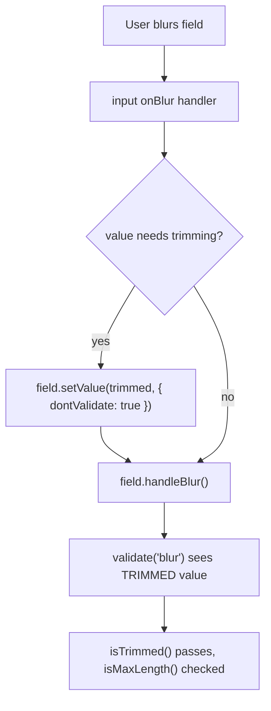

# Text Length Constraints Research

## Problem

The Invoice and InvoiceItem SQLite schemas have no length constraints on text columns.
Data flows in from two external sources:

1. **User upload** — filenames, content types via `uploadInvoice` callable
2. **AI extraction** — all InvoiceExtractionFields and InvoiceItemFields from the extraction workflow

Unbounded text can break UI rendering, waste storage in per-DObject SQLite, and mask upstream bugs.

## Effect v4 Schema Patterns for Length Constraints

### API surface

```ts
import * as Schema from "effect/Schema";

// Built-in filters — used with .check()
Schema.isMinLength(n); // length >= n
Schema.isMaxLength(n); // length <= n
Schema.isLengthBetween(min, max); // min <= length <= max
Schema.isNonEmpty(); // length >= 1 (shorthand for isMinLength(1))
Schema.isTrimmed(); // s.trim() === s

// Built-in constrained types
Schema.NonEmptyString; // String.check(isNonEmpty())
Schema.Trimmed; // String.check(isTrimmed())
Schema.Char; // String.check(isLengthBetween(1, 1))

// Composing checks — multiple filters in one .check() call
const Email = Schema.String.check(Schema.isMaxLength(254), Schema.isTrimmed());

// Branded types for domain clarity
const Currency = Schema.String.check(Schema.isLengthBetween(3, 10)).pipe(
  Schema.brand("Currency"),
);

// Custom error messages
const VendorName = Schema.String.check(
  Schema.isMaxLength(500, {
    message: "Vendor name must be 500 characters or fewer",
  }),
);

// Short-circuit with .abort() — skip remaining checks on first failure
const Id = Schema.String.check(
  Schema.isLengthBetween(1, 36).abort(),
  Schema.isTrimmed(),
);

// Trim + length check combined
const TrimmedBounded = Schema.Trimmed.check(
  Schema.isNonEmpty(),
  Schema.isMaxLength(500),
);
```

### Key files

| Location                                           | Content                       |
| -------------------------------------------------- | ----------------------------- |
| `refs/effect4/packages/effect/src/Schema.ts:6323`  | `isMinLength`                 |
| `refs/effect4/packages/effect/src/Schema.ts:6386`  | `isMaxLength`                 |
| `refs/effect4/packages/effect/src/Schema.ts:6428`  | `isLengthBetween`             |
| `refs/effect4/packages/effect/src/Schema.ts:6364`  | `isNonEmpty`                  |
| `refs/effect4/packages/effect/src/Schema.ts:4922`  | `isTrimmed`                   |
| `refs/effect4/packages/effect/src/Schema.ts:4881`  | `makeFilter` (custom filters) |
| `refs/effect4/packages/effect/SCHEMA.md:136-152`   | String check examples         |
| `refs/effect4/packages/effect/SCHEMA.md:2279-2524` | Filter/validation patterns    |
| `refs/effect4/packages/effect/SCHEMA.md:2485-2497` | Branding patterns             |

## Current DB Schema (src/organization-agent.ts:95-132)

### Invoice table

```sql
create table if not exists Invoice (
  id text primary key,
  name text not null default '',
  fileName text not null default '',
  contentType text not null default '',
  createdAt integer not null default (unixepoch() * 1000),
  r2ActionTime integer,
  idempotencyKey text unique,
  r2ObjectKey text not null default '',
  status text not null,
  invoiceConfidence real not null default 0,
  invoiceNumber text not null default '',
  invoiceDate text not null default '',
  dueDate text not null default '',
  currency text not null default '',
  vendorName text not null default '',
  vendorEmail text not null default '',
  vendorAddress text not null default '',
  billToName text not null default '',
  billToEmail text not null default '',
  billToAddress text not null default '',
  subtotal text not null default '',
  tax text not null default '',
  total text not null default '',
  amountDue text not null default '',
  extractedJson text,
  error text
);
```

### InvoiceItem table

```sql
create table if not exists InvoiceItem (
  id text primary key,
  invoiceId text not null references Invoice(id) on delete cascade,
  "order" real not null,
  description text not null default '',
  quantity text not null default '',
  unitPrice text not null default '',
  amount text not null default '',
  period text not null default ''
);
```

## Current Domain Schemas (src/lib/OrganizationDomain.ts)

```ts
export const InvoiceExtractionFields = Schema.Struct({
  invoiceConfidence: Schema.Number,
  invoiceNumber: Schema.String,
  invoiceDate: Schema.String,
  dueDate: Schema.String,
  currency: Schema.String,
  vendorName: Schema.String,
  vendorEmail: Schema.String,
  vendorAddress: Schema.String,
  billToName: Schema.String,
  billToEmail: Schema.String,
  billToAddress: Schema.String,
  subtotal: Schema.String,
  tax: Schema.String,
  total: Schema.String,
  amountDue: Schema.String,
});

export const InvoiceItemFields = Schema.Struct({
  description: Schema.String,
  quantity: Schema.String,
  unitPrice: Schema.String,
  amount: Schema.String,
  period: Schema.String,
});
```

All fields are bare `Schema.String` with no constraints.

## Proposed Domain Schema Changes

Schemas validate only — check that values are trimmed and within max length, never mutate.
Trimming is the form layer's responsibility (see Trimming Strategy below).
Code-controlled columns (`id`, `status`, `idempotencyKey`) left unconstrained per decision #1.

### Effect Schema helper (validation only)

```ts
const trimmedMax = (max: number) =>
  Schema.String.check(Schema.isTrimmed(), Schema.isMaxLength(max))
```

Rejects untrimmed or over-length strings. No transformation — callers must trim before passing data through.

### InvoiceExtractionFields (OrganizationDomain.ts)

```ts
export const InvoiceExtractionFields = Schema.Struct({
  invoiceConfidence: Schema.Number,
  invoiceNumber: trimmedMax(100),
  invoiceDate: trimmedMax(50),
  dueDate: trimmedMax(50),
  currency: trimmedMax(10),
  vendorName: trimmedMax(500),
  vendorEmail: trimmedMax(254),
  vendorAddress: trimmedMax(2000),
  billToName: trimmedMax(500),
  billToEmail: trimmedMax(254),
  billToAddress: trimmedMax(2000),
  subtotal: trimmedMax(50),
  tax: trimmedMax(50),
  total: trimmedMax(50),
  amountDue: trimmedMax(50),
})
```

### InvoiceItemFields (OrganizationDomain.ts)

```ts
export const InvoiceItemFields = Schema.Struct({
  description: trimmedMax(2000),
  quantity: trimmedMax(50),
  unitPrice: trimmedMax(50),
  amount: trimmedMax(50),
  period: trimmedMax(50),
})
```

### Invoice struct — fields that need constraints

```ts
export const Invoice = Schema.Struct({
  id: Schema.String,
  name: trimmedMax(500),
  fileName: trimmedMax(500),
  contentType: trimmedMax(100),
  createdAt: Schema.Number,
  r2ActionTime: Schema.NullOr(Schema.Number),
  idempotencyKey: Schema.NullOr(Schema.String),
  r2ObjectKey: Schema.String,
  status: InvoiceStatus,
  ...InvoiceExtractionFields.fields,
  extractedJson: Schema.NullOr(trimmedMax(100_000)),
  error: Schema.NullOr(trimmedMax(10_000)),
})
```

### Alternative: Transform-based schemas

For reference, two transform-based approaches are viable if validation-only proves insufficient.

#### Option A: Single schema (trim + length everywhere)

Use `SchemaTransformation.trim()` + `isMaxLength()` — decode always trims.

```ts
const trimMax = (max: number) =>
  Schema.String.pipe(Schema.decode(SchemaTransformation.trim()))
    .check(Schema.isMaxLength(max))
```

#### Option B: Split input vs DB schemas (trim on input only)

Trim is decode-only, encode is passthrough in Effect v4. Use `trimMax` at input boundaries, `bounded` for DB reads.

- `Schema.decode(SchemaTransformation.trim())` applies trim on decode: `refs/effect4/packages/effect/SCHEMA.md:2935-2941`
- `trim` is decode-only (`Getter.trim()` with `Getter.passthrough()` for encode): `refs/effect4/packages/effect/SCHEMA.md:2967-2973`

```ts
const bounded = (max: number) =>
  Schema.String.check(Schema.isMaxLength(max))

const trimMax = (max: number) =>
  Schema.String.pipe(Schema.decode(SchemaTransformation.trim()))
    .check(Schema.isMaxLength(max))

const makeInvoiceFields = (text: (max: number) => Schema.Schema<string>) =>
  Schema.Struct({
    invoiceNumber: text(100),
    vendorName: text(500),
    vendorEmail: text(254),
  })

export const InvoiceFieldsInput = makeInvoiceFields(trimMax)
export const InvoiceFieldsDb = makeInvoiceFields(bounded)
```

#### Transform trade-offs

| Approach | Pros | Cons |
| --- | --- | --- |
| Validation-only (`trimmedMax`) | Schema never mutates; trim lives in form/input layer; simplest mental model | Requires all input paths to trim before validation |
| Single transform (`trimMax`) | One export; always normalized | Trim runs on every decode; masks untrimmed DB values |
| Split schemas | Trim only at boundaries; DB reads stay exact | More exports; must pick the right schema per call site |

### SQLite DDL — CHECK constraints

```sql
-- Add to Invoice table DDL
check(length(name) <= 500),
check(length(fileName) <= 500),
check(length(contentType) <= 100),
check(length(r2ObjectKey) <= 200),
check(length(invoiceNumber) <= 100),
check(length(invoiceDate) <= 50),
check(length(dueDate) <= 50),
check(length(currency) <= 10),
check(length(vendorName) <= 500),
check(length(vendorEmail) <= 254),
check(length(vendorAddress) <= 2000),
check(length(billToName) <= 500),
check(length(billToEmail) <= 254),
check(length(billToAddress) <= 2000),
check(length(subtotal) <= 50),
check(length(tax) <= 50),
check(length(total) <= 50),
check(length(amountDue) <= 50),
check(length(extractedJson) <= 100000),
check(length(error) <= 10000)

-- Add to InvoiceItem table DDL
check(length(description) <= 2000),
check(length(quantity) <= 50),
check(length(unitPrice) <= 50),
check(length(amount) <= 50),
check(length(period) <= 50)
```

## Proposed Constraints

### Rationale per field

| Column           | Source                  | Proposed Limit | Why                                                          |
| ---------------- | ----------------------- | -------------- | ------------------------------------------------------------ |
| `id`             | code (UUID v4)          | 36             | Always UUID format. DB check optional since code-controlled. |
| `name`           | derived from fileName   | 500            | Truncated fileName. Same bound as fileName.                  |
| `fileName`       | user upload             | 500            | Most OS limits are 255 chars. 500 is generous for UTF-8.     |
| `contentType`    | user upload (validated) | 100            | Longest common MIME type is ~40 chars. 100 is generous.      |
| `idempotencyKey` | code (UUID)             | 36             | Always UUID.                                                 |
| `r2ObjectKey`    | code                    | 200            | Format: `{orgId}/invoices/{uuid}`. Bounded by construction.  |
| `status`         | code (enum)             | 20             | Longest value is "extracting" (10 chars).                    |
| `invoiceNumber`  | extraction (AI)         | 100            | Invoice numbers vary but rarely exceed 50 chars.             |
| `invoiceDate`    | extraction (AI)         | 50             | ISO 8601 date is 10 chars, with timezone ~25.                |
| `dueDate`        | extraction (AI)         | 50             | Same as invoiceDate.                                         |
| `currency`       | extraction (AI)         | 10             | ISO 4217 is 3 chars. 10 allows display names.                |
| `vendorName`     | extraction (AI)         | 500            | Company names, generous limit.                               |
| `vendorEmail`    | extraction (AI)         | 254            | RFC 5321 max email length.                                   |
| `vendorAddress`  | extraction (AI)         | 2000           | Multi-line address, can be verbose.                          |
| `billToName`     | extraction (AI)         | 500            | Same as vendorName.                                          |
| `billToEmail`    | extraction (AI)         | 254            | Same as vendorEmail.                                         |
| `billToAddress`  | extraction (AI)         | 2000           | Same as vendorAddress.                                       |
| `subtotal`       | extraction (AI)         | 50             | Numeric string like "1,234,567.89".                          |
| `tax`            | extraction (AI)         | 50             | Same as subtotal.                                            |
| `total`          | extraction (AI)         | 50             | Same as subtotal.                                            |
| `amountDue`      | extraction (AI)         | 50             | Same as subtotal.                                            |
| `extractedJson`  | code (serialized)       | 100000         | Full extraction payload.                                     |
| `error`          | code                    | 10000          | Error messages. Generous but bounded.                        |
| `description`    | extraction (AI)         | 2000           | Line item descriptions can be lengthy.                       |
| `quantity`       | extraction (AI)         | 50             | Numeric string.                                              |
| `unitPrice`      | extraction (AI)         | 50             | Numeric string.                                              |
| `amount`         | extraction (AI)         | 50             | Numeric string.                                              |
| `period`         | extraction (AI)         | 50             | Date range strings.                                          |

### No constraint needed

| Column             | Why                                                      |
| ------------------ | -------------------------------------------------------- |
| `id` (both tables) | Code-controlled UUIDs. Harmless to add but not critical. |
| `status`           | Code-controlled enum.                                    |
| `idempotencyKey`   | Code-controlled UUID.                                    |

## Decisions

1. **Code-controlled columns** (`id`, `status`, `idempotencyKey`): Skip constraints. No DB CHECK, no Effect Schema checks.

2. **`r2ObjectKey`**: Cap at 200 chars.

3. **`extractedJson`**: Cap at 100KB.

4. **Trimming strategy**: Form layer trims; schemas validate only. See details below.

   **Background:** `Schema.Trimmed` (`isTrimmed()`) is a check — it rejects untrimmed strings with an error, does not modify them. `Schema.decode(SchemaTransformation.trim())` is a transform — it always trims, never errors about whitespace. We use validation-only schemas (`isTrimmed()` + `isMaxLength()`), so trimming must happen before the schema sees the data.

   TanStack Form does not apply transformed schema output to form state:
   - "Validation will not provide you with transformed values." `refs/tan-form/docs/framework/react/guides/validation.md:461`
   - "The value passed to the onSubmit function will always be the input data... parse it in the onSubmit function." `refs/tan-form/docs/framework/react/guides/submission-handling.md:67-90`

### Trimming strategy: centralized trim-before-blur in TextField component (recommended)

Trim in the input's `onBlur` handler **before** calling `field.handleBlur()`, so blur validators always see the trimmed value. Centralize this in a pre-bound `TextField` component via `createFormHook`.

#### Why not a form-level onBlur listener?

Form-level `onBlur` listeners run **after** blur validation. From source:

**`handleBlur`** (`refs/tan-form/packages/form-core/src/FieldApi.ts:1944-1955`):

```ts
handleBlur = () => {
  // ...set isTouched, isBlurred meta...
  this.validate('blur')          // 1. blur validators run FIRST
  this.triggerOnBlurListener()   // 2. blur listeners run AFTER
}
```

A form-level listener that trims would run at step 2 — after blur validators already saw the untrimmed value. If `isTrimmed()` is on the blur validator, it rejects, then the listener trims, then `setValue` re-validates via onChange. The user sees a flash of a spurious trim error.

#### Why not onChange validation?

`isTrimmed()` on `validators.onChange` fires on every keystroke. A space is valid mid-string (e.g. `"John Smith"`), but `isTrimmed()` rejects leading/trailing whitespace — so typing a trailing space before the next word would show a false error. onChange is wrong for trim checking.

#### Correct approach: trim in input onBlur, validate on blur

Use `field.setValue(trimmed, { dontValidate: true })` to set the trimmed value without triggering change validation, then call `field.handleBlur()` which runs blur validation on the now-trimmed value.

**`setValue`** (`refs/tan-form/packages/form-core/src/FieldApi.ts:1390-1404`):

```ts
setValue = (updater, options?) => {
  this.form.setFieldValue(...)
  if (!options?.dontRunListeners) this.triggerOnChangeListener()
  if (!options?.dontValidate) this.validate('change')
}
```

**`UpdateMetaOptions`** (`refs/tan-form/packages/form-core/src/types.ts:132-145`):

```ts
export interface UpdateMetaOptions {
  dontUpdateMeta?: boolean
  dontValidate?: boolean
  dontRunListeners?: boolean
}
```

Flow:



No spurious errors. No flash. Blur validator sees clean data.

#### Centralized via TextField component

Use `createFormHook` to register a pre-bound `TextField` that handles trim-on-blur for all string fields:

```tsx
function TextField({ label }: { label: string }) {
  const field = useFieldContext<string>()
  return (
    <label>
      <span>{label}</span>
      <input
        value={field.state.value}
        onChange={(e) => field.handleChange(e.target.value)}
        onBlur={(e) => {
          const trimmed = e.target.value.trim()
          if (trimmed !== field.state.value) {
            field.setValue(trimmed, { dontValidate: true })
          }
          field.handleBlur()
        }}
      />
    </label>
  )
}

const { useAppForm } = createFormHook({
  fieldContext,
  formContext,
  fieldComponents: { TextField },
  formComponents: {},
})
```

Usage — validation via `validators.onBlur` with the Effect Schema:

```tsx
const form = useAppForm({
  defaultValues: { vendorName: '', vendorEmail: '' },
})

// ...
<form.AppField
  name="vendorName"
  validators={{ onBlur: vendorNameSchema }}
  children={(field) => <field.TextField label="Vendor Name" />}
/>
```

Docs:
- Custom form hooks: `refs/tan-form/docs/framework/react/guides/form-composition.md:10-44`
- Pre-bound field components: `refs/tan-form/docs/framework/react/guides/form-composition.md:46-104`
- Form-level listeners propagate to children: `refs/tan-form/docs/framework/react/guides/listeners.md:93-95`

#### Alternative: form-level onBlur listener (deferred trimming)

If centralizing in `TextField` is not feasible, a form-level listener works but with a caveat: blur validators see pre-trim values. Only viable if `isTrimmed()` is dropped from the schema and replaced with `isMaxLength()` only.

```tsx
const form = useForm({
  listeners: {
    onBlur: ({ fieldApi }) => {
      const value = fieldApi.state.value
      if (typeof value === "string") {
        const trimmed = value.trim()
        if (trimmed !== value) fieldApi.setValue(trimmed, { dontValidate: true })
      }
    },
  },
})
```

Trade-off: no schema-level guarantee that values are trimmed. Relies on all input paths using the listener. DB admits untrimmed strings since CHECK only enforces length.

### SSR forms with TanStack Start

TanStack Form supports SSR with TanStack Start via `@tanstack/react-form-start`. This enables server-side validation as a second layer of defense beyond client-side form validation.

#### How it works

1. **Shared form shape** via `formOptions()` — used on both client and server.
2. **Server validation** via `createServerValidate()` — runs in a `createServerFn` handler.
3. **State merging** via `useTransform` + `mergeForm` — server validation errors flow back to the client form.
4. **Progressive enhancement** — form posts as `multipart/form-data` to the server fn URL, works without JS.

Docs: `refs/tan-form/docs/framework/react/guides/ssr.md:14-174`

#### SSR form pattern for TanStack Start

```tsx
// shared form options
import { formOptions } from '@tanstack/react-form-start'

export const formOpts = formOptions({
  defaultValues: {
    vendorName: '',
    vendorEmail: '',
  },
})
```

```tsx
// server validation
import { createServerValidate, ServerValidateError } from '@tanstack/react-form-start'

const serverValidate = createServerValidate({
  ...formOpts,
  onServerValidate: ({ value }) => {
    // Run Effect Schema validation on server
    // Return error string if validation fails
  },
})

export const handleForm = createServerFn({ method: 'POST' })
  .inputValidator((data: unknown) => {
    if (!(data instanceof FormData)) throw new Error('Invalid form data')
    return data
  })
  .handler(async (ctx) => {
    try {
      const validatedData = await serverValidate(ctx.data)
      // Trim + validate with Effect Schema before persisting
      // This is where trimming happens on the server path
    } catch (e) {
      if (e instanceof ServerValidateError) return e.response
      throw e
    }
  })
```

```tsx
// client form with SSR state merging
import { mergeForm, useForm, useTransform } from '@tanstack/react-form-start'

export const Route = createFileRoute('/')({
  component: Home,
  loader: async () => ({ state: await getFormDataFromServer() }),
})

function Home() {
  const { state } = Route.useLoaderData()
  const form = useForm({
    ...formOpts,
    transform: useTransform((baseForm) => mergeForm(baseForm, state), [state]),
  })

  return (
    <form action={handleForm.url} method="post" encType="multipart/form-data">
      {/* Uses pre-bound TextField with trim-on-blur built in */}
    </form>
  )
}
```

#### SSR form trade-offs

| Aspect | Client-only form | SSR form |
| --- | --- | --- |
| Validation | Client-side only (until server fn call) | Client + server validation, errors merge back |
| Progressive enhancement | Requires JS | Works without JS via native form post |
| Trimming | TextField trims on blur before validation | TextField trims on blur + server normalizes on submit |
| Complexity | Lower — no server validate setup | Higher — `formOptions`, `createServerValidate`, `useTransform`/`mergeForm` |
| Security | Depends on server fn validation | Server validation is explicit and integrated |

#### When to use SSR forms

- Forms that must work without JavaScript (accessibility, progressive enhancement)
- Forms where server-side validation feedback should integrate seamlessly into the form UI (not just a toast/error banner)
- Forms with server-side-only validation rules (uniqueness checks, authorization)

For the invoice editing use case, SSR forms may be overkill if the primary path is already: client form → `createServerFn` → Effect Schema validation → DB write. The server fn already validates. SSR forms add value if you want server validation errors to appear inline on form fields without custom wiring.

#### Submission-time normalization

Parsing in `onSubmit` produces a transformed output value but does not mutate form state. It is normalization of the submitted data, not a state mutation.

5. **Branded types**: No brands for now.

6. **Date format validation**: Defer.

7. **SSR forms**: Evaluate. Current forms use client-only TanStack Form → `createServerFn`. SSR form pattern (`@tanstack/react-form-start`) adds server-side validation with error merging but increases complexity. Worth it if we want progressive enhancement or inline server validation errors. See SSR Forms section above.

## Next Steps

- [ ] Add `trimmedMax()` helper and constrained fields to `OrganizationDomain.ts`
- [ ] Add CHECK constraints to SQLite DDL in `organization-agent.ts`
- [ ] Create `createFormHook` with pre-bound `TextField` that trims on blur via `setValue({ dontValidate: true })` + `handleBlur()`
- [ ] Wire `validators.onBlur` using the constrained schemas on form fields
- [ ] Ensure extraction workflow decodes/validates through the constrained schemas
- [ ] Decide on SSR form adoption (see trade-offs above)
- [ ] Verify UI form validation surfaces constraint violations before DB write
