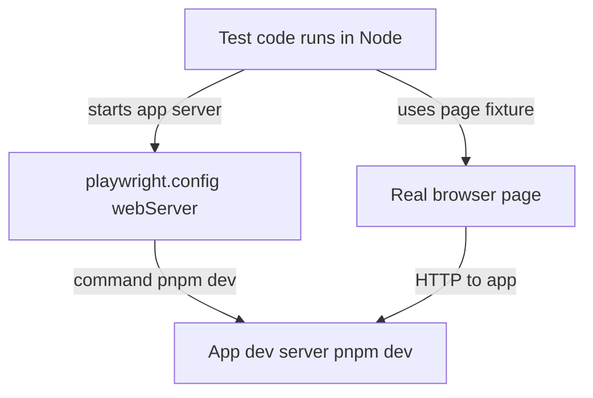
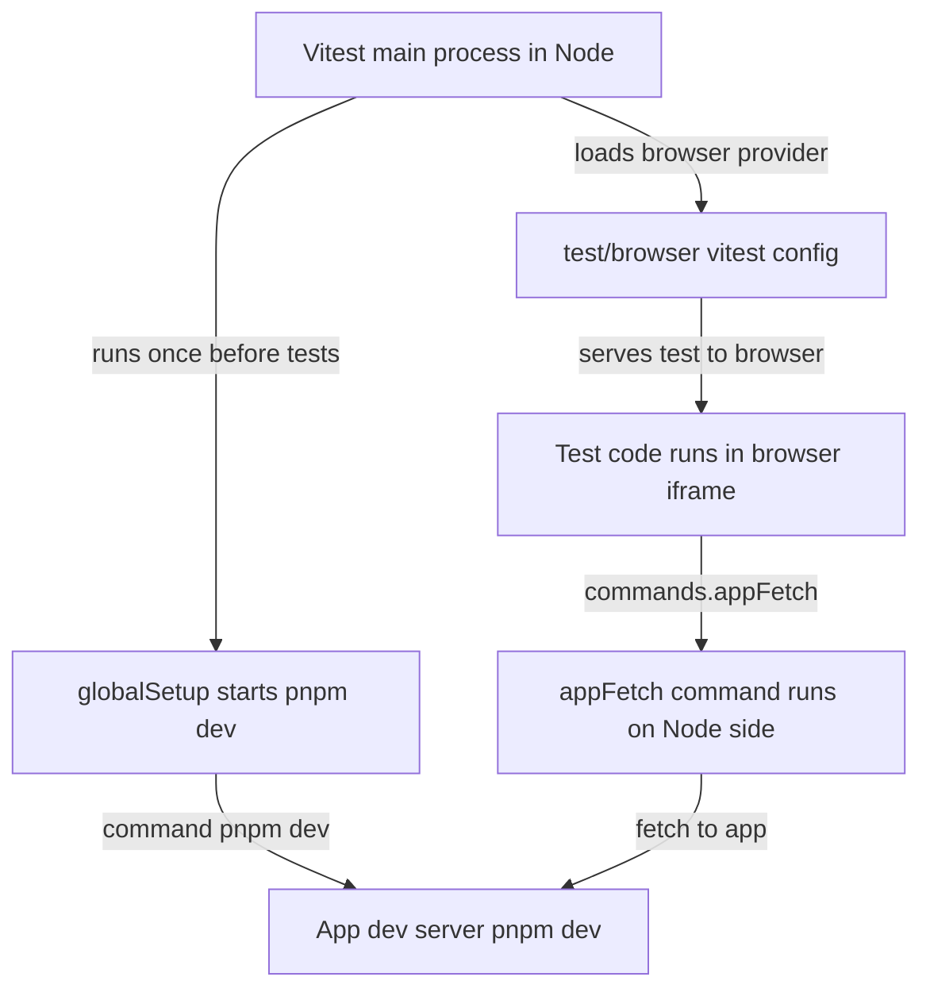
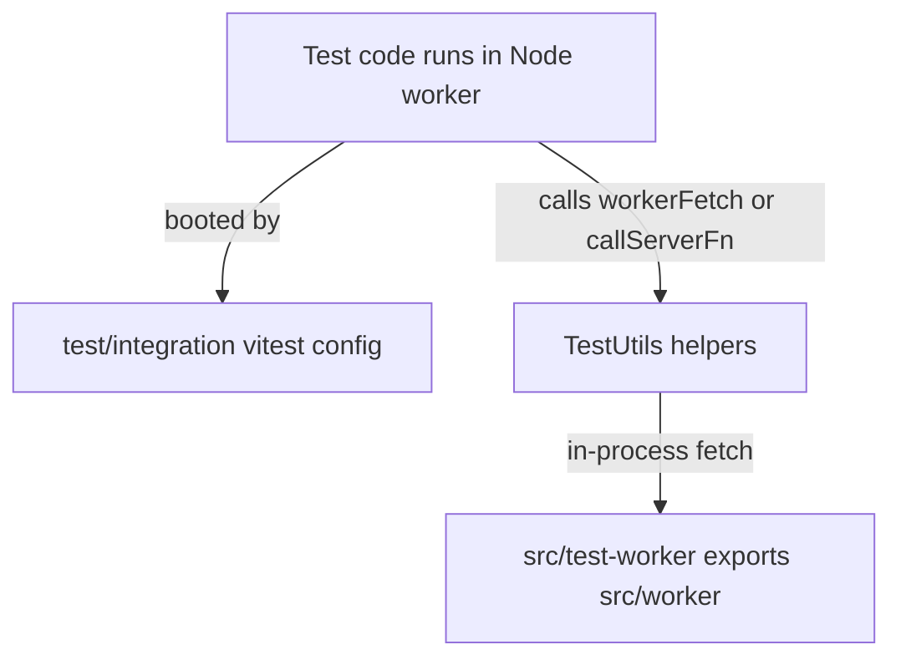
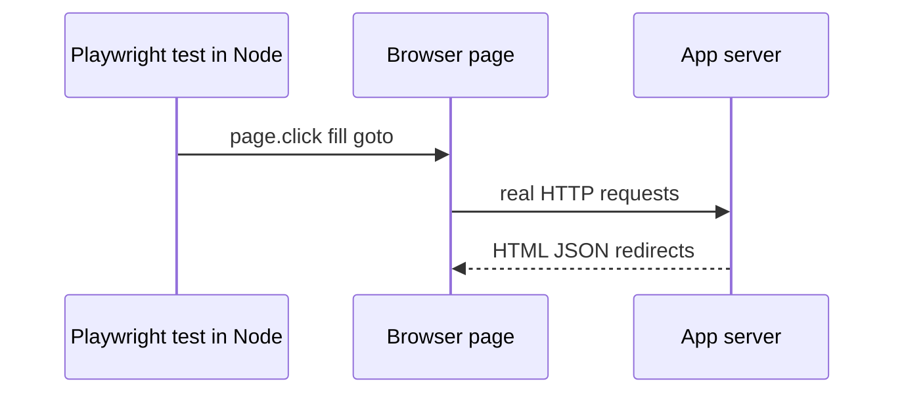
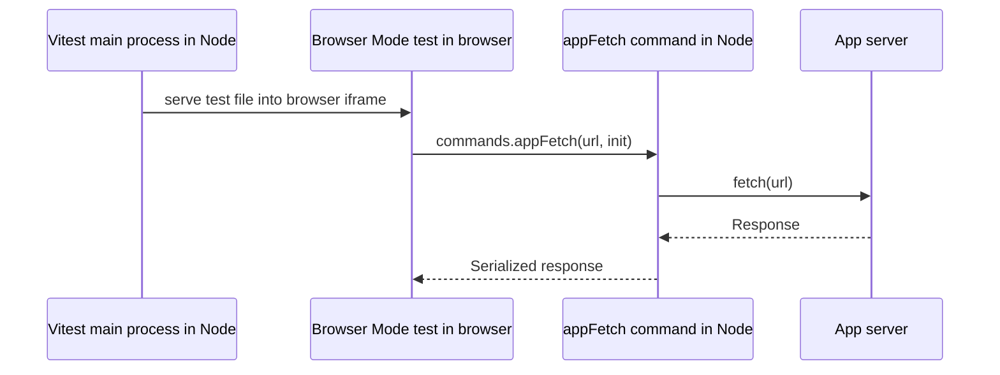
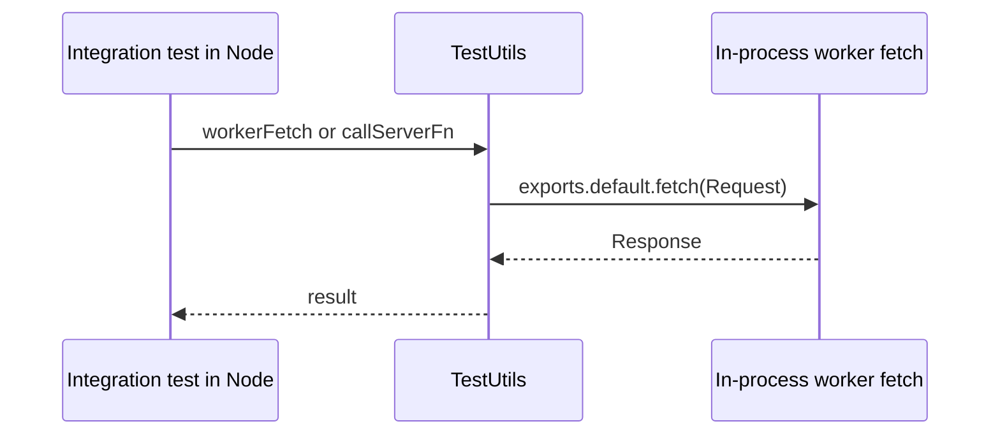

# Vitest Browser Mode with Playwright

## Bottom Line

Vitest Browser Mode with `playwright()` means:

- Vitest is still the test runner
- Playwright is the browser provider Vitest uses to drive a real browser
- your tests still use Vitest APIs like `test`, `expect`, `vi`, and `vitest/browser`

Standalone Playwright means:

- Playwright Test is both the runner and the browser automation layer
- your tests use Playwright fixtures like `{ page }` from `@playwright/test`
- the mental model is end-to-end test runner first, not unit/integration runner first

That is the main distinction. Browser Mode is not "Playwright with a different import path". It is Vitest running browser tests, with Playwright plugged in underneath.

## Execution Perspective

The easiest way to think about the three layers in this repo:

- Playwright E2E: the test is a remote control running in Node
- Vitest Browser Mode: the test body itself runs in a real browser page
- Vitest integration: the test runs in Node and calls the worker directly with no browser

The important question is not just "does it use Playwright?". The important question is: where does the test body execute?

### Diagram: Playwright E2E Execution



### Diagram: Browser Mode Execution



### Diagram: Integration Execution



### Diagram: Playwright E2E Request Path



### Diagram: Browser Mode Request Path



### Diagram: Integration Request Path



### Playwright E2E Perspective

From the test's point of view: "I am Node code controlling a browser."

- the test body runs in Node in files like [`e2e/upload.spec.ts`](file:///Users/mw/Documents/src/tanstack-cloudflare-effect-saas/e2e/upload.spec.ts#L15-L76)
- Playwright starts the app server via [`playwright.config.ts`](file:///Users/mw/Documents/src/tanstack-cloudflare-effect-saas/playwright.config.ts#L29-L34)
- your app's client code runs in the real browser page
- your app's server code runs in `pnpm dev`

So when Playwright does this:

```ts
await page.goto("/login")
await page.getByRole("button", { name: "Send magic link" }).click()
```

the test code is running in Node, but the browser performs the click and the browser sends a real HTTP request to the running app server.

### Vitest Browser Mode Perspective

From the test's point of view: "I am browser code, but I can ask Vitest's Node side to do things for me."

- the test body runs in the browser in files like [`test/browser/login.test.ts`](file:///Users/mw/Documents/src/tanstack-cloudflare-effect-saas/test/browser/login.test.ts#L39-L64)
- Vitest configures Browser Mode in [`test/browser/vitest.config.ts`](file:///Users/mw/Documents/src/tanstack-cloudflare-effect-saas/test/browser/vitest.config.ts#L33-L46)
- `globalSetup` runs on the Node side in [`test/browser/global-setup.ts`](file:///Users/mw/Documents/src/tanstack-cloudflare-effect-saas/test/browser/global-setup.ts#L34-L72)
- custom browser commands also run on the Node side, for example [`test/browser/app-fetch-command.ts`](file:///Users/mw/Documents/src/tanstack-cloudflare-effect-saas/test/browser/app-fetch-command.ts#L21-L48)

That split is why Browser Mode feels weird at first. It has two execution contexts:

- browser side: test body plus browser-importable app code
- Node side: Vitest main process, setup, and commands

In this repo, the browser-mode login test works like this:

1. the test body runs in the browser
2. it imports and calls `login(...)`
3. it calls `commands.appFetch(...)`
4. that command runs on the Node side
5. the command does a real `fetch` to the running app server

So Browser Mode is not "all browser" and not "all Node". It is split across both.

### Vitest Integration Perspective

From the test's point of view: "I am Node code calling the worker directly."

- the test body runs in Node in files like [`test/integration/login.test.ts`](file:///Users/mw/Documents/src/tanstack-cloudflare-effect-saas/test/integration/login.test.ts#L9-L80)
- the integration runtime is configured in [`test/integration/vitest.config.ts`](file:///Users/mw/Documents/src/tanstack-cloudflare-effect-saas/test/integration/vitest.config.ts#L22-L80)
- the helper functions live in [`test/TestUtils.ts`](file:///Users/mw/Documents/src/tanstack-cloudflare-effect-saas/test/TestUtils.ts#L35-L103)
- those helpers call `exports.default.fetch(...)` directly, which lands in [`src/worker.ts`](file:///Users/mw/Documents/src/tanstack-cloudflare-effect-saas/src/worker.ts#L172-L185)

So integration tests have:

- no browser
- no real dev server
- no real HTTP network hop
- direct in-process calls into the worker module

### Short Version

If you want one sentence per layer:

- Playwright E2E: pretend to be a user in a real browser against a real app server
- Vitest Browser Mode: run the test itself in a real browser, with escape hatches back to Node
- Vitest integration: call the worker and server-fn boundary directly from Node without a browser

## What Vitest Actually Manages

Vitest Browser Mode starts its own Vite-powered browser server for the test iframe and transformed modules.

Vitest docs are explicit about this:

> "Configure options for Vite server that serves code in the browser."

That is [`browser.api`](../refs/vitest/docs/config/browser/api.md), whose default port is `63315`.[^browser-api]

Vitest also documents that this is separate from your app dev server:

> "Vitest assigns port `63315` to avoid conflicts with the development server, allowing you to run both in parallel."[^browser-guide]

So yes: Browser Mode does use a local server, but it is Vitest's own browser server, not your TanStack Start app server.

## What Your App Still Has To Manage

If the test needs your full app HTTP boundary, worker entrypoint, auth routes, webhooks, or anything else outside the Vitest iframe, you still need to run that app separately.

This repo already does that in [`test/browser/global-setup.ts`](file:///Users/mw/Documents/src/tanstack-cloudflare-effect-saas/test/browser/global-setup.ts#L1-L56):

```ts
const devServer = spawn("pnpm", ["dev"], {
  cwd: rootDir,
  detached: true,
  env: { ...process.env },
  stdio: "ignore",
});
```

Then it waits for the app to be reachable:

```ts
const ready = await fetch(new URL("/login", appUrl))
  .then((response) => response.ok)
  .catch(() => false);
```

So in this repo the split is:

- Vitest manages the Browser Mode server and Playwright browser session
- `globalSetup` manages the TanStack Start app server by spawning `pnpm dev`

That matches Vitest's lifecycle docs: `globalSetup` runs once before test workers and can return teardown logic.[^global-setup]

## Why This Repo Needs Both

The test in [`test/browser/login.test.ts`](file:///Users/mw/Documents/src/tanstack-cloudflare-effect-saas/test/browser/login.test.ts#L1-L58) does not only click DOM in the Vitest iframe. It imports the real client login helper and forces its network call through the running app boundary.

That bridge is implemented with a custom Browser Mode command in [`test/browser/app-fetch-command.ts`](file:///Users/mw/Documents/src/tanstack-cloudflare-effect-saas/test/browser/app-fetch-command.ts#L1-L42):

```ts
export const appFetch: BrowserCommand<
  [url: string, init: SerializedRequestInit]
> = async (_ctx, url, init) => {
  const appUrl = process.env.VITEST_BROWSER_APP_URL;
  const requestUrl = new URL(url, appUrl);
  const response = await fetch(requestUrl, {
    body: init.body ?? undefined,
    headers: init.headers,
    method: init.method,
  });
```

So the current repo pattern is not "Vitest Browser Mode talks directly to the worker by magic". The real pattern is:

1. Vitest runs the test in a real browser
2. `globalSetup` starts the app server
3. browser-side code calls a custom command
4. that command performs server-side `fetch` against the running app

That is more grounded than the previous worker-fetch section, so I removed the speculative version.

## Picking The Right Layer

The decision is primarily about **what is under test**, not **what tools are available**.

| If the test is primarily about...                           | Use                    |
| ----------------------------------------------------------- | ---------------------- |
| Server fn, worker, RPC, repository, workflow, or auth logic | **Vitest integration** |
| A UI component or route fragment on a single page           | **Vitest Browser Mode** |
| A user journey that crosses pages, auth, or sessions        | **Playwright E2E**     |

Concrete heuristics:

- **If the test only calls server fns and asserts on responses, it is not a Browser Mode test.** Put it in `test/integration/`. A browser adds cost (real DOM, iframe, Playwright context) and buys nothing if nothing renders. The existing [`test/browser/login.test.ts`](file:///Users/mw/Documents/src/tanstack-cloudflare-effect-saas/test/browser/login.test.ts#L1-L65) is borderline by this rule: it imports `login` and asserts on the server fn response. Unless the value is specifically "prove this runs from a browser origin", it belongs in integration.
- **If the test navigates between routes, it is not a Browser Mode test.** Browser Mode reuses a single page per file and is designed to exercise a component or one rendered surface, not multi-page flows. Use Playwright.
- **If the test renders a component and exercises real browser APIs** (`matchMedia`, clipboard, `File`, focus, keyboard, `scrollIntoView`, popover/dialog focus traps), Browser Mode is the right home — it gives you real DOM plus direct module imports and Vitest mocks.
- **If the test needs auth cookies, multi-tab, downloads, redirects, or a cold session**, use Playwright. Browser Mode has no runner-managed app startup, no multi-context isolation per test, and no network interception at the runner level.

Vitest's own docs reinforce the single-page constraint:

> "Unlike Playwright test runner, Vitest opens a single page to run all tests that are defined in the same file. This means that isolation is restricted to a single test file, not to every individual test."[^playwright-provider]

> "Vitest creates a new context for every test file"[^playwright-provider]

So Browser Mode's sweet spot is deliberately narrow: **one page, one component or route fragment, real browser semantics, Vitest ergonomics**. Anything wider is Playwright; anything headless is integration.

## When Playwright Wins

This repo's [`playwright.config.ts`](file:///Users/mw/Documents/src/tanstack-cloudflare-effect-saas/playwright.config.ts#L1-L84) already shows the cleanest case for full-app tests:

```ts
webServer: {
  command: "pnpm dev",
  url: `http://localhost:${process.env.PORT}`,
  reuseExistingServer: !process.env.CI,
  stdout: "pipe",
},
```

That means Playwright Test can own app startup for normal end-to-end tests. If the goal is "open the app and drive the real product", Playwright is usually the simpler choice.

## Sidecar Processes

Neither Vitest Browser Mode nor Playwright's `webServer` manage sidecar processes (e.g. `stripe listen`) as a first-class concern. A sidecar is any auxiliary process the test depends on beyond the app server itself — webhook forwarders, queue workers, external emulators. They must be started separately (manual terminal, `globalSetup` spawn, or a process manager wrapping the runner) and are out of scope for this document.

## Coverage Gaps In This Repo

Current Playwright coverage is mostly full-flow product behavior:

- invoice CRUD and upload in `e2e/new-invoice.spec.ts`, `e2e/edit-invoice.spec.ts`, `e2e/delete-invoice.spec.ts`, and `e2e/upload.spec.ts`
- invitation flows in `e2e/invite.spec.ts`
- billing and Stripe flows in `e2e/stripe.spec.ts`
- cross-session org authorization in `e2e/organization-agent-authorization.spec.ts`

Current integration coverage is mostly worker, repository, queue, workflow, and server-fn behavior:

- login/session flow in `test/integration/login.test.ts`
- invoice RPC/upload workflow in `test/integration/invoice-crud.test.ts` and `test/integration/upload-invoice.test.ts`
- org authorization in `test/integration/organization-agent-authorization.test.ts`
- repository and provisioning behavior in `test/integration/*.test.ts`

What is thin today is the middle layer: client-heavy behavior that depends on real browser APIs, real focus and keyboard handling, real file and clipboard behavior, or Base UI popover/dialog behavior, but does not justify a full end-to-end flow. That is the strongest case for Browser Mode here.[^component-testing]

## Strong Browser Mode Candidates

### 1. Sidebar keyboard and responsive behavior

Best target:

- [`src/components/ui/sidebar.tsx`](file:///Users/mw/Documents/src/tanstack-cloudflare-effect-saas/src/components/ui/sidebar.tsx#L26-L108)
- [`src/hooks/use-mobile.ts`](file:///Users/mw/Documents/src/tanstack-cloudflare-effect-saas/src/hooks/use-mobile.ts#L3-L20)

Why it is a good Browser Mode test:

- it depends on `window.matchMedia`, `window.innerWidth`, `document.cookie`, and real keyboard events
- desktop and mobile paths intentionally diverge: desktop toggles collapsed state, mobile opens a sheet
- it is reusable UI infrastructure used by the authenticated app shell, not a single user journey

Why it does not fit the other layers:

- integration tests cannot realistically exercise `matchMedia`, browser key handling, or cookie writes
- Playwright could cover it, but it would be an expensive, layout-fragile E2E for a UI primitive

High-value assertions:

- `Ctrl+B` or `Cmd+B` toggles the sidebar and writes `sidebar_state` cookie
- desktop toggle changes `data-state` between `expanded` and `collapsed`
- mobile toggle opens the sheet path instead of the desktop collapse path

### 2. Invoice list browser-only micro-interactions

Best target:

- [`src/routes/app.$organizationId.invoices.index.tsx`](file:///Users/mw/Documents/src/tanstack-cloudflare-effect-saas/src/routes/app.%24organizationId.invoices.index.tsx#L122-L207)
- [`src/routes/app.$organizationId.invoices.index.tsx`](file:///Users/mw/Documents/src/tanstack-cloudflare-effect-saas/src/routes/app.%24organizationId.invoices.index.tsx#L629-L664)

Why it is a good Browser Mode test:

- it uses real browser-only APIs: `File`, `arrayBuffer`, `navigator.clipboard.writeText`, and `setTimeout`
- it has non-trivial client logic around upload success: clear file input, store pending invoice id, invalidate route, then auto-select once the refreshed invoice exists

Why it does not fit the other layers:

- integration already covers the upload RPC and workflow, but not file input encoding, clipboard, or post-invalidate selection behavior
- Playwright already covers full upload happy path, but that path is dominated by app/server workflow and would not isolate these client regressions well

High-value assertions:

- selecting a `File` causes the mutation to receive correct `fileName`, `contentType`, and base64 payload
- successful upload clears the file input
- after invalidate and refreshed loader data, the new invoice becomes selected automatically
- clicking `Copy JSON` writes to the clipboard, changes the label to `Copied`, then resets after 2 seconds

### 3. Invitations form validation and role select behavior

Best target:

- [`src/routes/app.$organizationId.invitations.tsx`](file:///Users/mw/Documents/src/tanstack-cloudflare-effect-saas/src/routes/app.%24organizationId.invitations.tsx#L201-L320)

Why it is a good Browser Mode test:

- this route combines TanStack Form client validation with Base UI select/popover interaction
- the input accepts comma-separated emails and validates transformed data against schema rules
- the role picker is a real interactive select, not a plain `<select>`

Why it does not fit the other layers:

- integration tests can validate the `invite` server fn, but not client-side field errors, `canSubmit`, or select keyboard behavior
- Playwright invite E2E already covers happy-path invitation flows; malformed email lists and select interaction details are too narrow for that layer

High-value assertions:

- invalid comma-separated emails show field errors before submit
- more than 10 emails is rejected client-side
- keyboard interaction can open the role select and choose `Admin`
- successful submit resets the form and invalidates the route

### 4. Admin search and dialog interaction

Best target:

- [`src/components/ui/input-group.tsx`](file:///Users/mw/Documents/src/tanstack-cloudflare-effect-saas/src/components/ui/input-group.tsx#L46-L64)
- [`src/routes/admin.users.tsx`](file:///Users/mw/Documents/src/tanstack-cloudflare-effect-saas/src/routes/admin.users.tsx#L156-L199)
- [`src/routes/admin.users.tsx`](file:///Users/mw/Documents/src/tanstack-cloudflare-effect-saas/src/routes/admin.users.tsx#L390-L430)
- [`src/routes/admin.sessions.tsx`](file:///Users/mw/Documents/src/tanstack-cloudflare-effect-saas/src/routes/admin.sessions.tsx#L72-L111)

Why it is a good Browser Mode test:

- the search input group has explicit click-to-focus behavior on the addon
- the admin users page mixes form submission, router search params, dropdown menus, and dialog state reset
- these are real browser interaction details, but not core end-to-end product flows

Why it does not fit the other layers:

- integration tests would only prove repository filtering, not the client interaction contract
- Playwright could test this, but admin search and modal micro-behavior would be noisy and low-signal as full E2E coverage

High-value assertions:

- clicking the search icon focuses the input
- submitting a filter resets `page` to `1` while preserving the filter string in route state
- opening Ban dialog, typing a reason, closing, and reopening resets the field as intended
- dropdown-menu -> dialog flow works with keyboard and focus

### 5. Live invoice invalidation from agent messages

Best target:

- [`src/routes/app.$organizationId.tsx`](file:///Users/mw/Documents/src/tanstack-cloudflare-effect-saas/src/routes/app.%24organizationId.tsx#L96-L121)
- [`src/lib/Activity.ts`](file:///Users/mw/Documents/src/tanstack-cloudflare-effect-saas/src/lib/Activity.ts#L3-L30)

Why it is a good Browser Mode test:

- it is pure client runtime behavior: decode websocket message, decide whether to invalidate, refresh the invoice route
- it is important to user experience because invoice state changes are async and arrive out-of-band

Why it does not fit the other layers:

- integration tests prove the backend events and authorization rules, but not that the browser reacts correctly to activity messages
- Playwright could cover it with two pages and real websocket timing, but that would be slow and brittle relative to the logic under test

High-value assertions:

- `invoice.created`, `invoice.uploaded`, `invoice.extraction.completed`, and `invoice.extraction.failed` trigger invoice-route invalidation
- `invoice.extraction.progress` does not invalidate
- malformed events are ignored safely

This one may deserve a tiny extraction of the message-handling logic if you want it to be easy to test in isolation.

## Secondary Candidates

These are useful, but weaker than the list above:

- pricing annual toggle in [`src/routes/_mkt.pricing.tsx`](file:///Users/mw/Documents/src/tanstack-cloudflare-effect-saas/src/routes/_mkt.pricing.tsx#L131-L228): good for isolating monthly/annual toggle and lookup-key selection without running Stripe, but lower leverage than sidebar/invoice/invitation coverage because Stripe E2E already exercises the path indirectly
- members role select in [`src/routes/app.$organizationId.members.tsx`](file:///Users/mw/Documents/src/tanstack-cloudflare-effect-saas/src/routes/app.%24organizationId.members.tsx#L286-L331): useful for Base UI select behavior and optimistic invalidation, but more redundant with existing invitation/authorization E2E and integration coverage

## Practical Recommendation

If you keep Browser Mode in this repo, the most compelling use is not another full route journey. It is a small set of browser-real component or route-fragment tests around:

1. sidebar responsive and keyboard behavior
2. invoice list clipboard and file-input behavior
3. invitations form validation and select behavior
4. admin filter and dialog interaction
5. live invoice invalidation from agent messages

That gives coverage where Playwright E2E is too heavy and Vitest integration is too server-focused.

## Recommendation For This Repo

Given the repo shape and your decision to standardize on Playwright:

- use Playwright for end-to-end coverage of the running app
- keep Vitest Browser Mode only for cases where real browser execution matters but direct module imports and Vitest ergonomics still buy you something

The existing browser test in [`test/browser/login.test.ts`](file:///Users/mw/Documents/src/tanstack-cloudflare-effect-saas/test/browser/login.test.ts#L1-L65) is a borderline case: it runs client code in a real browser and crosses the app HTTP boundary, but it renders no UI and asserts only on the server fn response. Under the heuristics above, it is closer to an integration test with extra ceremony than a true Browser Mode test. Keep it only if the "from a browser origin" property is load-bearing; otherwise move it to `test/integration/`.

[^browser-api]: [`refs/vitest/docs/config/browser/api.md`](file:///Users/mw/Documents/src/tanstack-cloudflare-effect-saas/refs/vitest/docs/config/browser/api.md#L1-L21)
[^browser-guide]: [`refs/vitest/docs/guide/browser/index.md`](file:///Users/mw/Documents/src/tanstack-cloudflare-effect-saas/refs/vitest/docs/guide/browser/index.md#L92-L123)
[^global-setup]: [`refs/vitest/docs/config/globalsetup.md`](file:///Users/mw/Documents/src/tanstack-cloudflare-effect-saas/refs/vitest/docs/config/globalsetup.md#L1-L41)
[^playwright-provider]: [`refs/vitest/docs/config/browser/playwright.md`](file:///Users/mw/Documents/src/tanstack-cloudflare-effect-saas/refs/vitest/docs/config/browser/playwright.md#L1-L58) and [`refs/vitest/docs/config/browser/playwright.md`](file:///Users/mw/Documents/src/tanstack-cloudflare-effect-saas/refs/vitest/docs/config/browser/playwright.md#L156-L163)
[^component-testing]: [`refs/vitest/docs/guide/browser/component-testing.md`](file:///Users/mw/Documents/src/tanstack-cloudflare-effect-saas/refs/vitest/docs/guide/browser/component-testing.md#L1-L56)
