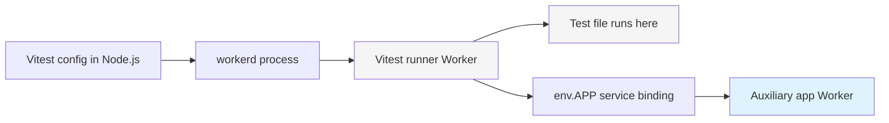
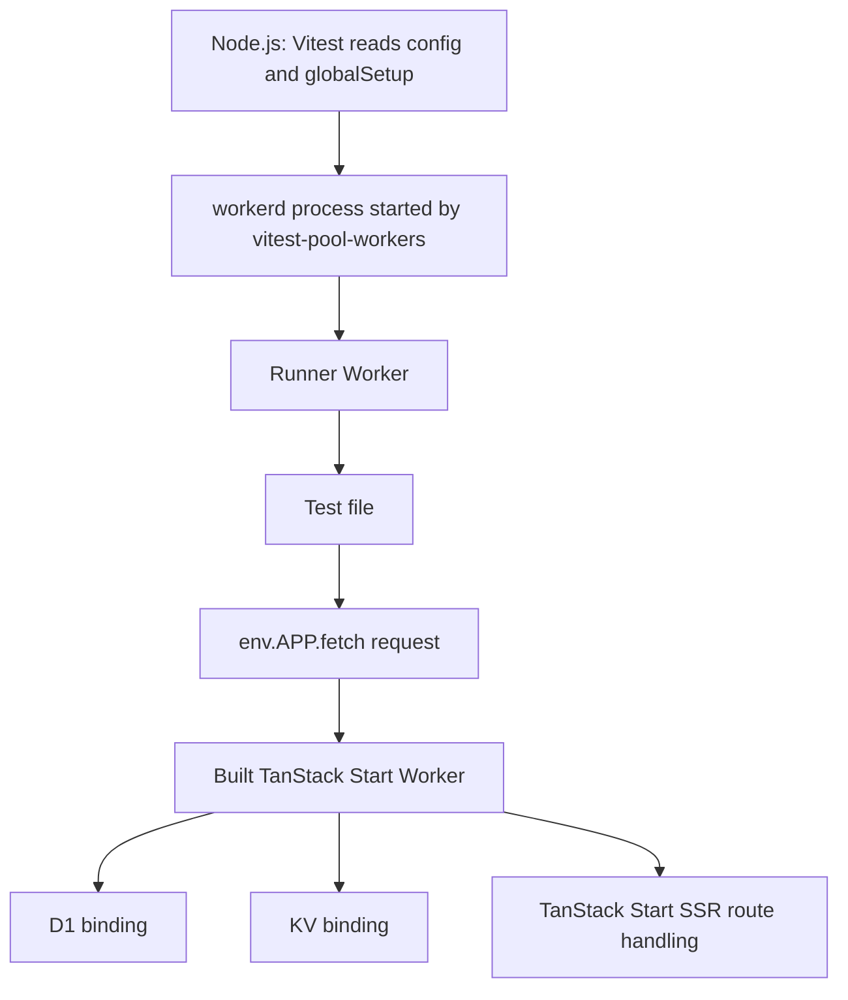

# Vitest 4 Runtime Blocker Research

> Sources: `src/worker.ts`, `src/router.tsx`, `test/integration/vitest.config.ts`, `refs/cloudflare-docs/src/content/docs/workers/framework-guides/web-apps/tanstack-start.mdx`, `refs/cloudflare-docs/src/content/docs/workers/testing/vitest-integration/test-apis.mdx`  
> Date: 2026-03-18

## Updated Takeaways After More Source Scanning

The current blocker is real, and the docs/implementation now make the shape of it clearer:

- Cloudflare Vitest integration is designed for two different styles of integration testing:
  - `main` Worker in the same isolate/context as tests via `exports.default.fetch()`
  - auxiliary Worker in a more production-like context, with tradeoffs
- TanStack Start on Cloudflare is designed around the Cloudflare Vite plugin owning the `ssr` environment
- our failure sits right at that seam: same-isolate Vitest integration + full-stack SSR framework wiring

## Auxiliary Workers, Plain English

An auxiliary Worker is just: another Worker running in the same local `workerd` process as your tests, but not as the special Vitest runner Worker.

That distinction matters.

- the `main` Worker is special in `vitest-pool-workers`
- it runs in the same isolate/context as the tests
- `exports.default.fetch()` talks to that special `main` Worker
- an auxiliary Worker is a more normal Worker that your tests usually call through a binding like `env.APP.fetch(...)`

Cloudflare docs say auxiliary Workers:

> run in the same `workerd` process as your tests and can be bound to.

Source: `refs/cloudflare-docs/src/content/docs/workers/testing/vitest-integration/configuration.mdx:127`

And the example fixture shows the pattern exactly:

```ts
serviceBindings: {
  WORKER: "worker-under-test",
},
workers: [
  {
    name: "worker-under-test",
    scriptPath: "./dist/index.js",
  },
],
```

Source: `refs/workers-sdk/fixtures/vitest-pool-workers-examples/basics-integration-auxiliary/vitest.config.ts:19`

Then the test calls the auxiliary Worker via the binding:

```ts
const response = await env.WORKER.fetch("http://example.com");
```

Source: `refs/workers-sdk/fixtures/vitest-pool-workers-examples/basics-integration-auxiliary/test/fetch-integration-auxiliary.test.ts:5`

## Mental Model

### Normal `main` Worker integration


Important part:

- test file and `main` Worker are in the same special test runtime world
- Cloudflare says this means same context + Vite-shaped module resolution

### Auxiliary Worker integration



Important part:

- tests still run in the special runner Worker
- routes run in a different Worker
- that route Worker is closer to a normal Worker execution model

### How this maps to our app



This is the architecture I mean when I say "use an auxiliary Worker to test TanStack Start routes with D1".

## Where The Routes Actually Run

This is the most important confusion to clear up.

### With `exports.default.fetch()`

- the route code runs in the `main` Worker
- but that `main` Worker is the special same-context Worker used by the Vitest pool
- that is why Cloudflare warns about different module resolution behavior

### With an auxiliary Worker

- the test code still runs in the Vitest runner Worker
- the route code runs in the auxiliary app Worker
- the request crosses a service binding boundary
- the app Worker can have its own D1/KV bindings just like a regular Worker

So yes: in the auxiliary pattern, the routes would run in the auxiliary app Worker, not in the Vitest runner Worker.

## Why This Seems Better For TanStack Start

The core hypothesis is now simpler:

- TanStack Start route execution is sensitive to the special same-context `main` Worker test mode
- auxiliary Workers avoid that exact mode
- therefore auxiliary Workers are the most plausible way to keep route testing inside `vitest-pool-workers`

This is not a proof. It is the best evidence-based next move.

## What Auxiliary Workers Are Not

- not a second Vitest runner
- not a browser
- not a completely separate local dev server
- not a replacement for `vitest-pool-workers`

They are just extra Workers loaded into the same local `workerd` process, usually called through service bindings.

## Practical Consequences For Us

If we go this route, the likely shape is:

1. keep a tiny `main` Worker for tests
2. build the real TanStack Start Worker to JS
3. register that built Worker as an auxiliary Worker in `cloudflareTest({ miniflare: { workers: [...] } })`
4. bind it on the runner Worker, something like `APP: "tanstack-start-app"`
5. have tests call `env.APP.fetch("http://example.com/")`
6. give the auxiliary Worker its D1 binding so route code hits the database normally

## Why D1 Still Fits

Your concern here is right: we still want real D1.

Nothing in the auxiliary Worker model prevents that. The docs say auxiliary Workers are just normal Miniflare Workers configured in the same process. That means they can have their own bindings, including D1, as part of their Worker options.

The tradeoff is not "no D1". The tradeoff is:

- more setup
- built JS artifact required
- less convenience than `exports.default.fetch()`

## Stronger Bottom Line

If we want to test real TanStack Start routes with D1 while staying inside `vitest-pool-workers`, the clearest next experiment is:

- routes run in an auxiliary app Worker
- tests run in the Vitest runner Worker
- tests call the app Worker via a service binding

That is the sharpest version of the recommendation.

## New Grounded Findings

### 1. `exports.default.fetch()` is intentionally same-context, and Cloudflare calls out module-resolution differences

Cloudflare docs say:

> When using `exports.default.fetch()` for integration tests, your Worker code runs in the same context as the test runner. This means you can use global mocks to control your Worker, but also means your Worker uses the subtly different module resolution behavior provided by Vite.

Source: `refs/cloudflare-docs/src/content/docs/workers/testing/vitest-integration/write-your-first-test.mdx:192`

This matches what we observed: the simple test Worker works, but the full TanStack Start route path is sensitive to this Vite-driven execution model.

### 2. Cloudflare explicitly recommends an auxiliary Worker when you want behavior closer to production

Immediately after the quote above, Cloudflare says:

> Usually this is not a problem, but to run your Worker in a fresh environment that is as close to production as possible, you can use an auxiliary Worker.

Source: `refs/cloudflare-docs/src/content/docs/workers/testing/vitest-integration/write-your-first-test.mdx:193`

This is the strongest doc signal so far that our next serious route-testing attempt should likely use an auxiliary Worker, not `exports.default.fetch()` against the main Worker.

### 3. Auxiliary Workers use normal Worker module resolution, but they must be built JS

Cloudflare's config docs say auxiliary Workers:

- cannot have TypeScript entrypoints
- must be compiled to JavaScript first
- use regular Workers module resolution semantics
- cannot access `cloudflare:test`
- are not affected by global mocks

Source: `refs/cloudflare-docs/src/content/docs/workers/testing/vitest-integration/configuration.mdx:127`

This matters a lot for TanStack Start routes:

- it avoids the exact same-isolate/same-module-instance behavior that is currently biting us
- but it means we need a built artifact and a different test shape, probably via a service binding from the runner Worker to the auxiliary app Worker

### 4. Cloudflare documents a known issue directly related to integration handlers

Known issues say:

> Dynamic `import()` statements do not work inside `export default { ... }` handlers when writing integration tests with `exports.default.fetch()` ... You must import and call your handlers directly, or use static `import` statements in the global scope.

Source: `refs/cloudflare-docs/src/content/docs/workers/testing/vitest-integration/known-issues.mdx:22`

This does not prove TanStack Start is using dynamic `import()` in exactly the wrong place, but it is highly relevant. TanStack Start server/runtime behavior absolutely involves runtime SSR/server-function module loading. That means our current failure is consistent with a known limitation area, not a random repo-only bug.

### 5. TanStack Start route handling really does center the server entrypoint

TanStack Start docs say:

> the `server.ts` file is the entry point for doing all SSR-related work as well as for handling server routes and server function requests.

Source: `refs/tan-start/docs/start/framework/react/guide/server-entry-point.md:36`

And custom handlers are expected via:

```ts
import {
  createStartHandler,
  defaultStreamHandler,
  defineHandlerCallback,
} from '@tanstack/react-start/server'
import { createServerEntry } from '@tanstack/react-start/server-entry'
```

Source: `refs/tan-start/docs/start/framework/react/guide/server-entry-point.md:43`

This gives us a plausible next tactic: test a custom server entry that keeps TanStack Start in the loop but strips our extra Worker concerns down to the minimum needed for route handling.

### 6. TanStack Start on Cloudflare wants the Vite plugin to own `ssr`

Cloudflare Vite plugin docs say for full-stack frameworks:

> If you are using the Cloudflare Vite plugin with TanStack Start ... your Worker is used for server-side rendering and tightly integrated with the framework.
> To support this, you should assign it to the `ssr` environment by setting `viteEnvironment.name` in the plugin config.

Source: `refs/cloudflare-docs/src/content/docs/workers/vite-plugin/reference/vite-environments.mdx:68`

This explains why route testing gets ugly inside plain Vitest config. The framework-supported path wants `cloudflare({ viteEnvironment: { name: "ssr" } })`, but the Cloudflare Vite plugin rejects worker environments with `resolve.external`, and Vitest's environment config currently trips that validation.

### 7. The vitest pool plugin itself confirms the split

The implementation of `cloudflareTest()` does three relevant things:

- forces Worker-oriented resolve conditions: `workerd`, `worker`, `module`, `browser`
- inlines deps for the test server
- sets `ssr.target = "webworker"`

Source: `refs/workers-sdk/packages/vitest-pool-workers/src/pool/plugin.ts:37`, `:76`, `:92`

That is enough for many Workers, but not enough to recreate the full Cloudflare Vite plugin + TanStack Start SSR environment contract.

### 8. The Cloudflare Vite plugin intentionally rejects Worker envs with `resolve.external`

The implementation says:

```ts
if (resolve.external === true || resolve.external.length) {
  disallowedEnvironmentOptions.resolveExternal = resolve.external;
}
```

and then throws:

> avoid setting `resolve.external` in your Cloudflare Worker environments.

Source: `refs/workers-sdk/packages/vite-plugin-cloudflare/src/vite-config.ts:33`

This confirms our earlier failure was expected plugin behavior, not us misreading an error.

### 9. The vitest pool runtime itself is doing Durable Object gymnastics to keep tests alive

The pool implementation comments:

> vitest-pool-workers runs all test files within the same Durable Object, so promise resolution regularly crosses request boundaries

and enables:

`"no_handle_cross_request_promise_resolution"`

Source: `refs/workers-sdk/packages/vitest-pool-workers/src/pool/index.ts:293`

This is another clue that same-context integration is a special execution model. A complex SSR framework that lazily loads modules during request handling is more likely to hit sharp edges here than a straightforward Worker.

## Revised Interpretation

The evidence now points to this:

1. `exports.default.fetch()` against `main` is the easy integration path, but it is explicitly same-context and Vite-shaped.
2. TanStack Start routes on Cloudflare are explicitly `ssr`-environment + Cloudflare-Vite-plugin territory.
3. Our repo is trying to test that full-stack SSR path inside the simpler Vitest same-context mode.
4. That mismatch is probably the real issue.

So the blocker is less "TanStack Start cannot be tested" and more:

"Testing full TanStack Start route handling through `exports.default.fetch()` on the `main` Worker is likely the wrong test harness for this app."

## Stronger Recommendation Now

### Best bet for real route testing inside vitest-pool-workers: auxiliary Worker strategy

Use the current simple `main` Worker as the test runner/control plane, and bind a built TanStack Start Worker as an auxiliary Worker.

Why this is now my top recommendation:

- Cloudflare explicitly suggests auxiliary Workers for a more production-like environment in integration tests
- auxiliary Workers use regular Worker module resolution semantics
- this sidesteps the same-isolate `exports.default.fetch()` path that currently hangs
- it lets us test actual route responses from a real built app Worker

Tradeoffs:

- auxiliary Worker must be built JS, not TS
- tests cannot call `cloudflare:test` from inside that auxiliary Worker
- test ergonomics are worse than `exports.default.fetch()`

### Strong fallback option: `unstable_startWorker()` for route tests

Cloudflare documents `unstable_startWorker()` as a way to run Wrangler's dev server internals directly.

Source: `refs/cloudflare-docs/src/content/docs/workers/testing/unstable_startworker.mdx:21`

If the goal is "test real TanStack Start routes running the way local dev does", this may actually be a better route-testing harness than Vitest pool integration for the SSR app itself.

Important nuance: this does not mean vitest-pool-workers becomes unnecessary. It still has real advantages for bindings and test setup, especially D1 migration setup and direct access to Workers test APIs. The likely split is:

- vitest-pool-workers for Worker-level integration tests, bindings, D1/KV setup, and shared-module tests
- auxiliary Worker or `unstable_startWorker()` for real TanStack Start route execution

That suggests a split strategy rather than a full replacement.

### Less promising option: keep forcing `src/worker.ts` through `exports.default.fetch()`

This is still possible in theory, but the docs and implementation now suggest we are fighting the intended tool boundary.

I no longer think this should be the default path unless we can point to a specific fix such as:

- removing a known dynamic `import()` edge
- providing a narrower custom TanStack server entry that avoids the problematic runtime path

## Updated Practical Plan

1. Keep the current minimal Worker-pool smoke tests as the stable base.
2. Add research/experiments for an auxiliary Worker setup that targets a built TanStack Start app Worker.
3. If auxiliary Worker route testing is too painful, try `unstable_startWorker()` before giving up on direct route tests.
4. Only revisit `exports.default.fetch()` against the real TanStack Start Worker if we find a concrete, documented incompatibility we can remove.

## Short Version

The Vitest 3 -> 4 migration is mostly done. TypeScript is green. The remaining problem is not the migration API anymore.

The blocker is: our integration test now boots the real TanStack Start Worker entrypoint, but that Worker does not finish handling the request inside the Vitest Workers runtime. The request hangs during TanStack Start SSR/module loading, then workerd cancels it.

## What Works Already

- `pnpm typecheck:test` passes.
- test files now use the Vitest 4 import style:

```ts
import { exports } from "cloudflare:workers";
```

Source: `test/integration/smoke.test.ts:1`

- the test dispatch style is now the Cloudflare-recommended Vitest 4 pattern:

```ts
const response = await exports.default.fetch("http://example.com/");
```

Source: `test/integration/smoke.test.ts:6`

Cloudflare docs explicitly say:

> Use `exports.default.fetch()` to write integration tests against your Worker's default export handler.

Source: `refs/cloudflare-docs/src/content/docs/workers/testing/vitest-integration/test-apis.mdx:46`

## What The Test Is Actually Doing

Current Vitest config runs the Worker from source:

```ts
cloudflareTest({
  main: path.resolve(__dirname, "../../src/worker.ts"),
  wrangler: { configPath: wranglerConfigPath },
  miniflare: { bindings: { TEST_MIGRATIONS: migrations } },
})
```

Source: `test/integration/vitest.config.ts:35`

That means `exports.default.fetch()` is calling the default export from `src/worker.ts`.

Our Worker is not a tiny handler. It delegates into TanStack Start:

```ts
return serverEntry.fetch(request, {
  context: {
    env,
    runEffect,
  },
});
```

Source: `src/worker.ts:174`

And the TanStack router setup pulls in SSR router/query machinery:

```ts
const queryClient = new QueryClient();
const router = createRouter({ ... });
setupRouterSsrQueryIntegration({ router, queryClient });
```

Source: `src/router.tsx:8`, `src/router.tsx:10`, `src/router.tsx:17`

## What Fails

The smoke test:

```ts
it("serves /", async () => {
  const response = await exports.default.fetch("http://example.com/");
  expect([200, 302]).toContain(response.status);
});
```

Source: `test/integration/smoke.test.ts:5`

fails with:

> The Workers runtime canceled this request because it detected that your Worker's code had hung and would never generate a response.

and Vitest also reports follow-on cross-context errors like:

> Cannot perform I/O on behalf of a different Durable Object.

From the captured run, the most important trace is:

- request starts in `test/integration/smoke.test.ts:6`
- Worker logs `fetch: http://example.com/`
- module loading continues through `src/worker.ts`
- then through `@tanstack/start-server-core`
- then into `src/router.tsx`
- then workerd cancels the request as hung

One concrete line from the failure:

> `Cannot load '/node_modules/.pnpm/@tanstack+react-query.../index.js' imported from /Users/mw/Documents/src/tanstack-cloudflare-effect-saas/src/router.tsx after the environment was torn down.`

This is not the root cause by itself. It is a symptom of the request hanging first, then teardown happening while module loading is still in flight.

## Why This Is Confusing

On paper, the setup looks correct:

- Cloudflare says use `exports.default.fetch()` for Vitest 4 integration tests.
- Cloudflare says TanStack Start on Workers should use `@tanstack/react-start/server-entry` or a custom entrypoint wrapping it.

Cloudflare's TanStack Start guide says:

> `"main": "@tanstack/react-start/server-entry"`

Source: `refs/cloudflare-docs/src/content/docs/workers/framework-guides/web-apps/tanstack-start.mdx:101`

and for custom entrypoints:

```ts
import handler from "@tanstack/react-start/server-entry";

export default {
  fetch: handler.fetch,
}
```

Source: `refs/cloudflare-docs/src/content/docs/workers/framework-guides/web-apps/tanstack-start.mdx:152`

Our `src/worker.ts` matches that general model. So the issue is not "wrong concept". It is a runtime interaction between:

- Vitest Workers integration
- TanStack Start SSR request bootstrapping
- Vite module loading inside the test runtime

## What I Tried

### Attempt 1: use the old built output as `main`

Used `dist/server/index.js` as `main`.

Result:

- avoided some source-resolution issues
- but still hung during SSR request handling / environment teardown

### Attempt 2: use Wrangler/main source entrypoint

Used `src/worker.ts` as `main`.

Result:

- fixes the old build-artifact path mismatch
- loads the real Worker entrypoint
- still hangs during request handling

### Attempt 3: include app plugins in Vitest config

Added enough Vite/TanStack plugin config so private TanStack Start specifiers resolve.

Result:

- private entry imports resolve
- request now gets farther into real app code
- still hangs in runtime

### Attempt 4: merge more of the main Vite config

Tried bringing over more of `vite.config.ts`.

Result:

- `@cloudflare/vite-plugin` conflicts with the Vitest Workers runtime because it validates Worker environment options and rejects Vite's `resolve.external` setup for the `ssr` environment
- so we cannot simply reuse the whole app Vite config inside Vitest

## Best Current Theory

The migration exposed a deeper issue:

`exports.default.fetch()` is invoking a TanStack Start SSR Worker that lazily loads framework/router modules during the request, and that loading path does not complete cleanly inside this Vitest Workers execution model.

In other words:

- Vitest 4 migration itself is not the blocker anymore
- the blocker is full-framework runtime execution under this specific integration style

## What This Probably Is Not

- not a missing `cloudflareTest()` migration step
- not a `SELF` -> `exports.default` migration bug
- not a typing issue
- not a missing D1 migration binding
- not a lint/typecheck problem

## Most Likely Ways Forward

### Option 1. Create a test-only Worker entrypoint

Make a special Worker entrypoint for Vitest integration that wraps only the server behavior we want to exercise, without the full runtime path that currently hangs.

Why this may help:

- keeps Cloudflare Vitest integration for Worker-level testing
- gives us control over what loads eagerly vs lazily
- lets us isolate whether TanStack Start's default server boot path is the real problem

Risk:

- test entrypoint may drift from production entrypoint if we are not careful

### Option 2. Move route-level coverage to browser/dev-server tests

Use Playwright or a dev-worker-based flow for route assertions like `/` and auth flows, and keep Vitest integration focused on lower-level Worker concerns.

Why this may help:

- browser/dev-server path is closer to how TanStack Start is usually exercised end-to-end
- avoids forcing full SSR app boot inside `exports.default.fetch()` in the test pool

Risk:

- changes the purpose of this integration suite
- slower than current Worker-level tests

### Option 3. Reduce what these integration tests cover

Use Vitest Workers integration only for things like:

- D1/KV helpers
- Worker bindings
- small handler-level logic

and stop treating it as the primary place to test end-to-end SSR routes.

## Current Direction

This is a runtime architecture question, not a migration bug.

Decisions so far:

1. Keep the Vitest 4 migration changes already made.
2. Defer full TanStack Start SSR route validation until we get a simpler Worker-pool test green.
3. Try a very small test-only Worker entrypoint if needed, as a stepping stone.
4. Replace the current `/` smoke test with a simpler first-base test instead of proving the whole SSR path immediately.

## Clarified Goals

1. We eventually do want TanStack Start in the integration path.
2. It is fine to defer that while we first prove the Vitest 4 Worker setup can run something simple and stable.
3. The immediate goal is not feature coverage. The immediate goal is establishing one working integration test path we can trust and extend.

## Useful File References

- `test/integration/vitest.config.ts`
- `test/integration/smoke.test.ts`
- `src/worker.ts`
- `src/router.tsx`
- `vite.config.ts`
- `docs/vitest4-cloudflare-workers-research.md`
