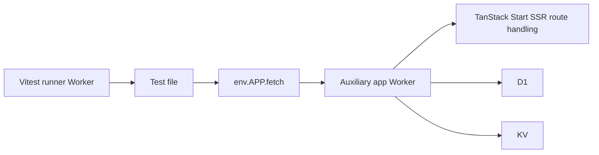
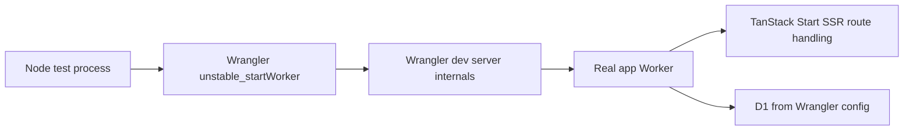

# Vitest 4 Route-Testing Blocker

> Sources: `refs/cloudflare-docs/src/content/docs/workers/testing/vitest-integration/`, `refs/cloudflare-docs/src/content/docs/workers/testing/unstable_startworker.mdx`, `refs/cloudflare-docs/src/content/docs/workers/vite-plugin/reference/vite-environments.mdx`, `refs/tan-start/docs/start/framework/react/guide/server-entry-point.md`, `refs/workers-sdk/packages/miniflare/src/plugins/core/modules.ts`  
> Date: 2026-03-18

## Bottom Line

- `vitest-pool-workers` works in this repo for Worker-level tests, D1 migrations, and shared-module tests.
- It does not currently work for real TanStack Start route execution through `exports.default.fetch()`.
- Best next route-testing candidates:
  1. auxiliary Worker, if we can produce a Miniflare-friendly app bundle
  2. `unstable_startWorker()` if we want Wrangler/dev-server behavior directly

## Why `exports.default.fetch()` Fails Here

Cloudflare docs say:

> When using `exports.default.fetch()` for integration tests, your Worker code runs in the same context as the test runner ... your Worker uses the subtly different module resolution behavior provided by Vite.

Source: `refs/cloudflare-docs/src/content/docs/workers/testing/vitest-integration/write-your-first-test.mdx:192`

That same-context path is likely the wrong harness for this app's SSR route execution.

Why:

- TanStack Start on Cloudflare is built around the Cloudflare Vite plugin owning the `ssr` environment
- our app Worker delegates into `@tanstack/react-start/server-entry`
- route handling pulls in TanStack Start SSR/router machinery during request handling
- inside the Vitest same-context mode, requests hang and get canceled

Cloudflare also documents a related known issue:

> Dynamic `import()` statements do not work inside `export default { ... }` handlers when writing integration tests with `exports.default.fetch()`

Source: `refs/cloudflare-docs/src/content/docs/workers/testing/vitest-integration/known-issues.mdx:22`

## Auxiliary Workers, Plain English

An auxiliary Worker is another Worker in the same local `workerd` process, but not the special Vitest `main` Worker.

- tests still run in the Vitest runner Worker
- the app routes run in the auxiliary Worker
- tests call it via a binding like `env.APP.fetch(...)`

Cloudflare docs say auxiliary Workers:

> run in the same `workerd` process as your tests and can be bound to.

Source: `refs/cloudflare-docs/src/content/docs/workers/testing/vitest-integration/configuration.mdx:127`

## Architecture

### Current `main` Worker path

### Auxiliary Worker path

### `unstable_startWorker()` path

## What We Tried With Auxiliary Worker

We attempted this shape:

- tiny runner Worker as `main`
- built TanStack Start app as auxiliary Worker
- test calls app via `env.APP.fetch(...)`

This got farther, but failed on the built app bundle itself.

### Failure 1: built server `.js` needed ESM handling

Miniflare initially parsed `dist/server/assets/worker-entry-*.js` as non-ESM.

### Failure 2: dynamic module specifiers in the built app bundle

After fixing ESM parsing, Miniflare failed with:

> `ERR_MODULE_DYNAMIC_SPEC`: dynamic module specifiers are unsupported. You must manually define your modules when constructing Miniflare.

Source of that error text: `refs/workers-sdk/packages/miniflare/src/plugins/core/modules.ts:280`

This is the key new finding.

Meaning:

- the auxiliary-Worker idea is still plausible
- but the current TanStack Start server build is not directly consumable by Miniflare as a simple `scriptPath` Worker
- Miniflare wants a fully enumerated `modules: [...]` graph when the bundle uses dynamic specifiers

## What This Means

If we want real TanStack Start route tests inside `vitest-pool-workers`, we likely need one of these:

1. a different app build output that Miniflare can consume cleanly
2. generated/manual `modules: [...]` for the auxiliary Worker
3. a different route-test harness

## Is `unstable_startWorker()` Better For Routes?

Possibly yes.

Cloudflare docs say:

> `unstable_startWorker()` ... exposes the internals of Wrangler's dev server ... you can pass in a Wrangler configuration file, and it will automatically load the configuration for you.

Source: `refs/cloudflare-docs/src/content/docs/workers/testing/unstable_startworker.mdx:21`

That matters because TanStack Start on Cloudflare is designed around Wrangler + the Cloudflare Vite plugin + SSR environment wiring.

So `unstable_startWorker()` is a better conceptual fit for real route tests than `exports.default.fetch()` on the Vitest `main` Worker.

## Does `unstable_startWorker()` Allow Migrated D1?

Probably yes, but not via the same helper path as `vitest-pool-workers`.

What is grounded:

- `unstable_startWorker()` loads Wrangler config automatically
- Wrangler config includes D1 bindings
- therefore the started Worker should have D1 available through normal Wrangler/dev-server wiring

What is not yet proven in this repo:

- the exact migration workflow we should use with `unstable_startWorker()`

Important distinction:

- `vitest-pool-workers` gives us `readD1Migrations()` and `applyD1Migrations()` helpers designed for its test runtime
- `unstable_startWorker()` is not that runtime

So the question is not "can it have D1?". It almost certainly can.

The real question is:

- how do we ensure the D1 database is migrated before route assertions?

Most likely answers:

1. pre-apply migrations with Wrangler before starting the worker
2. start the worker against a test/local DB that is already migrated
3. see if Wrangler dev startup already handles the desired local D1 state for our setup

I have not verified which of those is best yet.

## Current Recommendation

- keep `vitest-pool-workers` for D1/shared-module/Worker-level tests
- do not keep pushing `exports.default.fetch()` for real TanStack Start routes
- next research/implementation target should be one of:
  1. make auxiliary Worker work with a Miniflare-friendly TanStack Start bundle
  2. prototype route tests with `unstable_startWorker()` and a migrated local D1 workflow
