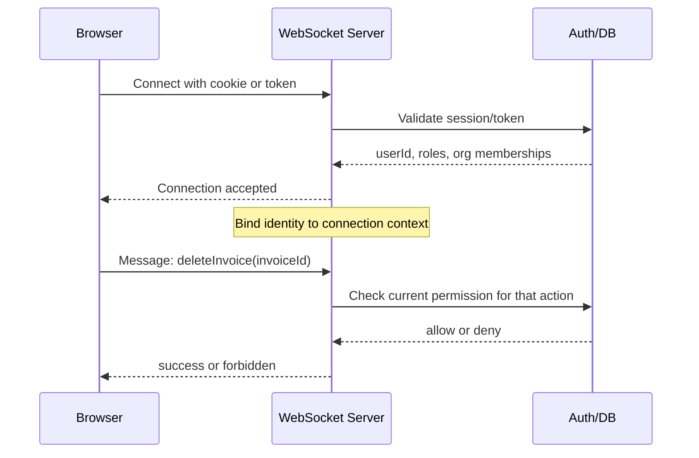

# WebSocket Auth Patterns Research

## Question

If we want long-lived WebSockets, how do web apps usually identify the user and enforce permissions over time?

Short answer:

- most apps authenticate the connection once, not every message
- the server binds identity to the connection/session server-side
- then every incoming message is authorized against that bound identity
- for long-lived sockets, mature systems also handle expiry, refresh, logout, and forced disconnect

So the common pattern is **not** "the user identifies himself in every message". The common pattern is:

1. authenticate at handshake or immediately after connect
2. attach identity to the socket/connection context
3. do message-level authorization on every action
4. revalidate or refresh over time

## The Browser Constraint

The root annoyance is the browser API itself.

MDN shows the browser constructor is:

```js
new WebSocket(url)
new WebSocket(url, protocols)
```

There is no way to set arbitrary headers like `Authorization` from the browser WebSocket API.

Source: `https://developer.mozilla.org/en-US/docs/Web/API/WebSocket/WebSocket`

Ably's overview says this plainly:

> "the WebSocket browser API does not allow you to set arbitrary headers with the HTTP handshake like `Authorization`."

Source: `https://ably.com/blog/websocket-authentication`

This is why WebSocket auth patterns look different from normal HTTP auth patterns.

## What Standards And Security Guidance Say

RFC 6455 says the handshake can use ordinary HTTP auth mechanisms:

> "The WebSocket server can use any client authentication mechanism available to a generic HTTP server, such as cookies or HTTP authentication."

Source: `https://datatracker.ietf.org/doc/html/rfc6455`

But it also says browsers use an origin-based security model and send an `Origin` header in the handshake.

RFC 6455:

> "The `Origin` header field ... is used to protect against unauthorized cross-origin use of a WebSocket server by scripts using the WebSocket API in a web browser."

OWASP adds the operational guidance:

> "Validate the `Origin` header on every handshake. Always use an explicit allowlist of trusted origins."

> "Check authorization for each action"

> "Close WebSocket connections when sessions expire"

Source: `https://cheatsheetseries.owasp.org/cheatsheets/WebSocket_Security_Cheat_Sheet.html`

That combination is the mainstream model:

- secure transport
- handshake auth
- origin validation
- per-message authorization
- lifecycle handling for expiry/logout

## Common Patterns In Real Apps

## 1. Cookie-backed handshake auth

This is common for same-origin apps.

How it works:

- browser opens `wss://app.example.com/socket`
- browser sends cookies during the handshake
- server validates session cookie
- server binds `userId`, org, roles, etc. to that connection

OWASP warns why this is not enough on its own:

> "Browsers include cookies in WebSocket handshake requests, making WebSocket applications vulnerable to Cross-Site WebSocket Hijacking (CSWSH)."

So apps using cookies normally also do:

- `Origin` allowlist validation
- `SameSite` cookies where possible
- logout-triggered disconnect
- session-expiry disconnect

This is the closest pattern to what this repo already does.

## 2. Token in query params during handshake

Common when cookies are not suitable.

How it works:

- client connects to `wss://example.com/socket?token=...`
- server validates token during upgrade
- server stores identity on the connection

Ably notes the key downside:

> "query parameters will still show up in plaintext on the server where they will likely get logged"

So this pattern is common, but usually improved with **short-lived / ephemeral tokens**.

## 3. Token in first message after connect

Also common.

How it works:

- allow socket to open in unauthenticated state
- first client message is something like `{ type: "authenticate", token }`
- server validates token
- if valid, mark connection authenticated
- if invalid or timeout, close socket

Ably's summary:

> "send credentials in the first message post-connection"

This avoids query-string leakage, but increases protocol complexity and requires strict timeouts to avoid idle unauthenticated sockets.

## 4. Framework-specific connection auth payloads

Many higher-level frameworks wrap one of the above patterns.

Socket.IO exposes handshake auth payloads:

```js
const socket = io({
  auth: {
    token: "abc"
  }
})
```

And server middleware runs once per connection:

> "A middleware function gets executed for every incoming connection"

> "this function will be executed only once per connection"

Source: `https://socket.io/docs/v4/middlewares/`

GraphQL over WebSocket commonly does the same thing with `connectionParams`:

```ts
createClient({
  url: "ws://.../graphql",
  connectionParams: () => ({
    Authorization: `Bearer ${session.token}`,
  }),
})
```

And the GraphQL WS recipes explicitly include token refresh + client restart patterns.

Source: `https://the-guild.dev/graphql/ws/recipes`

So the industry pattern is familiar:

- send auth material at connect time
- server validates once per connection
- reconnect when token changes

## The Important Distinction: Authentication vs Authorization

This is where many systems get sloppy.

### Authentication

Who is this connection?

Examples:

- session cookie
- bearer token
- ephemeral WS token

### Authorization

Can this authenticated user perform **this** action?

OWASP is explicit:

> "Don't assume WebSocket connection equals unlimited access. Check authorization for each action"

This is the most important takeaway for our app.

Even if the socket is authenticated, a message like:

```json
{ "type": "deleteInvoice", "invoiceId": "..." }
```

still needs an authorization check such as:

- is this user still a member of the org?
- does this user still have write permission?
- is this invoice in this org?

So user identity is typically **not** repeated in every message, but authorization still happens per message.

## How Other Web Apps Usually Do Long-Lived WebSockets

The mainstream pattern looks like this:



Key point:

- messages do not usually carry identity repeatedly
- the server already knows who the connection is
- but the server still checks whether that identity may perform the requested action

## Long-Lived Connection Problems And Common Countermeasures

## 1. Session expires while socket stays open

OWASP recommends:

> "Close WebSocket connections when sessions expire"

Common approaches:

- periodic server-side revalidation
- token expiry timers on the server
- close connection when session becomes invalid
- force reconnect with fresh auth

## 2. User logs out elsewhere

OWASP:

> "When users log out, close all their WebSocket connections immediately. Maintain a mapping of sessions to active connections"

This is very common in production systems.

## 3. Permissions change while socket is open

This is the tricky one for us.

Common approaches:

- check current permissions on every privileged message
- version permissions and invalidate sockets when version changes
- close sockets when org membership / role changes
- use short-lived tokens and reconnect periodically

This is the part that matters most for invoice writes.

## 4. Token refresh

Common pattern:

- client uses a short-lived access token
- before expiry, obtain fresh token
- reconnect or restart socket with new token

The GraphQL WS recipes show exactly this style with `connectionParams` and `restart()`.

This is a normal modern approach for long-lived sockets.

## 5. Unauthenticated connection abuse

If auth happens after connect, apps usually add:

- short deadline to authenticate
- low limits on unauthenticated sockets
- terminate immediately on invalid auth message

This is why many teams prefer handshake auth when possible.

## Should The User Identify Himself In WebSocket Messages?

Usually: **no**.

Typical web apps do **not** send `userId` or a bearer token on every message.

Why:

- redundant; the server already knows the connection identity
- easier to spoof client fields if server trusts them incorrectly
- unnecessary bandwidth/protocol noise

What messages usually contain instead:

- action type
- domain resource identifiers
- payload for that action

Example:

```json
{ "type": "deleteInvoice", "invoiceId": "inv_123" }
```

Then server logic says:

- connection belongs to `user_42`
- `user_42` currently has org `acme` write access? if yes, continue

## When Do Apps Put Auth In Messages?

Sometimes, but usually only for one of these reasons:

- initial in-band auth message after connect
- token refresh message
- special cryptographic signed-message protocol
- multi-tenant multiplexing where one socket carries multiple logical auth scopes

For ordinary browser business apps, per-message signed identity envelopes are uncommon.

## What This Suggests For This Codebase

The repo already has:

- same-origin app
- Better Auth session cookies
- worker auth checks in `src/worker.ts`
- one org-scoped `useAgent()` connection in `src/routes/app.$organizationId.tsx`

So the most natural pattern here is not "put user identity in every WebSocket message".

It is:

## Recommended pattern

1. authenticate the handshake using the existing cookie-backed session
2. validate `Origin`
3. bind `userId`, `activeOrganizationId`, and maybe role/permission snapshot to the connection
4. for each privileged callable / message, check current authorization for that action
5. on logout/session expiry/org membership change, close or invalidate affected connections
6. keep low-risk realtime updates on the long-lived socket; keep especially sensitive writes on server functions if per-request auth is preferable

## Specifically For Our Agent Situation

For `OrganizationAgent`-style RPC:

- do **not** trust the fact that a socket is connected as sufficient authorization for destructive methods
- do **not** rely on readonly alone
- do attach identity to the connection
- do check current permission inside privileged methods

That implies helper patterns like:

- `getCurrentConnectionIdentity()`
- `requireCurrentOrgAccess("write")`
- `closeConnectionsForSession(sessionId)` or `closeConnectionsForUser(userId)`

## Practical Architecture Options

## Option A: Cookie handshake + per-message authz

Best fit for this repo.

- same-origin works well
- no token plumbing on client
- preserves current Better Auth model
- still requires message-level permission checks

## Option B: Short-lived WS token + reconnect

Good if we want more explicit WebSocket auth semantics.

- client fetches short-lived socket token from server fn
- `useAgent({ query: async () => ({ token }) })`
- worker validates token at connect
- reconnect when token expires

This is common in larger systems and cross-origin systems.

## Option C: In-band auth message after connect

Viable, but less attractive here.

- more custom protocol work
- need strict unauthenticated timeout handling
- easier to get wrong

I would not choose this first in this codebase.

## Recommendation

For this app, the best default is:

- **same-origin cookie-backed WebSocket handshake auth**
- **strict `Origin` validation**
- **server-bound connection identity**
- **message-level authorization on every privileged action**
- **connection invalidation on logout / expiry / membership changes**

If we later need stronger WebSocket-specific lifecycle control, add:

- short-lived WebSocket-specific tokens
- forced reconnect / refresh behavior

## Bottom Line

How do other web apps do this?

- they usually authenticate the socket once
- store identity on the server-side connection
- authorize every sensitive action separately
- refresh or revoke long-lived connections over time

So the thing to add in our mental model is not "user identifies himself in every message".

It is:

- **connection authentication**
- **server-side connection identity**
- **message-level authorization**
- **revocation / expiry handling**

That is the standard long-lived WebSocket security shape.
